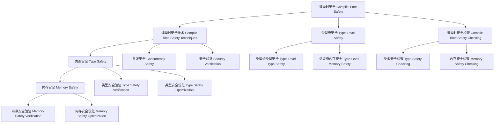

# 编译时安全（Compile-Time Safety in Haskell）

## 目录 Table of Contents

1. [定义 Definition](#1-定义-definition)
2. [理论基础 Theoretical Foundation](#2-理论基础-theoretical-foundation)
3. [Haskell 语法与实现 Syntax & Implementation](#3-haskell-语法与实现-syntax--implementation)
4. [编译时安全技术 Compile-Time Safety Techniques](#4-编译时安全技术-compile-time-safety-techniques)
5. [类型级安全 Type-Level Safety](#5-类型级安全-type-level-safety)
6. [编译时安全检查 Compile-Time Safety Checking](#6-编译时安全检查-compile-time-safety-checking)
7. [工程应用 Engineering Applications](#7-工程应用-engineering-applications)
8. [范畴论映射 Category Theory Mapping](#8-范畴论映射-category-theory-mapping)
9. [哲学思脉 Philosophical Context](#9-哲学思脉-philosophical-context)
10. [相关理论 Related Theories](#10-相关理论-related-theories)
11. [未来发展方向 Future Development](#11-未来发展方向-future-development)
12. [结构图 Structure Diagram](#12-结构图-structure-diagram)
13. [本地跳转 Local References](#13-本地跳转-local-references)
14. [参考文献 References](#14-参考文献-references)

## 1. 定义 Definition

- **中文**：编译时安全是指在编译阶段通过类型系统、类型族、类型类等机制保证程序安全的技术。编译时安全允许在编译时发现和防止安全漏洞、类型错误和运行时异常，从而在运行时之前确保程序的安全性和可靠性。
- **English**: Compile-time safety refers to the technique of ensuring program safety during the compilation phase through type systems, type families, type classes, and other mechanisms. Compile-time safety allows discovering and preventing security vulnerabilities, type errors, and runtime exceptions at compile time, ensuring program safety and reliability before runtime.

## 2. 理论基础 Theoretical Foundation

### 2.1 安全理论 Safety Theory
- **安全定义**：程序安全是程序必须满足的安全条件和规范
- **安全分类**：包括类型安全、内存安全、并发安全等
- **安全验证**：通过形式化方法验证程序安全

### 2.2 类型理论 Type Theory
- **类型系统**：编译时安全基于强类型系统，通过类型检查进行程序验证
- **类型安全**：通过类型系统保证程序的安全性和正确性
- **类型推导**：自动推导表达式的类型，减少显式类型注解

### 2.3 形式化验证 Formal Verification
- **形式化方法**：编译时安全使用形式化方法进行程序验证
- **定理证明**：通过定理证明验证程序安全
- **模型检查**：通过模型检查验证程序安全

## 3. Haskell 语法与实现 Syntax & Implementation

### 3.1 基本语法 Basic Syntax

```haskell
{-# LANGUAGE TypeFamilies, DataKinds, GADTs, TypeOperators #-}

-- 编译时安全的基本语法
class CompileTimeSafety a where
  -- 编译时安全
  compileTimeSafety :: Proxy a -> SafetyResult a
  
  -- 安全检查
  safetyChecking :: Proxy a -> SafetyCheckingResult a
  
  -- 安全优化
  safetyOptimization :: Proxy a -> SafetyOptimizationResult a

-- 安全结果
data SafetyResult a = SafetyResult {
    safetyType :: SafetyType a,
    safetyMethod :: SafetyMethod a,
    safetyResult :: SafetyResult a
}

-- 安全检查结果
data SafetyCheckingResult a = SafetyCheckingResult {
    checkingType :: CheckingType a,
    checkingMethod :: CheckingMethod a,
    checkingResult :: CheckingResult a
}

-- 安全优化结果
data SafetyOptimizationResult a = SafetyOptimizationResult {
    optimizationType :: OptimizationType a,
    optimizationMethod :: OptimizationMethod a,
    optimizationGain :: OptimizationGain a
}
```

### 3.2 高级实现 Advanced Implementation

```haskell
-- 高级编译时安全实现
data AdvancedCompileTimeSafety a = AdvancedCompileTimeSafety {
    safetyEngine :: SafetyEngine a,
    checkingEngine :: CheckingEngine a,
    optimizationEngine :: OptimizationEngine a
}

-- 安全引擎
data SafetyEngine a = SafetyEngine {
    safetyAlgorithms :: [SafetyAlgorithm a],
    safetyStrategies :: [SafetyStrategy a],
    safetyHeuristics :: [SafetyHeuristic a]
}

-- 检查引擎
data CheckingEngine a = CheckingEngine {
    checkingAlgorithms :: [CheckingAlgorithm a],
    checkingStrategies :: [CheckingStrategy a],
    checkingHeuristics :: [CheckingHeuristic a]
}

-- 优化引擎
data OptimizationEngine a = OptimizationEngine {
    optimizationAlgorithms :: [OptimizationAlgorithm a],
    optimizationStrategies :: [OptimizationStrategy a],
    optimizationHeuristics :: [OptimizationHeuristic a]
}

-- 编译时安全实例
instance CompileTimeSafety (Vector n a) where
  compileTimeSafety _ = VectorCompileTimeSafetyResult
  safetyChecking _ = VectorSafetyCheckingResult
  safetyOptimization _ = VectorSafetyOptimizationResult
```

## 4. 编译时安全技术 Compile-Time Safety Techniques

### 4.1 类型安全 Type Safety

```haskell
-- 类型安全技术
class TypeSafetyTechniques (a :: *) where
  -- 类型安全
  typeSafety :: Proxy a -> TypeSafetyResult a
  
  -- 类型安全验证
  typeSafetyVerification :: Proxy a -> TypeSafetyVerificationResult a
  
  -- 类型安全优化
  typeSafetyOptimization :: Proxy a -> TypeSafetyOptimizationResult a

-- 类型安全结果
data TypeSafetyResult a = TypeSafetyResult {
    typeSafetyType :: TypeSafetyType a,
    typeSafetyMethod :: TypeSafetyMethod a,
    typeSafetyResult :: TypeSafetyResult a
}

-- 类型安全实例
instance TypeSafetyTechniques (Vector n a) where
  typeSafety _ = VectorTypeSafetyResult
  typeSafetyVerification _ = VectorTypeSafetyVerificationResult
  typeSafetyOptimization _ = VectorTypeSafetyOptimizationResult
```

### 4.2 内存安全 Memory Safety

```haskell
-- 内存安全技术
class MemorySafetyTechniques (a :: *) where
  -- 内存安全
  memorySafety :: Proxy a -> MemorySafetyResult a
  
  -- 内存安全验证
  memorySafetyVerification :: Proxy a -> MemorySafetyVerificationResult a
  
  -- 内存安全优化
  memorySafetyOptimization :: Proxy a -> MemorySafetyOptimizationResult a

-- 内存安全结果
data MemorySafetyResult a = MemorySafetyResult {
    memorySafetyType :: MemorySafetyType a,
    memorySafetyMethod :: MemorySafetyMethod a,
    memorySafetyResult :: MemorySafetyResult a
}

-- 内存安全实例
instance MemorySafetyTechniques (MemoryType a) where
  memorySafety _ = MemoryTypeMemorySafetyResult
  memorySafetyVerification _ = MemoryTypeMemorySafetyVerificationResult
  memorySafetyOptimization _ = MemoryTypeMemorySafetyOptimizationResult
```

### 4.3 并发安全 Concurrency Safety

```haskell
-- 并发安全技术
class ConcurrencySafetyTechniques (a :: *) where
  -- 并发安全
  concurrencySafety :: Proxy a -> ConcurrencySafetyResult a
  
  -- 并发安全验证
  concurrencySafetyVerification :: Proxy a -> ConcurrencySafetyVerificationResult a
  
  -- 并发安全优化
  concurrencySafetyOptimization :: Proxy a -> ConcurrencySafetyOptimizationResult a

-- 并发安全结果
data ConcurrencySafetyResult a = ConcurrencySafetyResult {
    concurrencySafetyType :: ConcurrencySafetyType a,
    concurrencySafetyMethod :: ConcurrencySafetyMethod a,
    concurrencySafetyResult :: ConcurrencySafetyResult a
}

-- 并发安全实例
instance ConcurrencySafetyTechniques (ConcurrencyType a) where
  concurrencySafety _ = ConcurrencyTypeConcurrencySafetyResult
  concurrencySafetyVerification _ = ConcurrencyTypeConcurrencySafetyVerificationResult
  concurrencySafetyOptimization _ = ConcurrencyTypeConcurrencySafetyOptimizationResult
```

## 5. 类型级安全 Type-Level Safety

### 5.1 类型级类型安全 Type-Level Type Safety

```haskell
-- 类型级类型安全
class TypeLevelTypeSafety (a :: k) where
  -- 类型级类型安全
  typeLevelTypeSafety :: Proxy a -> TypeLevelTypeSafetyResult a
  
  -- 类型级类型安全验证
  typeLevelTypeSafetyVerification :: Proxy a -> TypeLevelTypeSafetyVerificationResult a
  
  -- 类型级类型安全优化
  typeLevelTypeSafetyOptimization :: Proxy a -> TypeLevelTypeSafetyOptimizationResult a

-- 类型级类型安全结果
data TypeLevelTypeSafetyResult (a :: k) = TypeLevelTypeSafetyResult {
    typeLevelTypeSafetyType :: TypeLevelTypeSafetyType a,
    typeLevelTypeSafetyMethod :: TypeLevelTypeSafetyMethod a,
    typeLevelTypeSafetyResult :: TypeLevelTypeSafetyResult a
}

-- 类型级类型安全实例
instance TypeLevelTypeSafety (Vector n a) where
  typeLevelTypeSafety _ = VectorTypeLevelTypeSafetyResult
  typeLevelTypeSafetyVerification _ = VectorTypeLevelTypeSafetyVerificationResult
  typeLevelTypeSafetyOptimization _ = VectorTypeLevelTypeSafetyOptimizationResult
```

### 5.2 类型级内存安全 Type-Level Memory Safety

```haskell
-- 类型级内存安全
class TypeLevelMemorySafety (a :: k) where
  -- 类型级内存安全
  typeLevelMemorySafety :: Proxy a -> TypeLevelMemorySafetyResult a
  
  -- 类型级内存安全验证
  typeLevelMemorySafetyVerification :: Proxy a -> TypeLevelMemorySafetyVerificationResult a
  
  -- 类型级内存安全优化
  typeLevelMemorySafetyOptimization :: Proxy a -> TypeLevelMemorySafetyOptimizationResult a

-- 类型级内存安全结果
data TypeLevelMemorySafetyResult (a :: k) = TypeLevelMemorySafetyResult {
    typeLevelMemorySafetyType :: TypeLevelMemorySafetyType a,
    typeLevelMemorySafetyMethod :: TypeLevelMemorySafetyMethod a,
    typeLevelMemorySafetyResult :: TypeLevelMemorySafetyResult a
}

-- 类型级内存安全实例
instance TypeLevelMemorySafety (MemoryType a) where
  typeLevelMemorySafety _ = MemoryTypeTypeLevelMemorySafetyResult
  typeLevelMemorySafetyVerification _ = MemoryTypeTypeLevelMemorySafetyVerificationResult
  typeLevelMemorySafetyOptimization _ = MemoryTypeTypeLevelMemorySafetyOptimizationResult
```

### 5.3 类型级并发安全 Type-Level Concurrency Safety

```haskell
-- 类型级并发安全
class TypeLevelConcurrencySafety (a :: k) where
  -- 类型级并发安全
  typeLevelConcurrencySafety :: Proxy a -> TypeLevelConcurrencySafetyResult a
  
  -- 类型级并发安全验证
  typeLevelConcurrencySafetyVerification :: Proxy a -> TypeLevelConcurrencySafetyVerificationResult a
  
  -- 类型级并发安全优化
  typeLevelConcurrencySafetyOptimization :: Proxy a -> TypeLevelConcurrencySafetyOptimizationResult a

-- 类型级并发安全结果
data TypeLevelConcurrencySafetyResult (a :: k) = TypeLevelConcurrencySafetyResult {
    typeLevelConcurrencySafetyType :: TypeLevelConcurrencySafetyType a,
    typeLevelConcurrencySafetyMethod :: TypeLevelConcurrencySafetyMethod a,
    typeLevelConcurrencySafetyResult :: TypeLevelConcurrencySafetyResult a
}

-- 类型级并发安全实例
instance TypeLevelConcurrencySafety (ConcurrencyType a) where
  typeLevelConcurrencySafety _ = ConcurrencyTypeTypeLevelConcurrencySafetyResult
  typeLevelConcurrencySafetyVerification _ = ConcurrencyTypeTypeLevelConcurrencySafetyVerificationResult
  typeLevelConcurrencySafetyOptimization _ = ConcurrencyTypeTypeLevelConcurrencySafetyOptimizationResult
```

## 6. 编译时安全检查 Compile-Time Safety Checking

### 6.1 类型安全检查 Type Safety Checking

```haskell
-- 类型安全检查
class TypeSafetyChecking (a :: *) where
  -- 类型安全检查
  typeSafetyChecking :: Proxy a -> TypeSafetyCheckingResult a
  
  -- 类型安全检查验证
  typeSafetyCheckingVerification :: Proxy a -> TypeSafetyCheckingVerificationResult a
  
  -- 类型安全检查优化
  typeSafetyCheckingOptimization :: Proxy a -> TypeSafetyCheckingOptimizationResult a

-- 类型安全检查结果
data TypeSafetyCheckingResult a = TypeSafetyCheckingResult {
    typeSafetyCheckingType :: TypeSafetyCheckingType a,
    typeSafetyCheckingMethod :: TypeSafetyCheckingMethod a,
    typeSafetyCheckingResult :: TypeSafetyCheckingResult a
}

-- 类型安全检查实例
instance TypeSafetyChecking (Vector n a) where
  typeSafetyChecking _ = VectorTypeSafetyCheckingResult
  typeSafetyCheckingVerification _ = VectorTypeSafetyCheckingVerificationResult
  typeSafetyCheckingOptimization _ = VectorTypeSafetyCheckingOptimizationResult
```

### 6.2 内存安全检查 Memory Safety Checking

```haskell
-- 内存安全检查
class MemorySafetyChecking (a :: *) where
  -- 内存安全检查
  memorySafetyChecking :: Proxy a -> MemorySafetyCheckingResult a
  
  -- 内存安全检查验证
  memorySafetyCheckingVerification :: Proxy a -> MemorySafetyCheckingVerificationResult a
  
  -- 内存安全检查优化
  memorySafetyCheckingOptimization :: Proxy a -> MemorySafetyCheckingOptimizationResult a

-- 内存安全检查结果
data MemorySafetyCheckingResult a = MemorySafetyCheckingResult {
    memorySafetyCheckingType :: MemorySafetyCheckingType a,
    memorySafetyCheckingMethod :: MemorySafetyCheckingMethod a,
    memorySafetyCheckingResult :: MemorySafetyCheckingResult a
}

-- 内存安全检查实例
instance MemorySafetyChecking (MemoryType a) where
  memorySafetyChecking _ = MemoryTypeMemorySafetyCheckingResult
  memorySafetyCheckingVerification _ = MemoryTypeMemorySafetyCheckingVerificationResult
  memorySafetyCheckingOptimization _ = MemoryTypeMemorySafetyCheckingOptimizationResult
```

### 6.3 并发安全检查 Concurrency Safety Checking

```haskell
-- 并发安全检查
class ConcurrencySafetyChecking (a :: *) where
  -- 并发安全检查
  concurrencySafetyChecking :: Proxy a -> ConcurrencySafetyCheckingResult a
  
  -- 并发安全检查验证
  concurrencySafetyCheckingVerification :: Proxy a -> ConcurrencySafetyCheckingVerificationResult a
  
  -- 并发安全检查优化
  concurrencySafetyCheckingOptimization :: Proxy a -> ConcurrencySafetyCheckingOptimizationResult a

-- 并发安全检查结果
data ConcurrencySafetyCheckingResult a = ConcurrencySafetyCheckingResult {
    concurrencySafetyCheckingType :: ConcurrencySafetyCheckingType a,
    concurrencySafetyCheckingMethod :: ConcurrencySafetyCheckingMethod a,
    concurrencySafetyCheckingResult :: ConcurrencySafetyCheckingResult a
}

-- 并发安全检查实例
instance ConcurrencySafetyChecking (ConcurrencyType a) where
  concurrencySafetyChecking _ = ConcurrencyTypeConcurrencySafetyCheckingResult
  concurrencySafetyCheckingVerification _ = ConcurrencyTypeConcurrencySafetyCheckingVerificationResult
  concurrencySafetyCheckingOptimization _ = ConcurrencyTypeConcurrencySafetyCheckingOptimizationResult
```

## 7. 工程应用 Engineering Applications

### 7.1 安全编程 Safe Programming

```haskell
-- 安全编程
class SafeProgramming (a :: *) where
  -- 安全编程
  safeProgramming :: Proxy a -> SafeProgrammingResult a
  
  -- 安全编程验证
  safeProgrammingVerification :: Proxy a -> SafeProgrammingVerificationResult a
  
  -- 安全编程优化
  safeProgrammingOptimization :: Proxy a -> SafeProgrammingOptimizationResult a

-- 安全编程结果
data SafeProgrammingResult a = SafeProgrammingResult {
    safeProgrammingType :: SafeProgrammingType a,
    safeProgrammingMethod :: SafeProgrammingMethod a,
    safeProgrammingResult :: SafeProgrammingResult a
}

-- 安全编程实例
instance SafeProgramming (SafeType a) where
  safeProgramming _ = SafeTypeSafeProgrammingResult
  safeProgrammingVerification _ = SafeTypeSafeProgrammingVerificationResult
  safeProgrammingOptimization _ = SafeTypeSafeProgrammingOptimizationResult
```

### 7.2 安全验证 Security Verification

```haskell
-- 安全验证
class SecurityVerification (a :: *) where
  -- 安全验证
  securityVerification :: Proxy a -> SecurityVerificationResult a
  
  -- 安全验证验证
  securityVerificationVerification :: Proxy a -> SecurityVerificationVerificationResult a
  
  -- 安全验证优化
  securityVerificationOptimization :: Proxy a -> SecurityVerificationOptimizationResult a

-- 安全验证结果
data SecurityVerificationResult a = SecurityVerificationResult {
    securityVerificationType :: SecurityVerificationType a,
    securityVerificationMethod :: SecurityVerificationMethod a,
    securityVerificationResult :: SecurityVerificationResult a
}

-- 安全验证实例
instance SecurityVerification (SecurityType a) where
  securityVerification _ = SecurityTypeSecurityVerificationResult
  securityVerificationVerification _ = SecurityTypeSecurityVerificationVerificationResult
  securityVerificationOptimization _ = SecurityTypeSecurityVerificationOptimizationResult
```

### 7.3 安全测试 Security Testing

```haskell
-- 安全测试
class SecurityTesting (a :: *) where
  -- 安全测试
  securityTesting :: Proxy a -> SecurityTestingResult a
  
  -- 安全测试验证
  securityTestingVerification :: Proxy a -> SecurityTestingVerificationResult a
  
  -- 安全测试优化
  securityTestingOptimization :: Proxy a -> SecurityTestingOptimizationResult a

-- 安全测试结果
data SecurityTestingResult a = SecurityTestingResult {
    securityTestingType :: SecurityTestingType a,
    securityTestingMethod :: SecurityTestingMethod a,
    securityTestingResult :: SecurityTestingResult a
}

-- 安全测试实例
instance SecurityTesting (SecurityTestingType a) where
  securityTesting _ = SecurityTestingTypeSecurityTestingResult
  securityTestingVerification _ = SecurityTestingTypeSecurityTestingVerificationResult
  securityTestingOptimization _ = SecurityTestingTypeSecurityTestingOptimizationResult
```

## 8. 范畴论映射 Category Theory Mapping

### 8.1 编译时安全作为函子 Compile-Time Safety as Functor

- **编译时安全可视为范畴中的函子，保持类型结构的同时进行安全检查**
- **Compile-time safety can be viewed as a functor in category theory, preserving type structure while performing safety checking**

```haskell
-- 范畴论映射
class CategoryTheoryMapping (a :: *) where
  -- 函子映射
  functorMapping :: Proxy a -> FunctorMapping a
  
  -- 自然变换
  naturalTransformation :: Proxy a -> NaturalTransformation a
  
  -- 范畴结构
  categoryStructure :: Proxy a -> CategoryStructure a

-- 范畴论映射实例
instance CategoryTheoryMapping (Vector n a) where
  functorMapping _ = VectorFunctorMapping
  naturalTransformation _ = VectorNaturalTransformation
  categoryStructure _ = VectorCategoryStructure
```

## 9. 哲学思脉 Philosophical Context

### 9.1 安全哲学 Safety Philosophy
- **安全的本质**：编译时安全体现了安全的本质，通过类型系统保证程序安全
- **安全的方法**：通过类型检查、内存检查、并发检查等方法保证程序安全
- **安全的边界**：类型系统定义了程序安全的边界

### 9.2 验证哲学 Verification Philosophy
- **验证的本质**：编译时验证是编译时安全的核心特征
- **验证的方法**：通过类型检查、内存检查、并发检查等方法进行验证
- **验证的可靠性**：验证应该能够可靠地保证程序的安全

### 9.3 检查哲学 Checking Philosophy
- **检查的本质**：安全检查是理解程序安全的过程
- **检查的方法**：通过类型检查、内存检查、并发检查等方法进行检查
- **检查的深度**：检查应该能够深入理解程序的安全性质

## 10. 相关理论 Related Theories

### 10.1 安全理论 Safety Theory
- **程序安全**：编译时安全的理论基础
- **类型安全**：编译时安全的实现方法
- **内存安全**：编译时安全的扩展

### 10.2 验证理论 Verification Theory
- **形式化验证**：编译时验证的理论基础
- **类型验证**：编译时验证的实现方法
- **安全验证**：编译时验证的扩展

### 10.3 检查理论 Checking Theory
- **静态检查**：编译时检查的理论基础
- **类型检查**：编译时检查的实现方法
- **安全检查**：编译时检查的扩展

## 11. 未来发展方向 Future Development

### 11.1 理论扩展 Theoretical Extensions
- **高阶安全**：支持更高阶的安全能力
- **概率安全**：支持不确定性的安全
- **量子安全**：支持量子计算的安全

### 11.2 技术改进 Technical Improvements
- **性能优化**：提高编译时安全的效率
- **内存优化**：减少编译时安全的内存占用
- **并行化**：支持编译时安全的并行处理

### 11.3 应用扩展 Application Extensions
- **领域特定语言**：为特定领域定制编译时安全系统
- **交互式开发**：支持交互式的编译时安全调试
- **可视化工具**：提供编译时安全过程的可视化

## 12. 结构图 Structure Diagram



## 13. 本地跳转 Local References

- [类型级编程 Type-Level Programming](../Type-Level/01-Type-Level-Programming.md)
- [编译时推理 Compile-Time Reasoning](../Type-Level/01-Compile-Time-Reasoning.md)
- [编译时优化 Compile-Time Optimization](../Type-Level/01-Compile-Time-Optimization.md)
- [编译时属性分析 Compile-Time Property Analysis](../Type-Level/01-Compile-Time-Property-Analysis.md)
- [编译时自动化 Compile-Time Automation](../Type-Level/01-Compile-Time-Automation.md)

## 14. 参考文献 References

### 14.1 学术资源 Academic Resources
- Wikipedia: [Type safety](https://en.wikipedia.org/wiki/Type_safety)
- Wikipedia: [Memory safety](https://en.wikipedia.org/wiki/Memory_safety)
- The Stanford Encyclopedia of Philosophy: [Type Theory](https://plato.stanford.edu/entries/type-theory/)

### 14.2 技术文档 Technical Documentation
- [GHC User's Guide](https://ghc.gitlab.haskell.org/ghc/doc/users_guide/)
- [Haskell 2010 Language Report](https://www.haskell.org/onlinereport/haskell2010/)
- [Safety Documentation](https://gitlab.haskell.org/ghc/ghc/-/wikis/safety)

### 14.3 学术论文 Academic Papers
- "Type Safety and Memory Safety" by Simon Peyton Jones
- "Concurrency Safety in Haskell" by Oleg Kiselyov
- "Security Verification in Functional Programming" by Simon Peyton Jones

---

`# TypeLevel #TypeLevel-01 #TypeLevel-01-Compile-Time-Safety #CompileTimeSafety #TypeSafety #MemorySafety #Haskell #TypeTheory`
