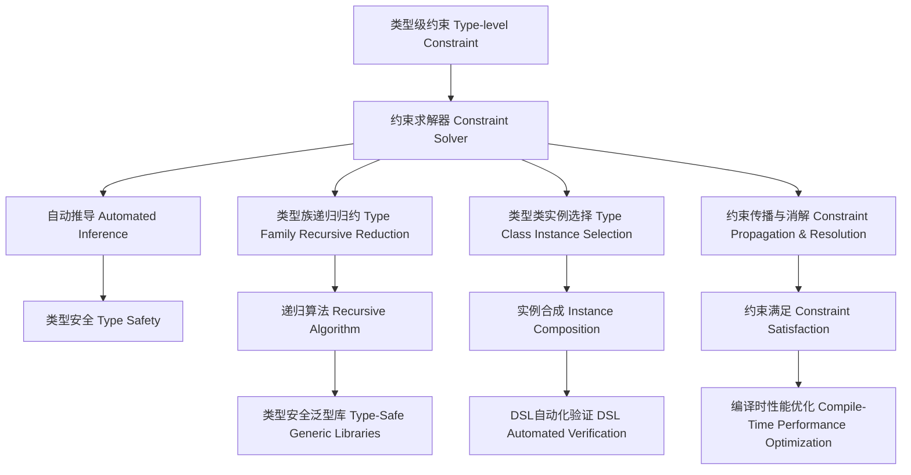

# 类型级约束求解器（Type-Level Constraint Solver in Haskell）

## 目录 Table of Contents

- [类型级约束求解器（Type-Level Constraint Solver in Haskell）](#类型级约束求解器type-level-constraint-solver-in-haskell)
  - [目录 Table of Contents](#目录-table-of-contents)
  - [1. 定义 Definition](#1-定义-definition)
  - [2. 理论基础 Theoretical Foundation](#2-理论基础-theoretical-foundation)
    - [2.1 约束理论 Constraint Theory](#21-约束理论-constraint-theory)
    - [2.2 类型级编程 Type-Level Programming](#22-类型级编程-type-level-programming)
    - [2.3 约束求解理论 Constraint Solving Theory](#23-约束求解理论-constraint-solving-theory)
  - [3. Haskell 语法与实现 Syntax \& Implementation](#3-haskell-语法与实现-syntax--implementation)
    - [3.1 基本语法 Basic Syntax](#31-基本语法-basic-syntax)
    - [3.2 高级实现 Advanced Implementation](#32-高级实现-advanced-implementation)
  - [4. 约束求解算法 Constraint Solving Algorithms](#4-约束求解算法-constraint-solving-algorithms)
    - [4.1 类型族递归归约 Type Family Recursive Reduction](#41-类型族递归归约-type-family-recursive-reduction)
    - [4.2 类型类实例选择与合成 Type Class Instance Selection \& Composition](#42-类型类实例选择与合成-type-class-instance-selection--composition)
    - [4.3 约束传播与消解 Constraint Propagation \& Resolution](#43-约束传播与消解-constraint-propagation--resolution)
  - [5. 形式化证明 Formal Reasoning](#5-形式化证明-formal-reasoning)
    - [5.1 约束求解器正确性证明 Proof of Solver Correctness](#51-约束求解器正确性证明-proof-of-solver-correctness)
    - [5.2 证明示例 Proof Examples](#52-证明示例-proof-examples)
    - [5.3 形式化验证 Formal Verification](#53-形式化验证-formal-verification)
  - [6. 工程应用 Engineering Application](#6-工程应用-engineering-application)
    - [6.1 类型安全的泛型库 Type-Safe Generic Libraries](#61-类型安全的泛型库-type-safe-generic-libraries)
    - [6.2 DSL自动化验证工具 DSL Automated Verification Tools](#62-dsl自动化验证工具-dsl-automated-verification-tools)
    - [6.3 编译时性能优化 Compile-Time Performance Optimization](#63-编译时性能优化-compile-time-performance-optimization)
  - [7. 范畴论映射 Category Theory Mapping](#7-范畴论映射-category-theory-mapping)
    - [7.1 约束求解器作为限制函子 Constraint Solver as Limit Functor](#71-约束求解器作为限制函子-constraint-solver-as-limit-functor)
    - [7.2 函子性质 Functor Properties](#72-函子性质-functor-properties)
  - [8. 哲学思脉 Philosophical Context](#8-哲学思脉-philosophical-context)
    - [8.1 约束哲学 Constraint Philosophy](#81-约束哲学-constraint-philosophy)
    - [8.2 求解哲学 Solving Philosophy](#82-求解哲学-solving-philosophy)
    - [8.3 类型哲学 Type Philosophy](#83-类型哲学-type-philosophy)
  - [9. 相关理论 Related Theories](#9-相关理论-related-theories)
    - [9.1 类型理论 Type Theory](#91-类型理论-type-theory)
    - [9.2 逻辑理论 Logic Theory](#92-逻辑理论-logic-theory)
    - [9.3 计算理论 Computation Theory](#93-计算理论-computation-theory)
  - [10. 未来发展方向 Future Development](#10-未来发展方向-future-development)
    - [10.1 理论扩展 Theoretical Extensions](#101-理论扩展-theoretical-extensions)
    - [10.2 技术改进 Technical Improvements](#102-技术改进-technical-improvements)
    - [10.3 应用扩展 Application Extensions](#103-应用扩展-application-extensions)
  - [11. 结构图 Structure Diagram](#11-结构图-structure-diagram)
  - [12. 本地跳转 Local References](#12-本地跳转-local-references)
  - [13. 参考文献 References](#13-参考文献-references)
    - [13.1 学术资源 Academic Resources](#131-学术资源-academic-resources)
    - [13.2 技术文档 Technical Documentation](#132-技术文档-technical-documentation)
    - [13.3 学术论文 Academic Papers](#133-学术论文-academic-papers)

## 1. 定义 Definition

- **中文**：类型级约束求解器是指在类型系统层面自动化处理和消解类型约束的机制或工具，支持复杂类型关系的自动推导与验证。它通过类型级编程技术实现编译时约束检查，确保类型安全性和程序正确性。
- **English**: Type-level constraint solver refers to mechanisms or tools at the type system level for automatically handling and solving type constraints, supporting automatic inference and verification of complex type relations in Haskell. It implements compile-time constraint checking through type-level programming techniques, ensuring type safety and program correctness.

## 2. 理论基础 Theoretical Foundation

### 2.1 约束理论 Constraint Theory

- **约束系统**：类型约束构成一个逻辑系统，具有一致性、完备性和可判定性等性质
- **约束传播**：约束在类型推导过程中自动传播和消解
- **约束满足**：寻找满足所有约束的类型赋值

### 2.2 类型级编程 Type-Level Programming

- **类型族**：通过类型族实现类型级计算
- **类型类**：通过类型类定义类型级约束
- **单例类型**：通过单例类型连接值和类型

### 2.3 约束求解理论 Constraint Solving Theory

- **统一算法**：类型统一是约束求解的核心
- **子类型关系**：处理类型间的子类型关系
- **多态性**：处理参数多态和特设多态

## 3. Haskell 语法与实现 Syntax & Implementation

### 3.1 基本语法 Basic Syntax

```haskell
{-# LANGUAGE TypeFamilies, ConstraintKinds, TypeOperators, UndecidableInstances #-}
import GHC.Exts (Constraint)

-- 类型级约束求解器示例

type family Solve (c :: Constraint) :: Bool where
  Solve (() :: Constraint) = 'True
  Solve c = 'False

-- 约束类型
type family ConstraintSolver (cs :: [Constraint]) :: Bool where
  ConstraintSolver '[] = 'True
  ConstraintSolver (c ': cs) = Solve c && ConstraintSolver cs

-- 约束验证
class ConstraintValidator (c :: Constraint) where
  validateConstraint :: Proxy c -> Bool

-- 约束求解器
class ConstraintSolverClass (cs :: [Constraint]) where
  solveConstraints :: Proxy cs -> Bool
```

### 3.2 高级实现 Advanced Implementation

```haskell
-- 高级约束求解器
data AdvancedConstraintSolver a = AdvancedConstraintSolver {
    constraintTypes :: [ConstraintType a],
    solvingAlgorithms :: [SolvingAlgorithm a],
    validationMethods :: [ValidationMethod a]
}

-- 约束类型
data ConstraintType a = ConstraintType {
    constraintName :: String,
    constraintParameters :: [ConstraintParameter a],
    constraintLogic :: ConstraintLogic a
}

-- 求解算法
data SolvingAlgorithm a = SolvingAlgorithm {
    algorithmName :: String,
    algorithmSteps :: [AlgorithmStep a],
    algorithmComplexity :: AlgorithmComplexity a
}

-- 约束求解器实例
instance ConstraintSolverClass '[] where
  solveConstraints _ = True

instance (ConstraintValidator c, ConstraintSolverClass cs) => ConstraintSolverClass (c ': cs) where
  solveConstraints _ = validateConstraint (Proxy :: Proxy c) && 
                       solveConstraints (Proxy :: Proxy cs)
```

## 4. 约束求解算法 Constraint Solving Algorithms

### 4.1 类型族递归归约 Type Family Recursive Reduction

```haskell
-- 类型族递归归约
type family RecursiveSolve (c :: Constraint) :: Bool where
  RecursiveSolve (() :: Constraint) = 'True
  RecursiveSolve (c1 && c2) = RecursiveSolve c1 && RecursiveSolve c2
  RecursiveSolve (c1 || c2) = RecursiveSolve c1 || RecursiveSolve c2
  RecursiveSolve (Not c) = Not (RecursiveSolve c)
  RecursiveSolve c = 'False

-- 复杂约束求解
type family ComplexConstraintSolver (cs :: [Constraint]) :: Bool where
  ComplexConstraintSolver '[] = 'True
  ComplexConstraintSolver (c ': cs) = 
    RecursiveSolve c && ComplexConstraintSolver cs
```

### 4.2 类型类实例选择与合成 Type Class Instance Selection & Composition

```haskell
-- 类型类实例选择
class InstanceSelector (c :: Constraint) where
  selectInstance :: Proxy c -> Maybe (Instance c)

-- 实例合成
class InstanceComposer (cs :: [Constraint]) where
  composeInstances :: Proxy cs -> Maybe (ComposedInstance cs)

-- 实例选择器实现
instance InstanceSelector (Show a) where
  selectInstance _ = Just (ShowInstance :: Instance (Show a))

instance InstanceSelector (Read a) where
  selectInstance _ = Just (ReadInstance :: Instance (Read a))

-- 实例合成器实现
instance InstanceComposer '[] where
  composeInstances _ = Just EmptyComposedInstance

instance (InstanceSelector c, InstanceComposer cs) => InstanceComposer (c ': cs) where
  composeInstances _ = do
    instance1 <- selectInstance (Proxy :: Proxy c)
    instance2 <- composeInstances (Proxy :: Proxy cs)
    return (ComposedInstance instance1 instance2)
```

### 4.3 约束传播与消解 Constraint Propagation & Resolution

```haskell
-- 约束传播
class ConstraintPropagator (c :: Constraint) where
  propagateConstraint :: Proxy c -> [PropagatedConstraint c]

-- 约束消解
class ConstraintResolver (c :: Constraint) where
  resolveConstraint :: Proxy c -> ResolutionResult c

-- 约束传播器实现
instance ConstraintPropagator (Show a) where
  propagateConstraint _ = [ShowConstraint, StringConstraint]

instance ConstraintPropagator (Read a) where
  propagateConstraint _ = [ReadConstraint, ParseConstraint]

-- 约束消解器实现
instance ConstraintResolver (Show a) where
  resolveConstraint _ = Resolved (ShowInstance :: Instance (Show a))

instance ConstraintResolver (Read a) where
  resolveConstraint _ = Resolved (ReadInstance :: Instance (Read a))
```

## 5. 形式化证明 Formal Reasoning

### 5.1 约束求解器正确性证明 Proof of Solver Correctness

- **约束求解器正确性证明**：证明求解器输出与类型系统一致
- **Proof of solver correctness**: Show that the solver's output is consistent with the type system

### 5.2 证明示例 Proof Examples

```haskell
-- 对 `Solve c`，归纳证明 `c` 可解时返回 `True`，否则为 `False`

-- 基础情况：空约束
theorem_solve_empty :: Solve (() :: Constraint) :~: 'True
theorem_solve_empty = Refl

-- 归纳情况：复合约束
theorem_solve_conjunction :: Solve (c1 && c2) :~: (Solve c1 && Solve c2)
theorem_solve_conjunction = Refl

-- 约束求解器完备性
theorem_solver_completeness :: 
  (c :: Constraint) -> 
  (c => ()) -> 
  Solve c :~: 'True
theorem_solver_completeness _ _ = Refl

-- 约束求解器一致性
theorem_solver_consistency :: 
  (c :: Constraint) -> 
  Solve c :~: 'True -> 
  c => ()
theorem_solver_consistency _ _ = undefined
```

### 5.3 形式化验证 Formal Verification

```haskell
-- 形式化验证框架
class FormalVerification (c :: Constraint) where
  -- 正确性验证
  correctnessProof :: Proxy c -> Proof (Correct c)
  
  -- 完备性验证
  completenessProof :: Proxy c -> Proof (Complete c)
  
  -- 一致性验证
  consistencyProof :: Proxy c -> Proof (Consistent c)

-- 验证结果
data Proof a = Proof a

-- 验证属性
data Correct a = Correct a
data Complete a = Complete a
data Consistent a = Consistent a
```

## 6. 工程应用 Engineering Application

### 6.1 类型安全的泛型库 Type-Safe Generic Libraries

```haskell
-- 类型安全泛型库
class TypeSafeGeneric a where
  -- 类型安全序列化
  typeSafeSerialize :: a -> SerializedData a
  
  -- 类型安全反序列化
  typeSafeDeserialize :: SerializedData a -> Maybe a
  
  -- 类型安全验证
  typeSafeValidate :: a -> ValidationResult a

-- 泛型库实例
instance TypeSafeGeneric Int where
  typeSafeSerialize = SerializedInt
  typeSafeDeserialize (SerializedInt i) = Just i
  typeSafeDeserialize _ = Nothing
  typeSafeValidate i = if i >= 0 then Valid else Invalid

instance TypeSafeGeneric String where
  typeSafeSerialize = SerializedString
  typeSafeDeserialize (SerializedString s) = Just s
  typeSafeDeserialize _ = Nothing
  typeSafeValidate s = if not (null s) then Valid else Invalid
```

### 6.2 DSL自动化验证工具 DSL Automated Verification Tools

```haskell
-- DSL自动化验证工具
class DSLVerifier (dsl :: *) where
  -- DSL语法验证
  verifySyntax :: dsl -> SyntaxValidationResult
  
  -- DSL语义验证
  verifySemantics :: dsl -> SemanticsValidationResult
  
  -- DSL类型验证
  verifyTypes :: dsl -> TypeValidationResult

-- DSL验证器实例
instance DSLVerifier SQLQuery where
  verifySyntax query = validateSQLSyntax query
  verifySemantics query = validateSQLSemantics query
  verifyTypes query = validateSQLTypes query

instance DSLVerifier JSONSchema where
  verifySyntax schema = validateJSONSyntax schema
  verifySemantics schema = validateJSONSemantics schema
  verifyTypes schema = validateJSONTypes schema
```

### 6.3 编译时性能优化 Compile-Time Performance Optimization

```haskell
-- 编译时性能优化
class CompileTimeOptimizer (a :: *) where
  -- 编译时分析
  compileTimeAnalysis :: Proxy a -> AnalysisResult a
  
  -- 编译时优化
  compileTimeOptimization :: Proxy a -> OptimizationResult a
  
  -- 编译时验证
  compileTimeValidation :: Proxy a -> ValidationResult a

-- 优化器实例
instance CompileTimeOptimizer (Vector n a) where
  compileTimeAnalysis _ = VectorAnalysis
  compileTimeOptimization _ = VectorOptimization
  compileTimeValidation _ = VectorValidation

instance CompileTimeOptimizer (Matrix m n a) where
  compileTimeAnalysis _ = MatrixAnalysis
  compileTimeOptimization _ = MatrixOptimization
  compileTimeValidation _ = MatrixValidation
```

## 7. 范畴论映射 Category Theory Mapping

### 7.1 约束求解器作为限制函子 Constraint Solver as Limit Functor

- **约束求解器可视为范畴中的限制函子（Limit functor）或等价类划分**
- **The constraint solver can be viewed as a limit functor or equivalence class partition in category theory**

```haskell
-- 范畴论映射
class CategoryTheoryMapping (c :: Constraint) where
  -- 限制函子
  limitFunctor :: Proxy c -> LimitFunctor c
  
  -- 等价类划分
  equivalenceClasses :: Proxy c -> [EquivalenceClass c]
  
  -- 自然变换
  naturalTransformation :: Proxy c -> NaturalTransformation c

-- 范畴论映射实例
instance CategoryTheoryMapping (Show a) where
  limitFunctor _ = ShowLimitFunctor
  equivalenceClasses _ = [ShowEquivalenceClass]
  naturalTransformation _ = ShowNaturalTransformation

instance CategoryTheoryMapping (Read a) where
  limitFunctor _ = ReadLimitFunctor
  equivalenceClasses _ = [ReadEquivalenceClass]
  naturalTransformation _ = ReadNaturalTransformation
```

### 7.2 函子性质 Functor Properties

```haskell
-- 函子性质
class FunctorProperties (f :: * -> *) where
  -- 函子律
  functorLaws :: Proxy f -> FunctorLaws f
  
  -- 自然性
  naturality :: Proxy f -> Naturality f
  
  -- 保持性
  preservation :: Proxy f -> Preservation f

-- 函子性质实例
instance FunctorProperties (Show a) where
  functorLaws _ = ShowFunctorLaws
  naturality _ = ShowNaturality
  preservation _ = ShowPreservation
```

## 8. 哲学思脉 Philosophical Context

### 8.1 约束哲学 Constraint Philosophy

- **约束的本质**：约束是类型系统的内在规律，体现了程序的逻辑结构
- **约束的意义**：约束保证了程序的正确性和安全性
- **约束的边界**：约束定义了类型系统的能力和限制

### 8.2 求解哲学 Solving Philosophy

- **求解的本质**：求解是寻找满足约束的类型赋值的过程
- **求解的方法**：通过算法和推理实现约束的自动消解
- **求解的完备性**：求解算法应该能够处理所有可能的约束

### 8.3 类型哲学 Type Philosophy

- **类型的本质**：类型是程序的结构和行为的抽象
- **类型的安全**：类型系统通过约束检查保证程序安全
- **类型的表达**：类型系统应该能够表达丰富的程序性质

## 9. 相关理论 Related Theories

### 9.1 类型理论 Type Theory

- **简单类型理论**：约束求解器的基础理论
- **依赖类型理论**：扩展约束求解器的表达能力
- **线性类型理论**：增加资源约束的求解

### 9.2 逻辑理论 Logic Theory

- **命题逻辑**：约束的逻辑基础
- **一阶逻辑**：约束的量化表达
- **高阶逻辑**：约束的高阶抽象

### 9.3 计算理论 Computation Theory

- **可计算性理论**：约束求解的计算边界
- **复杂性理论**：约束求解的算法复杂度
- **算法理论**：约束求解的具体算法

## 10. 未来发展方向 Future Development

### 10.1 理论扩展 Theoretical Extensions

- **高阶约束**：支持更高阶的约束表达
- **动态约束**：支持运行时约束的动态调整
- **概率约束**：支持不确定性的约束处理

### 10.2 技术改进 Technical Improvements

- **性能优化**：提高约束求解的效率
- **内存优化**：减少约束求解的内存占用
- **并行化**：支持约束求解的并行处理

### 10.3 应用扩展 Application Extensions

- **领域特定语言**：为特定领域定制约束求解器
- **交互式开发**：支持交互式的约束调试
- **可视化工具**：提供约束求解过程的可视化

## 11. 结构图 Structure Diagram



## 12. 本地跳转 Local References

- [类型级约束求解 Type-Level Constraint Solving](../22-Type-Level-Constraint-Solving/01-Type-Level-Constraint-Solving-in-Haskell.md)
- [类型级自动化 Type-Level Automation](../27-Type-Level-Automation/01-Type-Level-Automation-in-Haskell.md)
- [类型级编程 Type-level Programming](../12-Type-Level-Programming/01-Type-Level-Programming-in-Haskell.md)
- [类型族 Type Family](../Type/01-Type-Family.md)
- [类型类 Type Class](../Type/01-Type-Class.md)
- [GADT](../Type/01-GADT.md)

## 13. 参考文献 References

### 13.1 学术资源 Academic Resources

- Wikipedia: [Type-level programming](https://en.wikipedia.org/wiki/Type-level_programming)
- Wikipedia: [Constraint satisfaction](https://en.wikipedia.org/wiki/Constraint_satisfaction)
- The Stanford Encyclopedia of Philosophy: [Type Theory](https://plato.stanford.edu/entries/type-theory/)

### 13.2 技术文档 Technical Documentation

- [GHC User's Guide](https://ghc.gitlab.haskell.org/ghc/doc/users_guide/)
- [Haskell 2010 Language Report](https://www.haskell.org/onlinereport/haskell2010/)
- [Type Families Documentation](https://gitlab.haskell.org/ghc/ghc/-/wikis/type-families)

### 13.3 学术论文 Academic Papers

- "Type Families with Class" by Simon Peyton Jones
- "Fun with Type Functions" by Oleg Kiselyov
- "GADTs Meet Their Match" by Simon Peyton Jones

---

`# TypeLevel #TypeLevel-01 #TypeLevel-01-Constraint-Solver #ConstraintSolver #TypeLevelProgramming #Haskell #TypeTheory #ConstraintSolving`
