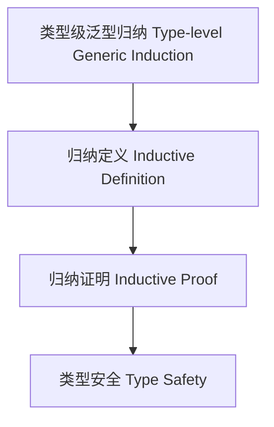

# 类型级泛型归纳（Type-Level Generic Induction in Haskell）

## 定义 Definition

- **中文**：类型级泛型归纳是指在类型系统层面对泛型类型和算法进行归纳定义和归纳证明的机制，支持类型安全的泛型编程与自动化推理。
- **English**: Type-level generic induction refers to mechanisms at the type system level for inductively defining and proving properties of generic types and algorithms, supporting type-safe generic programming and automated reasoning in Haskell.

## Haskell 语法与实现 Syntax & Implementation

```haskell
{-# LANGUAGE TypeFamilies, DataKinds, TypeOperators, GADTs #-}

-- 类型级泛型归纳示例：类型级列表长度

type family Length (xs :: [k]) :: Nat where
  Length '[] = 0
  Length (x ': xs) = 1 + Length xs
```

## 泛型归纳机制 Generic Induction Mechanism

- 类型族递归归纳、类型类泛型约束
- 支持类型级泛型算法的归纳定义与证明

## 形式化证明 Formal Reasoning

- **泛型归纳正确性证明**：归纳证明 Length xs 总能正确计算列表长度
- **Proof of correctness for generic induction**: Inductive proof that Length xs always computes the correct list length

### 证明示例 Proof Example

- 对 `Length xs`，对 `xs` 归纳：
  - 基础：`xs = []`，`Length [] = 0` 成立
  - 归纳：假设 `Length xs` 成立，则 `Length (x:xs) = 1 + Length xs` 也成立

## 工程应用 Engineering Application

- 类型安全的泛型库、自动化推理、DSL 框架
- Type-safe generic libraries, automated reasoning, DSL frameworks

## 结构图 Structure Diagram



## 本地跳转 Local References

- [类型级泛型 Type-level Generic](../24-Type-Level-Generic/01-Type-Level-Generic-in-Haskell.md)
- [类型级归纳与递归 Type-Level Induction & Recursion](../23-Type-Level-Induction/01-Type-Level-Induction-in-Haskell.md)
- [类型级泛型推理 Type-Level Generic Inference](../43-Type-Level-Generic-Inference/01-Type-Level-Generic-Inference-in-Haskell.md)
