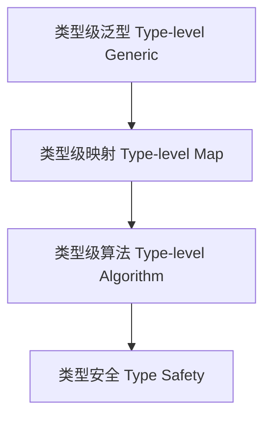

# 类型级泛型（Type-Level Generic in Haskell）

## 定义 Definition

- **中文**：类型级泛型是指在类型系统层面实现对多种类型结构的统一抽象与操作，支持类型级的通用编程与类型安全的泛型算法。
- **English**: Type-level generic refers to the abstraction and manipulation of various type structures at the type system level, enabling generic programming and type-safe generic algorithms at the type level in Haskell.

## Haskell 语法与实现 Syntax & Implementation

```haskell
{-# LANGUAGE TypeFamilies, DataKinds, TypeOperators, GADTs, KindSignatures #-}

-- 类型级泛型列表映射

type family Map (f :: k -> l) (xs :: [k]) :: [l] where
  Map f '[] = '[]
  Map f (x ': xs) = f x ': Map f xs
```

## 类型级泛型编程 Type-Level Generic Programming

- 类型级映射、折叠、过滤等通用操作
- 支持类型安全的泛型容器、类型级算法

## 形式化证明 Formal Reasoning

- **类型级泛型操作的正确性证明**：如归纳证明 Map 保持类型结构一致性
- **Proof of correctness for type-level generic operations**: e.g., inductive proof that Map preserves type structure

### 证明示例 Proof Example

- 对 `Map f xs`，对 `xs` 归纳：
  - 基础：`xs = []`，`Map f [] = []` 成立
  - 归纳：假设 `Map f xs` 成立，则 `Map f (x:xs) = f x : Map f xs` 也成立

## 工程应用 Engineering Application

- 类型安全的泛型容器、类型级算法库、DSL 框架
- Type-safe generic containers, type-level algorithm libraries, DSL frameworks

## 范畴论映射 Category Theory Mapping

- 类型级泛型映射对应于函子（Functor）在类型范畴上的作用

## 结构图 Structure Diagram



## 本地跳转 Local References

- [类型级编程 Type-level Programming](../12-Type-Level-Programming/01-Type-Level-Programming-in-Haskell.md)
- [高阶类型 Higher-Kinded Types](../08-Higher-Kinded-Types/01-Higher-Kinded-Types-in-Haskell.md)
- [GADT](../09-GADT/01-GADT-in-Haskell.md)
