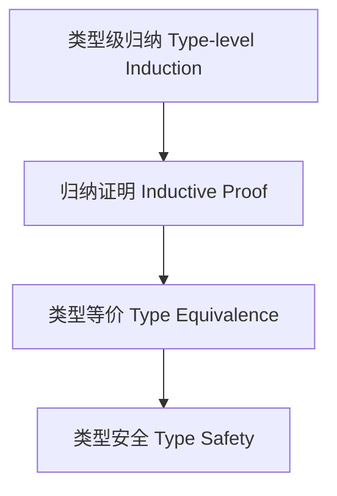

# 类型级归纳证明（Type-Level Inductive Proof in Haskell）

## 定义 Definition

- **中文**：类型级归纳证明是指在类型系统层面通过归纳法对类型关系、类型等价、类型安全等性质进行形式化证明的方法。
- **English**: Type-level inductive proof refers to formal methods at the type system level for proving properties such as type relations, type equivalence, and type safety using induction in Haskell.

## Haskell 语法与实现 Syntax & Implementation

```haskell
{-# LANGUAGE TypeFamilies, DataKinds, TypeOperators, UndecidableInstances #-}
import GHC.TypeLits

-- 类型级归纳证明示例：类型级加法的归纳证明

type family Add (a :: Nat) (b :: Nat) :: Nat where
  Add 0 b = b
  Add a b = 1 + Add (a - 1) b

-- 归纳证明 Add a b = Add b a
-- 省略具体证明代码，理论上可用类型等价与归纳法表达
```

## 归纳证明方法 Inductive Proof Methods

- 基础情形与归纳情形分解
- 类型等价与类型安全的归纳证明
- 类型族递归归纳

## 形式化推理 Formal Reasoning

- **类型级归纳证明的严谨性**：每一步都需保证类型系统一致性
- **Rigorousness of type-level inductive proof**: Each step must preserve type system consistency

### 证明示例 Proof Example

- 对 `Add a b`，对 `a` 归纳：
  - 基础：`a=0`，`Add 0 b = b` 成立
  - 归纳：假设 `Add (a-1) b` 成立，则 `Add a b = 1 + Add (a-1) b` 也成立

## 工程应用 Engineering Application

- 类型安全性证明、类型等价性验证、泛型算法正确性证明
- Type safety proofs, type equivalence validation, generic algorithm correctness proofs

## 范畴论映射 Category Theory Mapping

- 类型级归纳证明对应于初始代数（Initial algebra）上的归纳原理

## 结构图 Structure Diagram



## 本地跳转 Local References

- [类型级归纳与递归 Type-Level Induction & Recursion](../23-Type-Level-Induction/01-Type-Level-Induction-in-Haskell.md)
- [类型级证明 Type-Level Proof](../17-Type-Level-Proof/01-Type-Level-Proof-in-Haskell.md)
- [类型安全 Type Safety](../14-Type-Safety/01-Type-Safety-in-Haskell.md)
