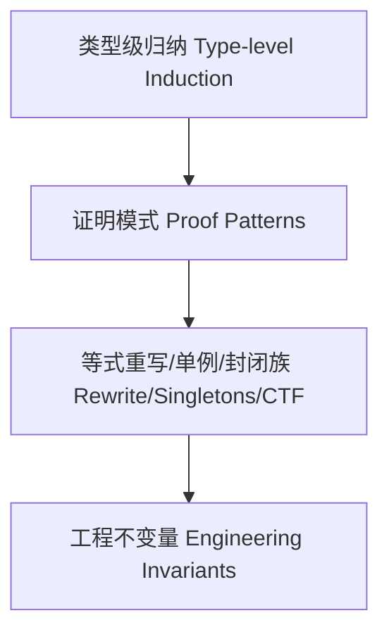

# 类型级归纳证明（Type-Level Inductive Proof in Haskell）

> 对标 Wikipedia/nLab 与教材：给出定义、原理、证明模式、Haskell 示例与工程应用，双语。

## 定义 Definition

- 中文：类型级归纳证明是在类型系统层面对索引数据/类型族递归进行归纳，以证明不变量（等价、安全、覆盖等）。
- English: Type-level inductive proof performs induction at the type level over indexed data/type-family recursion to establish invariants (equality, safety, coverage, etc.).

## 归纳原理 Induction Principles

- 基础情形 Base case：对最小构造（如 Z、[]、Unit）直接证明性质
- 归纳情形 Inductive step：假设对较小结构成立，推出对组合构造成立
- 结构归纳/强归纳 Structural/Strong induction：对 GADT/索引族根据构造器进行分类证明

## Haskell 语法与实现 Syntax & Implementation

```haskell
{-# LANGUAGE DataKinds, GADTs, TypeFamilies, TypeOperators, UndecidableInstances #-}

data Nat = Z | S Nat

-- 类型级加法（以归纳定义）
type family Add (a :: Nat) (b :: Nat) :: Nat where
  Add 'Z     b = b
  Add ('S a) b = 'S (Add a b)

-- 归纳证明样式：证明 Add a 'Z = a
-- 以布尔性质刻画证明目标（可与等价证据 :~: 配合）
type family AddZeroRight (a :: Nat) :: Bool where
  AddZeroRight 'Z     = 'True
  AddZeroRight ('S a) = AddZeroRight a

-- 单例桥接：在值层复用类型层的归纳结构

data SNat (n :: Nat) where
  SZ :: SNat 'Z
  SS :: SNat n -> SNat ('S n)

replicateVec :: SNat n -> a -> [a]  -- 示例：利用单例进行结构化递归
replicateVec SZ     _ = []
replicateVec (SS k) x = x : replicateVec k x
```

### 证明模式 Proof Patterns

- 等式重写（rewrite with :~:）：以 Refl 作为同一性证据实现替换
- 单例（Singletons）桥接：以 SNat n 见证类型层的归纳假设在值层展开
- 封闭类型族：以穷举分支进行“按构造器归纳”的等式约简

## 形式化推理 Formal Reasoning

- 严谨性：保持一致性（coherence）与终止性（termination）
- 覆盖性：每个构造器均被证明覆盖
- 与 GADTs/TF 的协同：在构造器上精化索引，归纳假设随之细化

## 工程应用 Engineering Application

- 向量/矩阵维度、协议状态机、权限/能力、AST 不变量的编译期证明
- 泛型库安全化：以类型级证明约束暴露 API 的可用状态

## 范畴论映射 Category Theory Mapping

- 初始代数上的归纳原理；W‑types 与归纳族对应普遍性

## 结构图 Structure Diagram



## 本地跳转 Local References

- [类型级归纳与递归 Type-Level Induction & Recursion](../23-Type-Level-Induction/01-Type-Level-Induction-in-Haskell.md)
- [类型级证明 Type-Level Proof](../17-Type-Level-Proof/01-Type-Level-Proof-in-Haskell.md)
- [类型安全 Type Safety](../14-Type-Safety/01-Type-Safety-in-Haskell.md)
