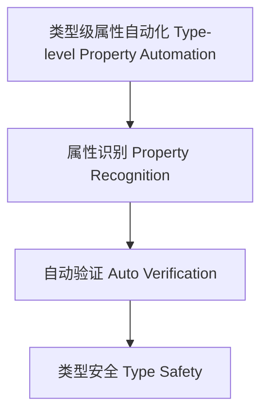

# 类型级属性自动化（Type-Level Property Automation in Haskell）

## 定义 Definition

- **中文**：类型级属性自动化是指在类型系统层面自动推导、验证和管理类型属性的机制，提升类型安全和编译期验证能力。
- **English**: Type-level property automation refers to mechanisms at the type system level for automatically inferring, verifying, and managing type properties, enhancing type safety and compile-time verification in Haskell.

## Haskell 语法与实现 Syntax & Implementation

```haskell
{-# LANGUAGE TypeFamilies, DataKinds, TypeOperators, GADTs #-}

-- 类型级属性自动化示例：自动判断类型是否为列表

type family IsList (a :: *) :: Bool where
  IsList [a] = 'True
  IsList a   = 'False
```

## 属性自动化机制 Property Automation Mechanism

- 类型族递归推导、类型类属性分析
- 支持类型属性的自动识别、验证与管理

## 形式化证明 Formal Reasoning

- **属性自动化正确性证明**：证明自动化机制能准确识别和验证类型属性
- **Proof of correctness for property automation**: Show that the automation mechanism accurately identifies and verifies type properties

### 证明示例 Proof Example

- 对 `IsList a`，若 a 为列表类型则为 True，否则为 False

## 工程应用 Engineering Application

- 类型安全的泛型库、自动化验证、DSL 框架
- Type-safe generic libraries, automated verification, DSL frameworks

## 结构图 Structure Diagram



## 本地跳转 Local References

- [类型级属性推导 Type-Level Property Inference](../42-Type-Level-Property-Inference/01-Type-Level-Property-Inference-in-Haskell.md)
- [类型级自动化验证 Type-Level Automated Verification](../49-Type-Level-Automated-Verification/01-Type-Level-Automated-Verification-in-Haskell.md)
- [类型安全 Type Safety](../14-Type-Safety/01-Type-Safety-in-Haskell.md)
