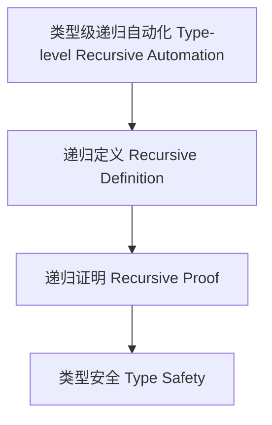

# 类型级递归自动化（Type-Level Recursive Automation in Haskell）

## 定义 Definition

- **中文**：类型级递归自动化是指在类型系统层面自动递归定义、递归推理和递归验证类型关系与属性的机制，提升类型安全和编译期验证能力。
- **English**: Type-level recursive automation refers to mechanisms at the type system level for automatically recursively defining, reasoning, and verifying type relations and properties, enhancing type safety and compile-time verification in Haskell.

## Haskell 语法与实现 Syntax & Implementation

```haskell
{-# LANGUAGE TypeFamilies, DataKinds, TypeOperators, GADTs #-}

-- 类型级递归自动化示例：类型级列表长度递归

type family Length (xs :: [k]) :: Nat where
  Length '[] = 0
  Length (x ': xs) = 1 + Length xs
```

## 递归自动化机制 Recursive Automation Mechanism

- 类型族递归定义、类型类递归推理
- 支持类型关系与属性的自动递归定义与证明

## 形式化证明 Formal Reasoning

- **递归自动化正确性证明**：归纳证明 Length xs 总能正确计算列表长度
- **Proof of correctness for recursive automation**: Inductive proof that Length xs always computes the correct list length

### 证明示例 Proof Example

- 对 `Length xs`，对 `xs` 归纳：
  - 基础：`xs = []`，`Length [] = 0` 成立
  - 归纳：假设 `Length xs` 成立，则 `Length (x:xs) = 1 + Length xs` 也成立

## 工程应用 Engineering Application

- 类型安全的自动化推理、泛型库、DSL 框架
- Type-safe automated reasoning, generic libraries, DSL frameworks

## 结构图 Structure Diagram



## 本地跳转 Local References

- [类型级递归优化 Type-Level Recursion Optimization](../31-Type-Level-Recursion-Optimization/01-Type-Level-Recursion-Optimization-in-Haskell.md)
- [类型级归纳与递归 Type-Level Induction & Recursion](../23-Type-Level-Induction/01-Type-Level-Induction-in-Haskell.md)
- [类型安全 Type Safety](../14-Type-Safety/01-Type-Safety-in-Haskell.md)
