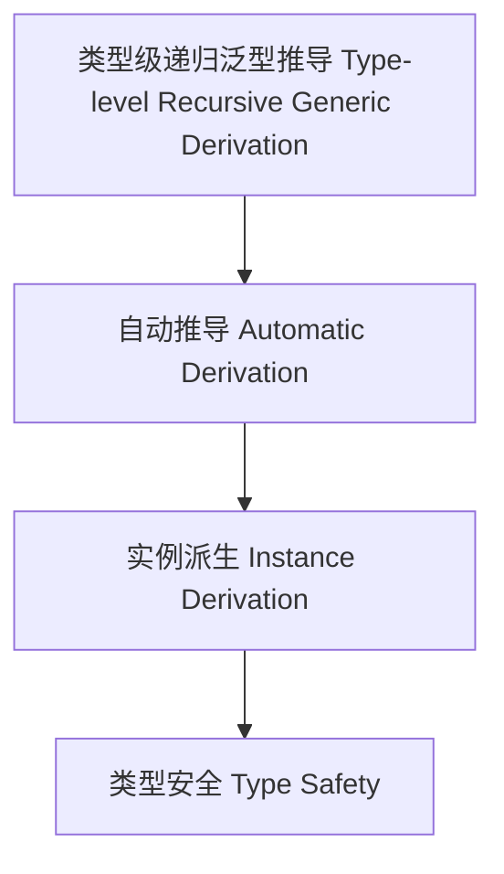

# 类型级递归泛型推导（Type-Level Recursive Generic Derivation in Haskell）

## 定义 Definition

- **中文**：类型级递归泛型推导是指在类型系统层面对递归泛型结构和算法进行类型级别自动推导与派生的机制。
- **English**: Type-level recursive generic derivation refers to mechanisms at the type system level for automatically deriving and inferring recursive generic structures and algorithms in Haskell.

## Haskell 语法与实现 Syntax & Implementation

```haskell
{-# LANGUAGE TypeFamilies, DataKinds, TypeOperators, GADTs #-}

-- 递归泛型推导示例：类型级自动派生 Show 实例
class GShow a where
  gshow :: a -> String

data Tree a = Leaf a | Node (Tree a) (Tree a)

instance Show a => GShow (Tree a) where
  gshow (Leaf x) = "Leaf " ++ show x
  gshow (Node l r) = "Node (" ++ gshow l ++ ", " ++ gshow r ++ ")"
```

## 推导机制 Derivation Mechanism

- 类型级自动推导、实例派生、递归泛型结构自动生成
- 支持类型安全的自动化泛型推导

## 形式化证明 Formal Reasoning

- **推导一致性证明**：自动推导的实例与手写实例等价
- **Proof of derivation consistency**: Automatically derived instances are equivalent to handwritten ones

### 证明示例 Proof Example

- 对 `GShow (Tree a)`，递归归纳每个构造器，自动推导与手写一致

## 工程应用 Engineering Application

- 类型安全的递归泛型推导、自动化实例生成、泛型库
- Type-safe recursive generic derivation, automated instance generation, generic libraries

## 结构图 Structure Diagram



## 本地跳转 Local References

- [类型级递归泛型实例 Type-Level Recursive Generic Instance](../77-Type-Level-Recursive-Generic-Instance/01-Type-Level-Recursive-Generic-Instance-in-Haskell.md)
- [类型级递归泛型算法 Type-Level Recursive Generic Algorithm](../72-Type-Level-Recursive-Generic-Algorithm/01-Type-Level-Recursive-Generic-Algorithm-in-Haskell.md)
- [类型安全 Type Safety](../14-Type-Safety/01-Type-Safety-in-Haskell.md)
