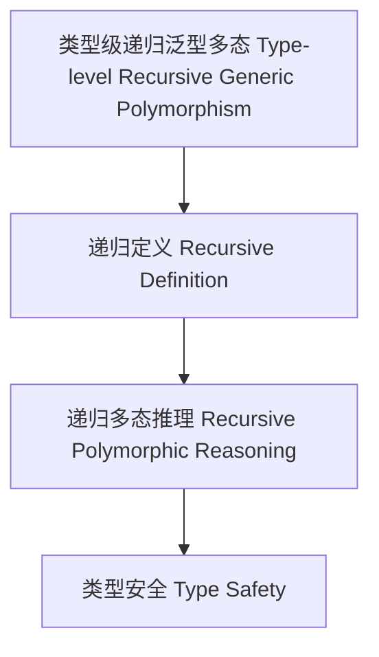

# 类型级递归泛型多态（Type-Level Recursive Generic Polymorphism in Haskell）

## 定义 Definition

- **中文**：类型级递归泛型多态是指在类型系统层面对泛型多态类型和算法进行递归定义、推理和验证的机制，支持类型安全的泛型编程与自动化推理。
- **English**: Type-level recursive generic polymorphism refers to mechanisms at the type system level for recursively defining, reasoning, and verifying polymorphic generic types and algorithms, supporting type-safe generic programming and automated reasoning in Haskell.

## Haskell 语法与实现 Syntax & Implementation

```haskell
{-# LANGUAGE TypeFamilies, DataKinds, TypeOperators, GADTs, RankNTypes #-}

-- 类型级递归泛型多态示例：递归多态映射

type family MapPoly (f :: forall a. a -> a) (xs :: [k]) :: [k] where
  MapPoly f '[] = '[]
  MapPoly f (x ': xs) = f x ': MapPoly f xs
```

## 递归泛型多态机制 Recursive Generic Polymorphism Mechanism

- 类型族递归定义、类型类递归多态推理
- 支持多态泛型类型和算法的递归定义、推理与验证

## 形式化证明 Formal Reasoning

- **递归泛型多态正确性证明**：归纳证明 MapPoly f xs 能正确映射所有元素
- **Proof of correctness for recursive generic polymorphism**: Inductive proof that MapPoly f xs correctly maps all elements

### 证明示例 Proof Example

- 对 `MapPoly f xs`，对 `xs` 递归归纳：
  - 基础：`xs = []`，`MapPoly f [] = []` 成立
  - 归纳：递归映射每个元素

## 工程应用 Engineering Application

- 类型安全的递归泛型多态库、自动化推理、DSL 框架
- Type-safe recursive polymorphic generic libraries, automated reasoning, DSL frameworks

## 结构图 Structure Diagram



## 本地跳转 Local References

- [类型级递归多态 Type-Level Recursive Polymorphism](../71-Type-Level-Recursive-Polymorphism/01-Type-Level-Recursive-Polymorphism-in-Haskell.md)
- [类型级递归泛型算法 Type-Level Recursive Generic Algorithm](../72-Type-Level-Recursive-Generic-Algorithm/01-Type-Level-Recursive-Generic-Algorithm-in-Haskell.md)
- [类型安全 Type Safety](../14-Type-Safety/01-Type-Safety-in-Haskell.md)
