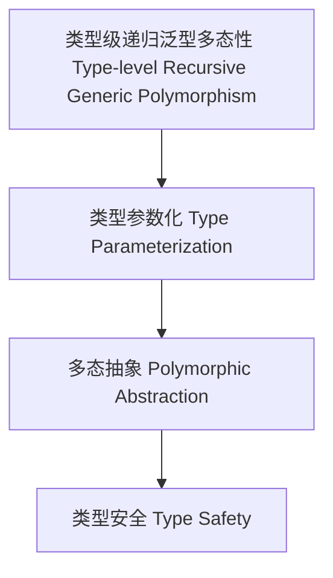

# 类型级递归泛型多态性（Type-Level Recursive Generic Polymorphism in Haskell）

## 定义 Definition

- **中文**：类型级递归泛型多态性是指在类型系统层面对递归泛型结构和算法实现多态抽象与类型参数化的机制。
- **English**: Type-level recursive generic polymorphism refers to mechanisms at the type system level for implementing polymorphic abstraction and type parameterization in recursive generic structures and algorithms in Haskell.

## Haskell 语法与实现 Syntax & Implementation

```haskell
{-# LANGUAGE GADTs, TypeFamilies, DataKinds, KindSignatures #-}

-- 递归泛型多态性示例：多态递归树

data PolyTree a where
  PLeaf :: a -> PolyTree a
  PNode :: PolyTree a -> PolyTree a -> PolyTree a

-- 类型级映射：对树中所有元素应用类型级函数

type family MapTree (f :: k -> l) (t :: PolyTree k) :: PolyTree l where
  MapTree f ('PLeaf x) = 'PLeaf (f x)
  MapTree f ('PNode l r) = 'PNode (MapTree f l) (MapTree f r)
```

## 递归泛型多态性机制 Recursive Generic Polymorphism Mechanism

- 类型参数化、类型级多态抽象、递归结构的多态映射
- 支持递归泛型结构的类型安全多态操作

## 形式化证明 Formal Reasoning

- **递归泛型多态性正确性证明**：归纳证明类型级多态映射的类型安全性
- **Proof of correctness for recursive generic polymorphism**: Inductive proof of type safety for type-level polymorphic mapping

### 证明示例 Proof Example

- 对 `MapTree f t` 递归归纳，`t = PLeaf` 时类型安全，`t = PNode l r` 时递归调用归纳成立

## 工程应用 Engineering Application

- 类型安全的递归泛型多态操作、类型级抽象、自动化泛型推导
- Type-safe recursive generic polymorphic operations, type-level abstraction, automated generic derivation

## 结构图 Structure Diagram



## 本地跳转 Local References

- [类型级递归多态性 Type-Level Recursive Polymorphism](../71-Type-Level-Recursive-Polymorphism/01-Type-Level-Recursive-Polymorphism-in-Haskell.md)
- [类型级递归泛型算法 Type-Level Recursive Generic Algorithm](../72-Type-Level-Recursive-Generic-Algorithm/01-Type-Level-Recursive-Generic-Algorithm-in-Haskell.md)
- [类型安全 Type Safety](../14-Type-Safety/01-Type-Safety-in-Haskell.md)
