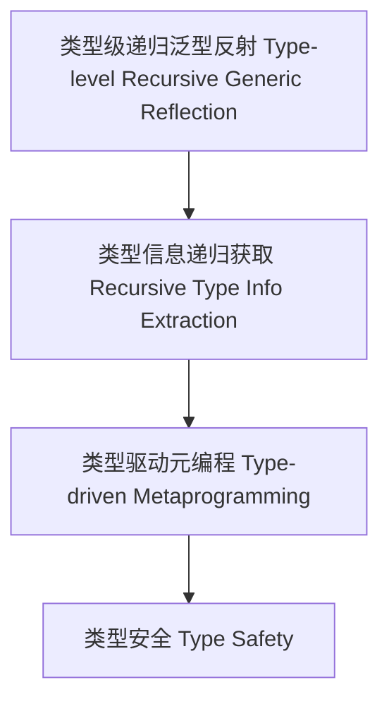

# 类型级递归泛型反射（Type-Level Recursive Generic Reflection in Haskell）

## 定义 Definition

- **中文**：类型级递归泛型反射是指在类型系统层面对泛型类型信息进行递归获取、分析和操作的机制，支持类型安全的元编程与自动化推理。
- **English**: Type-level recursive generic reflection refers to mechanisms at the type system level for recursively obtaining, analyzing, and manipulating generic type information, supporting type-safe metaprogramming and automated reasoning in Haskell.

## Haskell 语法与实现 Syntax & Implementation

```haskell
{-# LANGUAGE TypeApplications, TypeFamilies, ScopedTypeVariables, AllowAmbiguousTypes #-}
import Data.Proxy

-- 类型级递归泛型反射示例：递归获取嵌套泛型类型名
class TypeName a where
  typeName :: proxy a -> String

instance TypeName Int where
  typeName _ = "Int"

instance TypeName Bool where
  typeName _ = "Bool"

instance TypeName a => TypeName [a] where
  typeName _ = "List of " ++ typeName (Proxy :: Proxy a)

instance (TypeName a, TypeName b) => TypeName (a, b) where
  typeName _ = "Pair of (" ++ typeName (Proxy :: Proxy a) ++ ", " ++ typeName (Proxy :: Proxy b) ++ ")"
```

## 递归泛型反射机制 Recursive Generic Reflection Mechanism

- 类型类递归实例、类型族递归分析
- 支持嵌套泛型类型、复合类型的递归反射

## 形式化证明 Formal Reasoning

- **递归泛型反射一致性证明**：证明递归泛型反射机制不会破坏类型安全
- **Proof of consistency for recursive generic reflection**: Show that recursive generic reflection mechanisms preserve type safety

### 证明示例 Proof Example

- 对 `TypeName (a, b)`，递归获取 a 和 b 的类型名，保证类型信息一致

## 工程应用 Engineering Application

- 类型安全的自动注册、类型驱动的DSL、泛型推导
- Type-safe auto-registration, type-driven DSLs, generic derivation

## 结构图 Structure Diagram



## 本地跳转 Local References

- [类型级递归反射 Type-Level Recursive Reflection](../68-Type-Level-Recursive-Reflection/01-Type-Level-Recursive-Reflection-in-Haskell.md)
- [类型元编程 Type Metaprogramming](../18-Type-Metaprogramming/01-Type-Metaprogramming-in-Haskell.md)
- [类型安全 Type Safety](../14-Type-Safety/01-Type-Safety-in-Haskell.md)
