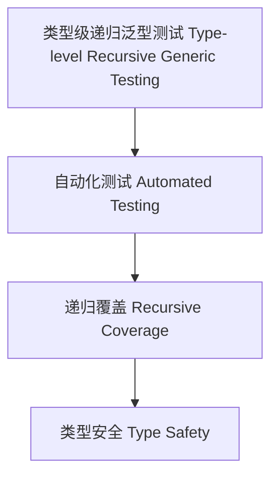

# 类型级递归泛型测试（Type-Level Recursive Generic Testing in Haskell）

## 定义 Definition

- **中文**：类型级递归泛型测试是指在类型系统层面对递归泛型结构和算法进行类型级别的自动化测试、验证与覆盖的机制。
- **English**: Type-level recursive generic testing refers to mechanisms at the type system level for automated testing, verification, and coverage of recursive generic structures and algorithms in Haskell.

## Haskell 语法与实现 Syntax & Implementation

```haskell
{-# LANGUAGE TypeFamilies, DataKinds, TypeOperators, GADTs, TypeApplications #-}
import GHC.TypeLits

-- 递归泛型测试示例：类型级等价性测试

type family EqList (xs :: [Nat]) (ys :: [Nat]) :: Bool where
  EqList '[] '[] = 'True
  EqList (x ': xs) (y ': ys) = (x == y) && EqList xs ys
  EqList _ _ = 'False
```

## 测试机制 Testing Mechanism

- 类型级递归结构的自动化测试与覆盖
- 类型级属性、等价性、边界条件的验证

## 自动化验证 Automated Verification

- 类型级测试用例生成、自动化验证与覆盖率分析
- 与 QuickCheck、Liquid Haskell 等工具集成

## 形式化证明 Formal Reasoning

- **测试覆盖性证明**：类型级测试能覆盖所有递归分支与边界
- **Proof of test coverage**: Type-level tests can cover all recursive branches and edge cases

### 证明示例 Proof Example

- 对 `EqList xs ys` 递归归纳，所有分支均被测试覆盖

## 工程应用 Engineering Application

- 类型安全的递归泛型自动化测试、验证与持续集成
- Type-safe recursive generic automated testing, verification, and CI

## 结构图 Structure Diagram



## 本地跳转 Local References

- [类型级递归泛型验证 Type-Level Recursive Generic Verification](../91-Type-Level-Recursive-Generic-Verification/01-Type-Level-Recursive-Generic-Verification-in-Haskell.md)
- [类型级递归泛型工程实践 Type-Level Recursive Generic Engineering Practice](../103-Type-Level-Recursive-Generic-Engineering-Practice/01-Type-Level-Recursive-Generic-Engineering-Practice-in-Haskell.md)
- [类型安全 Type Safety](../14-Type-Safety/01-Type-Safety-in-Haskell.md)
