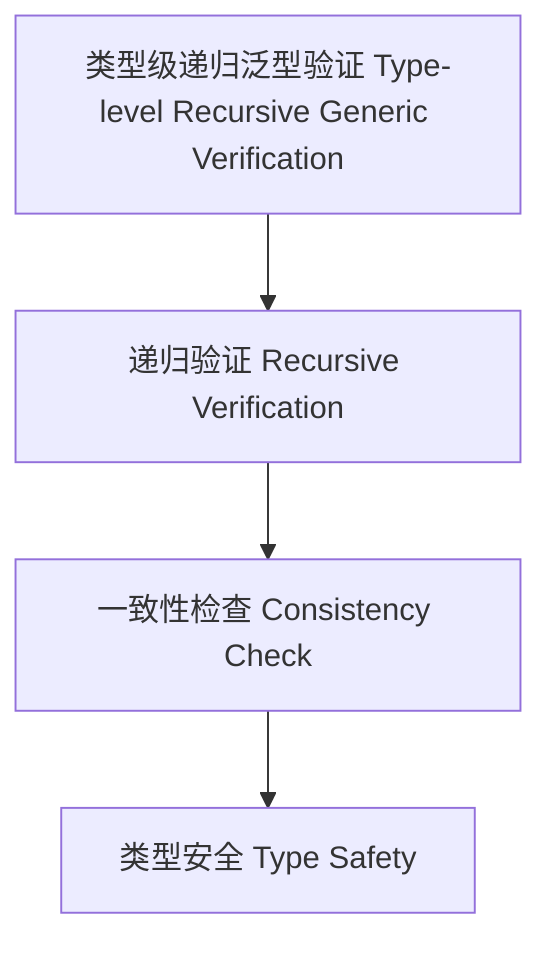

# 类型级递归泛型验证（Type-Level Recursive Generic Verification in Haskell）

## 定义 Definition

- **中文**：类型级递归泛型验证是指在类型系统层面对泛型类型和算法进行递归自动验证和一致性检查的机制，支持类型安全的泛型编程与自动化推理。
- **English**: Type-level recursive generic verification refers to mechanisms at the type system level for recursively and automatically verifying and checking the consistency of generic types and algorithms, supporting type-safe generic programming and automated reasoning in Haskell.

## Haskell 语法与实现 Syntax & Implementation

```haskell
{-# LANGUAGE TypeFamilies, DataKinds, TypeOperators, GADTs #-}

-- 类型级递归泛型验证示例：类型级列表长度验证

type family Length (xs :: [k]) :: Nat where
  Length '[] = 0
  Length (x ': xs) = 1 + Length xs

type family IsZero (n :: Nat) :: Bool where
  IsZero 0 = 'True
  IsZero n = 'False
```

## 递归泛型验证机制 Recursive Generic Verification Mechanism

- 类型族递归定义、类型类递归约束检查
- 支持泛型类型和算法的递归自动验证与一致性检查

## 形式化证明 Formal Reasoning

- **递归泛型验证正确性证明**：归纳证明 IsZero (Length xs) 能准确判断列表是否为空
- **Proof of correctness for recursive generic verification**: Inductive proof that IsZero (Length xs) correctly determines if a list is empty

### 证明示例 Proof Example

- 对 `IsZero (Length xs)`，对 `xs` 递归归纳，能准确判断列表是否为空

## 工程应用 Engineering Application

- 类型安全的递归泛型验证、自动化推理、泛型库
- Type-safe recursive generic verification, automated reasoning, generic libraries

## 结构图 Structure Diagram



## 本地跳转 Local References

- [类型级递归泛型归纳 Type-Level Recursive Generic Induction](../82-Type-Level-Recursive-Generic-Induction/01-Type-Level-Recursive-Generic-Induction-in-Haskell.md)
- [类型级递归泛型算法 Type-Level Recursive Generic Algorithm](../72-Type-Level-Recursive-Generic-Algorithm/01-Type-Level-Recursive-Generic-Algorithm-in-Haskell.md)
- [类型安全 Type Safety](../14-Type-Safety/01-Type-Safety-in-Haskell.md)
