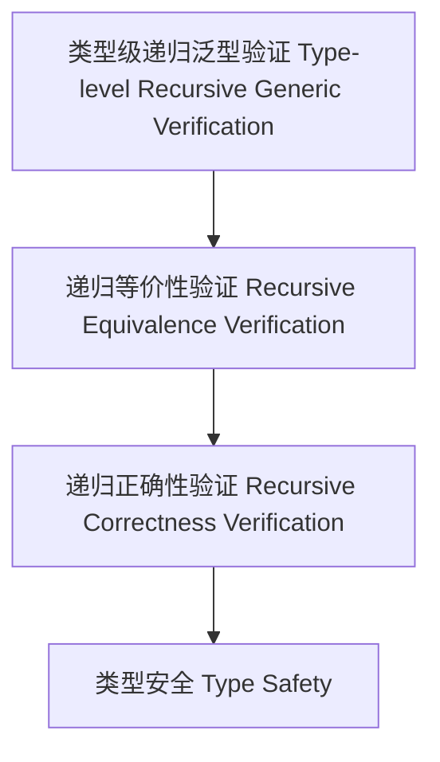

# 类型级递归泛型验证（Type-Level Recursive Generic Verification in Haskell）

## 定义 Definition

- **中文**：类型级递归泛型验证是指在类型系统层面对递归泛型结构、算法等进行类型级别的正确性、等价性和安全性验证的机制。
- **English**: Type-level recursive generic verification refers to mechanisms at the type system level for verifying the correctness, equivalence, and safety of recursive generic structures and algorithms in Haskell.

## Haskell 语法与实现 Syntax & Implementation

```haskell
{-# LANGUAGE TypeFamilies, DataKinds, GADTs, TypeOperators #-}

-- 递归泛型验证示例：类型级等价性验证

type family EqList (xs :: [k]) (ys :: [k]) :: Bool where
  EqList '[] '[] = 'True
  EqList (x ': xs) (y ': ys) = (x == y) && EqList xs ys
  EqList _ _ = 'False
```

## 递归泛型验证机制 Recursive Generic Verification Mechanism

- 类型级递归等价性、正确性、安全性验证
- 支持递归泛型结构和算法的自动化验证

## 形式化证明 Formal Reasoning

- **递归泛型验证正确性证明**：归纳证明类型级验证的可靠性
- **Proof of correctness for recursive generic verification**: Inductive proof of reliability for type-level verification

### 证明示例 Proof Example

- 对 `EqList xs ys` 递归归纳，空表时为真，非空时递归验证每一项，归纳成立

## 工程应用 Engineering Application

- 类型安全保证、递归泛型算法自动化验证、形式化建模
- Type safety assurance, automated verification of recursive generic algorithms, formal modeling

## 结构图 Structure Diagram



## 本地跳转 Local References

- [类型级递归验证 Type-Level Recursive Verification](../79-Type-Level-Recursive-Generic-Proof/01-Type-Level-Recursive-Generic-Proof-in-Haskell.md)
- [类型级递归泛型算法 Type-Level Recursive Generic Algorithm](../72-Type-Level-Recursive-Generic-Algorithm/01-Type-Level-Recursive-Generic-Algorithm-in-Haskell.md)
- [类型安全 Type Safety](../14-Type-Safety/01-Type-Safety-in-Haskell.md)
- [类型级递归泛型归纳 Type-Level Recursive Generic Induction](../82-Type-Level-Recursive-Generic-Induction/01-Type-Level-Recursive-Generic-Induction-in-Haskell.md)
- [类型级递归泛型算法 Type-Level Recursive Generic Algorithm](../72-Type-Level-Recursive-Generic-Algorithm/01-Type-Level-Recursive-Generic-Algorithm-in-Haskell.md)
- [类型安全 Type Safety](../14-Type-Safety/01-Type-Safety-in-Haskell.md)
