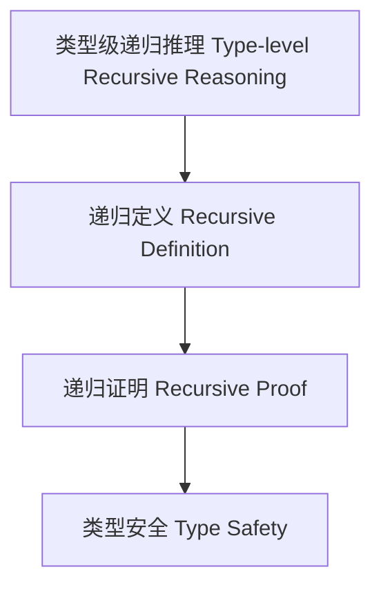

# 类型级递归推理（Type-Level Recursive Reasoning in Haskell）

## 定义 Definition

- **中文**：类型级递归推理是指在类型系统层面对类型关系、属性和算法进行递归定义与递归证明的机制，支持类型安全的自动化推理与泛型编程。
- **English**: Type-level recursive reasoning refers to mechanisms at the type system level for recursively defining and proving type relations, properties, and algorithms, supporting type-safe automated reasoning and generic programming in Haskell.

## Haskell 语法与实现 Syntax & Implementation

```haskell
{-# LANGUAGE TypeFamilies, DataKinds, TypeOperators, GADTs #-}

-- 类型级递归推理示例：类型级列表求和

type family Sum (xs :: [Nat]) :: Nat where
  Sum '[] = 0
  Sum (x ': xs) = x + Sum xs
```

## 递归推理机制 Recursive Reasoning Mechanism

- 类型族递归定义、类型类递归推理
- 支持类型关系、属性和算法的递归定义与自动化证明

## 形式化证明 Formal Reasoning

- **递归推理正确性证明**：归纳证明 Sum xs 能正确计算列表和
- **Proof of correctness for recursive reasoning**: Inductive proof that Sum xs correctly computes the sum of a list

### 证明示例 Proof Example

- 对 `Sum xs`，对 `xs` 归纳：
  - 基础：`xs = []`，`Sum [] = 0` 成立
  - 归纳：假设 `Sum xs` 成立，则 `Sum (x:xs) = x + Sum xs` 也成立

## 工程应用 Engineering Application

- 类型安全的递归算法、自动化推理、泛型库
- Type-safe recursive algorithms, automated reasoning, generic libraries

## 结构图 Structure Diagram



## 本地跳转 Local References

- [类型级归纳与递归 Type-Level Induction & Recursion](../23-Type-Level-Induction/01-Type-Level-Induction-in-Haskell.md)
- [类型级递归优化 Type-Level Recursion Optimization](../31-Type-Level-Recursion-Optimization/01-Type-Level-Recursion-Optimization-in-Haskell.md)
- [类型安全 Type Safety](../14-Type-Safety/01-Type-Safety-in-Haskell.md)
