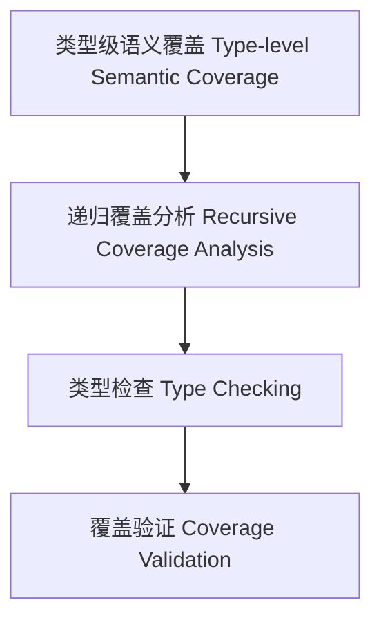

# 22-类型级语义覆盖（Type-Level Semantic Coverage in Haskell）

## 定义 Definition

- **中文**：类型级语义覆盖是指在类型系统层面对类型级结构和表达式进行递归语义覆盖分析、类型检查与验证的机制，支持类型安全的编译期语义覆盖保障。
- **English**: Type-level semantic coverage refers to mechanisms at the type system level for recursive semantic coverage analysis, type checking, and validation of type-level structures and expressions, supporting type-safe compile-time semantic coverage in Haskell.

## Haskell 语法与实现 Syntax & Implementation

```haskell
{-# LANGUAGE GADTs, DataKinds, TypeFamilies #-}

-- 类型级表达式

data Expr a where
  LitInt  :: Int  -> Expr Int
  Add     :: Expr Int -> Expr Int -> Expr Int

-- 类型级语义覆盖分析

type family SemCoverage (e :: Expr a) :: Bool where
  SemCoverage ('LitInt n) = 'True
  SemCoverage ('Add x y) = SemCoverage x && SemCoverage y
```

## 类型级递归覆盖分析与类型检查 Recursive Coverage Analysis & Type Checking

- 类型级表达式的递归语义覆盖分析、类型检查、验证
- 支持类型安全的编译期语义覆盖保障

## 形式化证明 Formal Reasoning

- **语义覆盖正确性证明**：SemCoverage e 能准确分析表达式语义覆盖性
- **Proof of semantic coverage correctness**: SemCoverage e can accurately analyze semantic coverage of expressions

### 证明示例 Proof Example

- 对 `SemCoverage e`，归纳每个构造器，覆盖分析覆盖所有情况

## 工程应用 Engineering Application

- 类型安全的类型级DSL、编译期语义覆盖分析、自动化验证
- Type-safe type-level DSLs, compile-time semantic coverage analysis, automated verification

## 结构图 Structure Diagram



## 本地跳转 Local References

- [类型级语义一致性 Type-Level Semantic Consistency](../122-Type-Level-Semantic-Consistency/01-Type-Level-Semantic-Consistency-in-Haskell.md)
- [类型级语义验证 Type-Level Semantic Validation](../120-Type-Level-Semantic-Validation/01-Type-Level-Semantic-Validation-in-Haskell.md)
- [类型安全 Type Safety](../14-Type-Safety/01-Type-Safety-in-Haskell.md)
