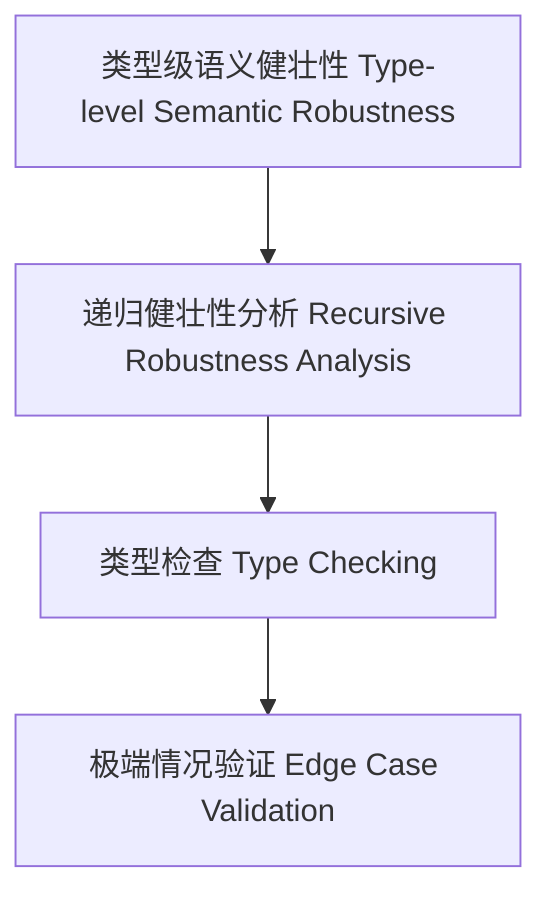

# 21-类型级语义健壮性（Type-Level Semantic Robustness in Haskell）

## 定义 Definition

- **中文**：类型级语义健壮性是指在类型系统层面对类型级结构和表达式进行递归健壮性分析、类型检查与极端情况验证的机制，支持类型安全的编译期语义健壮性保障。
- **English**: Type-level semantic robustness refers to mechanisms at the type system level for recursive robustness analysis, type checking, and edge case validation of type-level structures and expressions, supporting type-safe compile-time semantic robustness in Haskell.

## Haskell 语法与实现 Syntax & Implementation

```haskell
{-# LANGUAGE GADTs, DataKinds, TypeFamilies #-}

-- 类型级表达式

data Expr a where
  LitInt  :: Int  -> Expr Int
  Add     :: Expr Int -> Expr Int -> Expr Int

-- 类型级语义健壮性分析

type family SemRobust (e :: Expr a) :: Bool where
  SemRobust ('LitInt n) = 'True
  SemRobust ('Add x y) = SemRobust x && SemRobust y
```

## 类型级递归健壮性分析与类型检查 Recursive Robustness Analysis & Type Checking

- 类型级表达式的递归语义健壮性分析、类型检查、极端情况验证
- 支持类型安全的编译期语义健壮性保障

## 形式化证明 Formal Reasoning

- **语义健壮性正确性证明**：SemRobust e 能准确分析表达式语义健壮性
- **Proof of semantic robustness correctness**: SemRobust e can accurately analyze semantic robustness of expressions

### 证明示例 Proof Example

- 对 `SemRobust e`，归纳每个构造器，健壮性分析覆盖所有情况

## 工程应用 Engineering Application

- 类型安全的类型级DSL、编译期语义健壮性分析、自动化验证
- Type-safe type-level DSLs, compile-time semantic robustness analysis, automated verification

## 结构图 Structure Diagram



## 本地跳转 Local References

- [类型级语义覆盖 Type-Level Semantic Coverage](../124-Type-Level-Semantic-Coverage/01-Type-Level-Semantic-Coverage-in-Haskell.md)
- [类型级语义一致性 Type-Level Semantic Consistency](../122-Type-Level-Semantic-Consistency/01-Type-Level-Semantic-Consistency-in-Haskell.md)
- [类型安全 Type Safety](../14-Type-Safety/01-Type-Safety-in-Haskell.md)
