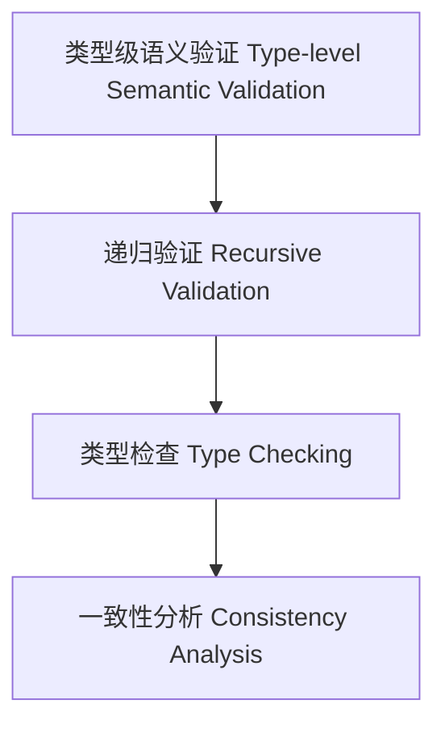

# 24-类型级语义验证（Type-Level Semantic Validation in Haskell）

## 定义 Definition

- **中文**：类型级语义验证是指在类型系统层面对类型级结构和表达式进行递归语义验证、类型检查与一致性分析的机制，支持类型安全的编译期语义验证。
- **English**: Type-level semantic validation refers to mechanisms at the type system level for recursive semantic validation, type checking, and consistency analysis of type-level structures and expressions, supporting type-safe compile-time semantic validation in Haskell.

## Haskell 语法与实现 Syntax & Implementation

```haskell
{-# LANGUAGE GADTs, DataKinds, TypeFamilies #-}

-- 类型级表达式

data Expr a where
  LitInt  :: Int  -> Expr Int
  Add     :: Expr Int -> Expr Int -> Expr Int

-- 类型级语义验证

type family SemValidate (e :: Expr a) :: Bool where
  SemValidate ('LitInt n) = 'True
  SemValidate ('Add x y) = SemValidate x && SemValidate y
```

## 类型级递归验证与类型检查 Recursive Validation & Type Checking

- 类型级表达式的递归语义验证、类型检查、一致性分析
- 支持类型安全的编译期语义验证

## 形式化证明 Formal Reasoning

- **语义验证正确性证明**：SemValidate e 能准确验证表达式语义一致性
- **Proof of semantic validation correctness**: SemValidate e can accurately validate semantic consistency of expressions

### 证明示例 Proof Example

- 对 `SemValidate e`，归纳每个构造器，验证覆盖所有情况

## 工程应用 Engineering Application

- 类型安全的类型级DSL、编译期语义验证、自动化验证
- Type-safe type-level DSLs, compile-time semantic validation, automated verification

## 结构图 Structure Diagram



## 本地跳转 Local References

- [类型级语义归纳 Type-Level Semantic Induction](../118-Type-Level-Semantic-Induction/01-Type-Level-Semantic-Induction-in-Haskell.md)
- [类型级编译期属性分析 Type-Level Compile-Time Property Analysis](../119-Type-Level-Compile-Time-Property-Analysis/01-Type-Level-Compile-Time-Property-Analysis-in-Haskell.md)
- [类型安全 Type Safety](../14-Type-Safety/01-Type-Safety-in-Haskell.md)
