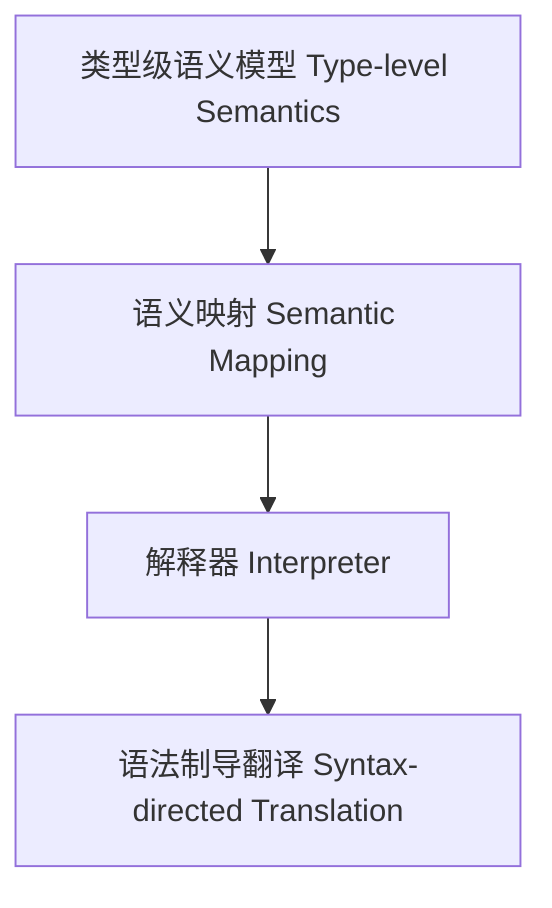

# 类型级语义模型（Type-Level Semantics in Haskell）

## 定义 Definition

- **中文**：类型级语义模型是指在类型系统层面对类型级结构、表达式等进行语义映射、解释与语法制导翻译的机制，支持类型安全的编译期语义分析。
- **English**: Type-level semantics refers to mechanisms at the type system level for semantic mapping, interpretation, and syntax-directed translation of type-level structures and expressions, supporting type-safe compile-time semantic analysis in Haskell.

## Haskell 语法与实现 Syntax & Implementation

```haskell
{-# LANGUAGE GADTs, DataKinds, TypeFamilies #-}

-- 类型级表达式与解释器

data Expr a where
  LitInt  :: Int  -> Expr Int
  Add     :: Expr Int -> Expr Int -> Expr Int

-- 类型级语义解释器
interp :: Expr a -> a
interp (LitInt n)   = n
interp (Add x y)    = interp x + interp y

-- 类型级语法制导翻译

type family Eval (e :: Expr Int) :: Int where
  Eval ('LitInt n) = n
  Eval ('Add x y) = Eval x + Eval y
```

## 类型级语义映射与解释器 Semantics & Interpreters

- 类型级表达式的语义解释、类型级语法制导翻译
- 支持类型安全的编译期语义分析与优化

## 形式化证明 Formal Reasoning

- **语义一致性证明**：Eval 与 interp 语义一致性
- **Proof of semantic consistency**: Consistency between Eval and interp

### 证明示例 Proof Example

- 对 `Eval e` 与 `interp e`，归纳每个构造器，语义一致

## 工程应用 Engineering Application

- 类型安全的类型级DSL、编译期优化、自动化验证
- Type-safe type-level DSLs, compile-time optimization, automated verification

## 结构图 Structure Diagram



## 本地跳转 Local References

- [类型驱动DSL Type-Driven DSL](../19-Type-Driven-DSL/01-Type-Driven-DSL-in-Haskell.md)
- [类型级泛型算法 Type-Level Generic Algorithm](../33-Type-Level-Generic-Algorithm/01-Type-Level-Generic-Algorithm-in-Haskell.md)
- [类型安全 Type Safety](../14-Type-Safety/01-Type-Safety-in-Haskell.md)
