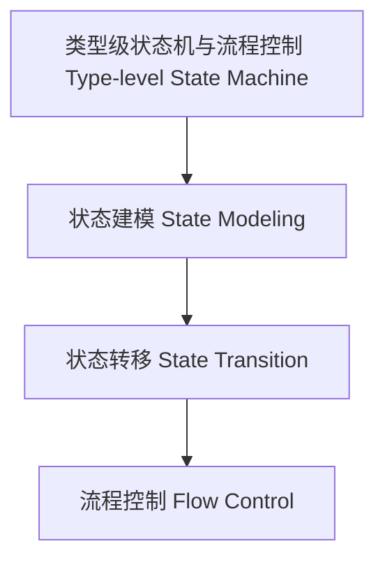

# 类型级状态机与流程控制（Type-Level State Machine in Haskell）

## 定义 Definition

- **中文**：类型级状态机与流程控制是指在类型系统层面对有限状态机、流程图等进行类型级建模与状态转移推理的机制，支持类型安全的编译期流程管理。
- **English**: Type-level state machine and flow control refer to mechanisms at the type system level for modeling finite state machines, flowcharts, and reasoning about state transitions, supporting type-safe compile-time flow management in Haskell.

## Haskell 语法与实现 Syntax & Implementation

```haskell
{-# LANGUAGE DataKinds, TypeFamilies, GADTs, KindSignatures #-}

-- 类型级状态机建模

data State = Idle | Running | Finished

type family Next (s :: State) :: State where
  Next 'Idle = 'Running
  Next 'Running = 'Finished
  Next 'Finished = 'Finished
```

## 类型级状态转移与流程控制 State Transition & Flow Control

- 类型级有限状态机、流程图、状态转移推理
- 支持类型安全的编译期流程建模与验证

## 形式化证明 Formal Reasoning

- **状态转移正确性证明**：Next 类型族覆盖所有状态，转移一致
- **Proof of state transition correctness**: Next type family covers all states, transitions are consistent

### 证明示例 Proof Example

- 对 `Next s`，s 取值为 Idle/Running/Finished 时均有定义，状态转移明确

## 工程应用 Engineering Application

- 类型安全的编译期状态机、流程控制、自动化验证
- Type-safe compile-time state machines, flow control, automated verification

## 结构图 Structure Diagram



## 本地跳转 Local References

- [类型级控制流 Type-Level Control Flow](../106-Type-Level-Control-Flow/01-Type-Level-Control-Flow-in-Haskell.md)
- [类型级泛型算法 Type-Level Generic Algorithm](../33-Type-Level-Generic-Algorithm/01-Type-Level-Generic-Algorithm-in-Haskell.md)
- [类型安全 Type Safety](../14-Type-Safety/01-Type-Safety-in-Haskell.md)
