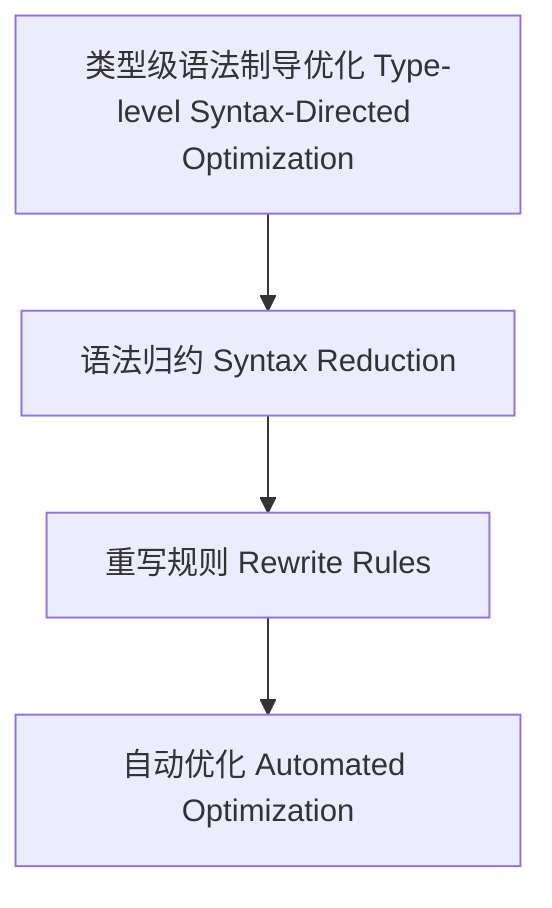

# 30-类型级语法制导优化（Type-Level Syntax-Directed Optimization in Haskell）

## 定义 Definition

- **中文**：类型级语法制导优化是指在类型系统层面根据类型级语法结构自动进行优化、归约与重写的机制，支持类型安全的编译期优化。
- **English**: Type-level syntax-directed optimization refers to mechanisms at the type system level for automatically optimizing, reducing, and rewriting based on type-level syntax structures, supporting type-safe compile-time optimization in Haskell.

## Haskell 语法与实现 Syntax & Implementation

```haskell
{-# LANGUAGE GADTs, DataKinds, TypeFamilies #-}

-- 类型级表达式

data Expr a where
  LitInt  :: Int  -> Expr Int
  Add     :: Expr Int -> Expr Int -> Expr Int
  Zero    :: Expr Int

-- 类型级语法制导优化

type family Optimize (e :: Expr Int) :: Expr Int where
  Optimize ('Add 'Zero x) = x
  Optimize ('Add x 'Zero) = x
  Optimize ('Add x y) = 'Add (Optimize x) (Optimize y)
  Optimize e = e
```

## 类型级优化机制 Optimization Mechanism

- 类型级语法归约、重写规则、自动优化
- 支持类型安全的编译期表达式优化

## 优化策略 Optimization Strategies

- 常量折叠、归约、消除冗余、递归优化
- Compile-time constant folding, reduction, redundancy elimination, recursive optimization

## 形式化证明 Formal Reasoning

- **优化正确性证明**：Optimize e 与 e 语义等价
- **Proof of optimization correctness**: Optimize e is semantically equivalent to e

### 证明示例 Proof Example

- 对 `Optimize e`，归纳每个构造器，优化前后语义一致

## 工程应用 Engineering Application

- 类型安全的类型级DSL、编译期优化、自动化验证
- Type-safe type-level DSLs, compile-time optimization, automated verification

## 结构图 Structure Diagram



## 本地跳转 Local References

- [类型级语义模型 Type-Level Semantics](../107-Type-Level-Semantics/01-Type-Level-Semantics-in-Haskell.md)
- [类型级泛型算法 Type-Level Generic Algorithm](../33-Type-Level-Generic-Algorithm/01-Type-Level-Generic-Algorithm-in-Haskell.md)
- [类型安全 Type Safety](../14-Type-Safety/01-Type-Safety-in-Haskell.md)
