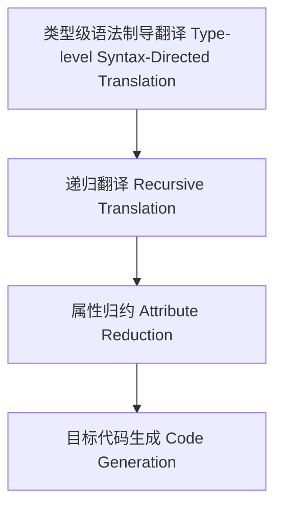

# 类型级语法制导翻译（Type-Level Syntax-Directed Translation in Haskell）

## 定义 Definition

- **中文**：类型级语法制导翻译是指在类型系统层面根据类型级语法结构递归进行属性归约、语义映射与目标代码生成的机制，支持类型安全的编译期翻译。
- **English**: Type-level syntax-directed translation refers to mechanisms at the type system level for recursively reducing attributes, mapping semantics, and generating target code based on type-level syntax structures, supporting type-safe compile-time translation in Haskell.

## Haskell 语法与实现 Syntax & Implementation

```haskell
{-# LANGUAGE GADTs, DataKinds, TypeFamilies #-}

-- 类型级AST

data AST a where
  LitInt  :: Int  -> AST Int
  Add     :: AST Int -> AST Int -> AST Int

-- 类型级语法制导翻译

type family Translate (e :: AST Int) :: String where
  Translate ('LitInt n) = ShowInt n
  Translate ('Add x y) = Append (Translate x) (Append " + " (Translate y))

-- 类型级字符串拼接与整数字符串化（伪代码，实际需类型级字符串支持）
type family Append (a :: String) (b :: String) :: String

type family ShowInt (n :: Nat) :: String
```

## 类型级递归翻译与属性归约 Recursive Translation & Attribute Reduction

- 类型级AST的递归翻译、属性归约、目标代码生成
- 支持类型安全的编译期语法制导翻译

## 形式化证明 Formal Reasoning

- **翻译正确性证明**：Translate e 能准确还原AST语义
- **Proof of translation correctness**: Translate e can accurately restore the semantics of the AST

### 证明示例 Proof Example

- 对 `Translate e`，递归归纳每个构造器，翻译结果与语义一致

## 工程应用 Engineering Application

- 类型安全的类型级DSL、编译期代码生成、自动化验证
- Type-safe type-level DSLs, compile-time code generation, automated verification

## 结构图 Structure Diagram



## 本地跳转 Local References

- [类型级AST建模 Type-Level AST Modeling](../112-Type-Level-AST-Modeling/01-Type-Level-AST-Modeling-in-Haskell.md)
- [类型级语义模型 Type-Level Semantics](../107-Type-Level-Semantics/01-Type-Level-Semantics-in-Haskell.md)
- [类型安全 Type Safety](../14-Type-Safety/01-Type-Safety-in-Haskell.md)
