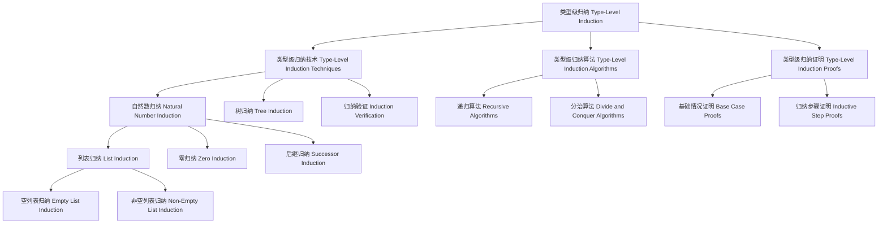

# 类型级归纳（Type-Level Induction）in Haskell

## 目录 Table of Contents

- [类型级归纳（Type-Level Induction）in Haskell](#类型级归纳type-level-inductionin-haskell)
  - [目录 Table of Contents](#目录-table-of-contents)
  - [1. 定义 Definition](#1-定义-definition)
  - [2. 理论基础 Theoretical Foundation](#2-理论基础-theoretical-foundation)
    - [2.1 归纳理论 Induction Theory](#21-归纳理论-induction-theory)
    - [2.2 类型理论 Type Theory](#22-类型理论-type-theory)
    - [2.3 递归理论 Recursion Theory](#23-递归理论-recursion-theory)
  - [3. Haskell 语法与实现 Syntax \& Implementation](#3-haskell-语法与实现-syntax--implementation)
    - [3.1 基本语法 Basic Syntax](#31-基本语法-basic-syntax)
    - [3.2 高级实现 Advanced Implementation](#32-高级实现-advanced-implementation)
  - [4. 类型级归纳技术 Type-Level Induction Techniques](#4-类型级归纳技术-type-level-induction-techniques)
    - [4.1 自然数归纳 Natural Number Induction](#41-自然数归纳-natural-number-induction)
    - [4.2 列表归纳 List Induction](#42-列表归纳-list-induction)
    - [4.3 树归纳 Tree Induction](#43-树归纳-tree-induction)
  - [5. 类型级归纳算法 Type-Level Induction Algorithms](#5-类型级归纳算法-type-level-induction-algorithms)
    - [5.1 递归算法 Recursive Algorithms](#51-递归算法-recursive-algorithms)
    - [5.2 分治算法 Divide and Conquer Algorithms](#52-分治算法-divide-and-conquer-algorithms)
    - [5.3 动态规划算法 Dynamic Programming Algorithms](#53-动态规划算法-dynamic-programming-algorithms)
  - [6. 类型级归纳证明 Type-Level Induction Proofs](#6-类型级归纳证明-type-level-induction-proofs)
    - [6.1 基础情况证明 Base Case Proofs](#61-基础情况证明-base-case-proofs)
    - [6.2 归纳步骤证明 Inductive Step Proofs](#62-归纳步骤证明-inductive-step-proofs)
    - [6.3 归纳假设证明 Inductive Hypothesis Proofs](#63-归纳假设证明-inductive-hypothesis-proofs)
  - [7. 工程应用 Engineering Applications](#7-工程应用-engineering-applications)
    - [7.1 程序验证 Program Verification](#71-程序验证-program-verification)
    - [7.2 类型安全编程 Type-Safe Programming](#72-类型安全编程-type-safe-programming)
    - [7.3 编译时验证 Compile-Time Verification](#73-编译时验证-compile-time-verification)
  - [8. 范畴论映射 Category Theory Mapping](#8-范畴论映射-category-theory-mapping)
    - [8.1 类型级归纳作为函子 Type-Level Induction as Functor](#81-类型级归纳作为函子-type-level-induction-as-functor)
  - [9. 哲学思脉 Philosophical Context](#9-哲学思脉-philosophical-context)
    - [9.1 归纳哲学 Induction Philosophy](#91-归纳哲学-induction-philosophy)
    - [9.2 证明哲学 Proof Philosophy](#92-证明哲学-proof-philosophy)
    - [9.3 递归哲学 Recursion Philosophy](#93-递归哲学-recursion-philosophy)
  - [10. 相关理论 Related Theories](#10-相关理论-related-theories)
    - [10.1 归纳理论 Induction Theory](#101-归纳理论-induction-theory)
    - [10.2 证明理论 Proof Theory](#102-证明理论-proof-theory)
    - [10.3 递归理论 Recursion Theory](#103-递归理论-recursion-theory)
  - [11. 未来发展方向 Future Development](#11-未来发展方向-future-development)
    - [11.1 理论扩展 Theoretical Extensions](#111-理论扩展-theoretical-extensions)
    - [11.2 技术改进 Technical Improvements](#112-技术改进-technical-improvements)
    - [11.3 应用扩展 Application Extensions](#113-应用扩展-application-extensions)
  - [12. 结构图 Structure Diagram](#12-结构图-structure-diagram)
  - [13. 本地跳转 Local References](#13-本地跳转-local-references)
  - [14. 参考文献 References](#14-参考文献-references)
    - [14.1 学术资源 Academic Resources](#141-学术资源-academic-resources)
    - [14.2 技术文档 Technical Documentation](#142-技术文档-technical-documentation)
    - [14.3 学术论文 Academic Papers](#143-学术论文-academic-papers)

## 1. 定义 Definition

- **中文**：类型级归纳是Haskell中一种强大的类型系统扩展，通过类型级别的归纳原理进行程序验证和类型推导。类型级归纳允许在编译时进行数学归纳证明，支持类型级递归、类型级算法和类型级数据结构，从而在编译时确保程序的正确性和完整性。
- **English**: Type-level induction is a powerful type system extension in Haskell that performs program verification and type inference through type-level inductive principles. Type-level induction allows mathematical inductive proofs at compile time, supporting type-level recursion, type-level algorithms, and type-level data structures, ensuring program correctness and completeness at compile time.

## 2. 理论基础 Theoretical Foundation

### 2.1 归纳理论 Induction Theory

- **归纳原理**：类型级归纳基于数学归纳原理，通过基础情况和归纳步骤进行证明
- **归纳结构**：支持自然数、列表、树等归纳数据结构的类型级操作
- **归纳完备性**：归纳应该能够处理所有可能的归纳情况

### 2.2 类型理论 Type Theory

- **类型系统**：类型级归纳基于强类型系统，通过类型检查进行程序验证
- **类型安全**：通过类型系统保证程序的安全性和正确性
- **类型推导**：自动推导表达式的类型，减少显式类型注解

### 2.3 递归理论 Recursion Theory

- **递归定义**：类型级归纳支持递归定义，通过归纳原理定义类型级函数
- **递归验证**：通过归纳原理验证递归函数的正确性
- **递归优化**：通过归纳原理优化递归函数的性能

## 3. Haskell 语法与实现 Syntax & Implementation

### 3.1 基本语法 Basic Syntax

```haskell
{-# LANGUAGE TypeFamilies, DataKinds, GADTs, TypeOperators, KindSignatures #-}

-- 类型级归纳的基本语法
class TypeLevelInduction a where
  -- 类型级归纳
  typeLevelInduction :: Proxy a -> InductionResult a
  
  -- 归纳验证
  inductionVerification :: Proxy a -> InductionVerificationResult a
  
  -- 归纳优化
  inductionOptimization :: Proxy a -> InductionOptimizationResult a

-- 归纳结果
data InductionResult a = InductionResult {
    inductionType :: InductionType a,
    inductionMethod :: InductionMethod a,
    inductionResult :: InductionResult a
}

-- 归纳验证结果
data InductionVerificationResult a = InductionVerificationResult {
    verificationType :: VerificationType a,
    verificationMethod :: VerificationMethod a,
    verificationStatus :: VerificationStatus a
}

-- 归纳优化结果
data InductionOptimizationResult a = InductionOptimizationResult {
    optimizationType :: OptimizationType a,
    optimizationMethod :: OptimizationMethod a,
    optimizationGain :: OptimizationGain a
}
```

### 3.2 高级实现 Advanced Implementation

```haskell
-- 高级类型级归纳实现
data AdvancedTypeLevelInduction a = AdvancedTypeLevelInduction {
    inductionEngine :: InductionEngine a,
    verificationEngine :: VerificationEngine a,
    optimizationEngine :: OptimizationEngine a
}

-- 归纳引擎
data InductionEngine a = InductionEngine {
    inductionAlgorithms :: [InductionAlgorithm a],
    inductionStrategies :: [InductionStrategy a],
    inductionHeuristics :: [InductionHeuristic a]
}

-- 验证引擎
data VerificationEngine a = VerificationEngine {
    verificationAlgorithms :: [VerificationAlgorithm a],
    verificationStrategies :: [VerificationStrategy a],
    verificationHeuristics :: [VerificationHeuristic a]
}

-- 优化引擎
data OptimizationEngine a = OptimizationEngine {
    optimizationAlgorithms :: [OptimizationAlgorithm a],
    optimizationStrategies :: [OptimizationStrategy a],
    optimizationHeuristics :: [OptimizationHeuristic a]
}

-- 类型级归纳实例
instance TypeLevelInduction (Vector n a) where
  typeLevelInduction _ = VectorTypeLevelInductionResult
  inductionVerification _ = VectorInductionVerificationResult
  inductionOptimization _ = VectorInductionOptimizationResult
```

## 4. 类型级归纳技术 Type-Level Induction Techniques

### 4.1 自然数归纳 Natural Number Induction

```haskell
-- 自然数归纳技术
class NaturalNumberInduction (n :: Nat) where
  -- 自然数归纳
  naturalNumberInduction :: Proxy n -> NaturalNumberInductionResult n
  
  -- 归纳验证
  inductionVerification :: Proxy n -> InductionVerificationResult n
  
  -- 归纳优化
  inductionOptimization :: Proxy n -> InductionOptimizationResult n

-- 自然数归纳结果
data NaturalNumberInductionResult (n :: Nat) = NaturalNumberInductionResult {
    naturalNumberInductionType :: NaturalNumberInductionType n,
    naturalNumberInductionMethod :: NaturalNumberInductionMethod n,
    naturalNumberInductionResult :: NaturalNumberInductionResult n
}

-- 自然数归纳实例
instance NaturalNumberInduction 'Z where
  naturalNumberInduction _ = ZeroNaturalNumberInductionResult
  inductionVerification _ = ZeroInductionVerificationResult
  inductionOptimization _ = ZeroInductionOptimizationResult

instance NaturalNumberInduction ('S n) where
  naturalNumberInduction _ = SuccNaturalNumberInductionResult
  inductionVerification _ = SuccInductionVerificationResult
  inductionOptimization _ = SuccInductionOptimizationResult
```

### 4.2 列表归纳 List Induction

```haskell
-- 列表归纳技术
class ListInduction (a :: *) where
  -- 列表归纳
  listInduction :: Proxy a -> ListInductionResult a
  
  -- 归纳验证
  inductionVerification :: Proxy a -> InductionVerificationResult a
  
  -- 归纳优化
  inductionOptimization :: Proxy a -> InductionOptimizationResult a

-- 列表归纳结果
data ListInductionResult a = ListInductionResult {
    listInductionType :: ListInductionType a,
    listInductionMethod :: ListInductionMethod a,
    listInductionResult :: ListInductionResult a
}

-- 列表归纳实例
instance ListInduction (List a) where
  listInduction _ = ListListInductionResult
  inductionVerification _ = ListInductionVerificationResult
  inductionOptimization _ = ListInductionOptimizationResult
```

### 4.3 树归纳 Tree Induction

```haskell
-- 树归纳技术
class TreeInduction (a :: *) where
  -- 树归纳
  treeInduction :: Proxy a -> TreeInductionResult a
  
  -- 归纳验证
  inductionVerification :: Proxy a -> InductionVerificationResult a
  
  -- 归纳优化
  inductionOptimization :: Proxy a -> InductionOptimizationResult a

-- 树归纳结果
data TreeInductionResult a = TreeInductionResult {
    treeInductionType :: TreeInductionType a,
    treeInductionMethod :: TreeInductionMethod a,
    treeInductionResult :: TreeInductionResult a
}

-- 树归纳实例
instance TreeInduction (Tree a) where
  treeInduction _ = TreeTreeInductionResult
  inductionVerification _ = TreeInductionVerificationResult
  inductionOptimization _ = TreeInductionOptimizationResult
```

## 5. 类型级归纳算法 Type-Level Induction Algorithms

### 5.1 递归算法 Recursive Algorithms

```haskell
-- 递归算法
class RecursiveAlgorithms (a :: *) where
  -- 递归算法
  recursiveAlgorithms :: Proxy a -> RecursiveAlgorithmsResult a
  
  -- 算法验证
  algorithmVerification :: Proxy a -> AlgorithmVerificationResult a
  
  -- 算法优化
  algorithmOptimization :: Proxy a -> AlgorithmOptimizationResult a

-- 递归算法结果
data RecursiveAlgorithmsResult a = RecursiveAlgorithmsResult {
    algorithmType :: AlgorithmType a,
    algorithmMethod :: AlgorithmMethod a,
    algorithmResult :: AlgorithmResult a
}

-- 递归算法实例
instance RecursiveAlgorithms (RecursiveType a) where
  recursiveAlgorithms _ = RecursiveTypeRecursiveAlgorithmsResult
  algorithmVerification _ = RecursiveTypeAlgorithmVerificationResult
  algorithmOptimization _ = RecursiveTypeAlgorithmOptimizationResult
```

### 5.2 分治算法 Divide and Conquer Algorithms

```haskell
-- 分治算法
class DivideAndConquerAlgorithms (a :: *) where
  -- 分治算法
  divideAndConquerAlgorithms :: Proxy a -> DivideAndConquerAlgorithmsResult a
  
  -- 算法验证
  algorithmVerification :: Proxy a -> AlgorithmVerificationResult a
  
  -- 算法优化
  algorithmOptimization :: Proxy a -> AlgorithmOptimizationResult a

-- 分治算法结果
data DivideAndConquerAlgorithmsResult a = DivideAndConquerAlgorithmsResult {
    algorithmType :: AlgorithmType a,
    algorithmMethod :: AlgorithmMethod a,
    algorithmResult :: AlgorithmResult a
}

-- 分治算法实例
instance DivideAndConquerAlgorithms (DivideAndConquerType a) where
  divideAndConquerAlgorithms _ = DivideAndConquerTypeDivideAndConquerAlgorithmsResult
  algorithmVerification _ = DivideAndConquerTypeAlgorithmVerificationResult
  algorithmOptimization _ = DivideAndConquerTypeAlgorithmOptimizationResult
```

### 5.3 动态规划算法 Dynamic Programming Algorithms

```haskell
-- 动态规划算法
class DynamicProgrammingAlgorithms (a :: *) where
  -- 动态规划算法
  dynamicProgrammingAlgorithms :: Proxy a -> DynamicProgrammingAlgorithmsResult a
  
  -- 算法验证
  algorithmVerification :: Proxy a -> AlgorithmVerificationResult a
  
  -- 算法优化
  algorithmOptimization :: Proxy a -> AlgorithmOptimizationResult a

-- 动态规划算法结果
data DynamicProgrammingAlgorithmsResult a = DynamicProgrammingAlgorithmsResult {
    algorithmType :: AlgorithmType a,
    algorithmMethod :: AlgorithmMethod a,
    algorithmResult :: AlgorithmResult a
}

-- 动态规划算法实例
instance DynamicProgrammingAlgorithms (DynamicProgrammingType a) where
  dynamicProgrammingAlgorithms _ = DynamicProgrammingTypeDynamicProgrammingAlgorithmsResult
  algorithmVerification _ = DynamicProgrammingTypeAlgorithmVerificationResult
  algorithmOptimization _ = DynamicProgrammingTypeAlgorithmOptimizationResult
```

## 6. 类型级归纳证明 Type-Level Induction Proofs

### 6.1 基础情况证明 Base Case Proofs

```haskell
-- 基础情况证明
class BaseCaseProofs (a :: *) where
  -- 基础情况证明
  baseCaseProofs :: Proxy a -> BaseCaseProofsResult a
  
  -- 证明验证
  proofVerification :: Proxy a -> ProofVerificationResult a
  
  -- 证明优化
  proofOptimization :: Proxy a -> ProofOptimizationResult a

-- 基础情况证明结果
data BaseCaseProofsResult a = BaseCaseProofsResult {
    proofType :: ProofType a,
    proofMethod :: ProofMethod a,
    proofResult :: ProofResult a
}

-- 基础情况证明实例
instance BaseCaseProofs (BaseCaseType a) where
  baseCaseProofs _ = BaseCaseTypeBaseCaseProofsResult
  proofVerification _ = BaseCaseTypeProofVerificationResult
  proofOptimization _ = BaseCaseTypeProofOptimizationResult
```

### 6.2 归纳步骤证明 Inductive Step Proofs

```haskell
-- 归纳步骤证明
class InductiveStepProofs (a :: *) where
  -- 归纳步骤证明
  inductiveStepProofs :: Proxy a -> InductiveStepProofsResult a
  
  -- 证明验证
  proofVerification :: Proxy a -> ProofVerificationResult a
  
  -- 证明优化
  proofOptimization :: Proxy a -> ProofOptimizationResult a

-- 归纳步骤证明结果
data InductiveStepProofsResult a = InductiveStepProofsResult {
    proofType :: ProofType a,
    proofMethod :: ProofMethod a,
    proofResult :: ProofResult a
}

-- 归纳步骤证明实例
instance InductiveStepProofs (InductiveStepType a) where
  inductiveStepProofs _ = InductiveStepTypeInductiveStepProofsResult
  proofVerification _ = InductiveStepTypeProofVerificationResult
  proofOptimization _ = InductiveStepTypeProofOptimizationResult
```

### 6.3 归纳假设证明 Inductive Hypothesis Proofs

```haskell
-- 归纳假设证明
class InductiveHypothesisProofs (a :: *) where
  -- 归纳假设证明
  inductiveHypothesisProofs :: Proxy a -> InductiveHypothesisProofsResult a
  
  -- 证明验证
  proofVerification :: Proxy a -> ProofVerificationResult a
  
  -- 证明优化
  proofOptimization :: Proxy a -> ProofOptimizationResult a

-- 归纳假设证明结果
data InductiveHypothesisProofsResult a = InductiveHypothesisProofsResult {
    proofType :: ProofType a,
    proofMethod :: ProofMethod a,
    proofResult :: ProofResult a
}

-- 归纳假设证明实例
instance InductiveHypothesisProofs (InductiveHypothesisType a) where
  inductiveHypothesisProofs _ = InductiveHypothesisTypeInductiveHypothesisProofsResult
  proofVerification _ = InductiveHypothesisTypeProofVerificationResult
  proofOptimization _ = InductiveHypothesisTypeProofOptimizationResult
```

## 7. 工程应用 Engineering Applications

### 7.1 程序验证 Program Verification

```haskell
-- 程序验证
class ProgramVerification (a :: *) where
  -- 程序验证
  programVerification :: Proxy a -> ProgramVerificationResult a
  
  -- 验证验证
  verificationVerification :: Proxy a -> VerificationVerificationResult a
  
  -- 验证优化
  verificationOptimization :: Proxy a -> VerificationOptimizationResult a

-- 程序验证结果
data ProgramVerificationResult a = ProgramVerificationResult {
    verificationType :: VerificationType a,
    verificationMethod :: VerificationMethod a,
    verificationResult :: VerificationResult a
}

-- 程序验证实例
instance ProgramVerification (ProgramType a) where
  programVerification _ = ProgramTypeProgramVerificationResult
  verificationVerification _ = ProgramTypeVerificationVerificationResult
  verificationOptimization _ = ProgramTypeVerificationOptimizationResult
```

### 7.2 类型安全编程 Type-Safe Programming

```haskell
-- 类型安全编程
class TypeSafeProgramming (a :: *) where
  -- 类型安全编程
  typeSafeProgramming :: Proxy a -> TypeSafeProgrammingResult a
  
  -- 类型安全检查
  typeSafetyChecking :: Proxy a -> TypeSafetyCheckingResult a
  
  -- 类型安全优化
  typeSafetyOptimization :: Proxy a -> TypeSafetyOptimizationResult a

-- 类型安全编程结果
data TypeSafeProgrammingResult a = TypeSafeProgrammingResult {
    typeSafeType :: TypeSafeType a,
    typeSafeMethod :: TypeSafeMethod a,
    typeSafeConclusion :: TypeSafeConclusion a
}

-- 类型安全编程实例
instance TypeSafeProgramming (SafeType a) where
  typeSafeProgramming _ = SafeTypeTypeSafeProgrammingResult
  typeSafetyChecking _ = SafeTypeTypeSafetyCheckingResult
  typeSafetyOptimization _ = SafeTypeTypeSafetyOptimizationResult
```

### 7.3 编译时验证 Compile-Time Verification

```haskell
-- 编译时验证
class CompileTimeVerification (a :: *) where
  -- 编译时验证
  compileTimeVerification :: Proxy a -> CompileTimeVerificationResult a
  
  -- 编译时分析
  compileTimeAnalysis :: Proxy a -> CompileTimeAnalysisResult a
  
  -- 编译时优化
  compileTimeOptimization :: Proxy a -> CompileTimeOptimizationResult a

-- 编译时验证结果
data CompileTimeVerificationResult a = CompileTimeVerificationResult {
    verificationType :: VerificationType a,
    verificationMethod :: VerificationMethod a,
    verificationStatus :: VerificationStatus a
}

-- 编译时验证实例
instance CompileTimeVerification (VerificationType a) where
  compileTimeVerification _ = VerificationTypeCompileTimeVerificationResult
  compileTimeAnalysis _ = VerificationTypeCompileTimeAnalysisResult
  compileTimeOptimization _ = VerificationTypeCompileTimeOptimizationResult
```

## 8. 范畴论映射 Category Theory Mapping

### 8.1 类型级归纳作为函子 Type-Level Induction as Functor

- **类型级归纳可视为范畴中的函子，保持类型结构的同时进行归纳证明**
- **Type-level induction can be viewed as a functor in category theory, preserving type structure while performing inductive proofs**

```haskell
-- 范畴论映射
class CategoryTheoryMapping (a :: *) where
  -- 函子映射
  functorMapping :: Proxy a -> FunctorMapping a
  
  -- 自然变换
  naturalTransformation :: Proxy a -> NaturalTransformation a
  
  -- 范畴结构
  categoryStructure :: Proxy a -> CategoryStructure a

-- 范畴论映射实例
instance CategoryTheoryMapping (Vector n a) where
  functorMapping _ = VectorFunctorMapping
  naturalTransformation _ = VectorNaturalTransformation
  categoryStructure _ = VectorCategoryStructure
```

## 9. 哲学思脉 Philosophical Context

### 9.1 归纳哲学 Induction Philosophy

- **归纳的本质**：类型级归纳体现了归纳的本质，通过归纳原理进行证明
- **归纳的方法**：通过基础情况、归纳步骤等方法进行归纳
- **归纳的完备性**：归纳应该能够处理所有可能的归纳情况

### 9.2 证明哲学 Proof Philosophy

- **证明的本质**：类型级归纳证明体现了证明的本质，通过形式化方法验证程序
- **证明的方法**：通过归纳原理、类型检查等方法进行证明
- **证明的可靠性**：证明应该能够可靠地验证程序的正确性

### 9.3 递归哲学 Recursion Philosophy

- **递归的本质**：类型级递归体现了递归的本质，通过递归定义构建复杂结构
- **递归的方法**：通过归纳原理、类型族等方法进行递归
- **递归的稳定性**：递归应该能够稳定地构建复杂结构

## 10. 相关理论 Related Theories

### 10.1 归纳理论 Induction Theory

- **数学归纳**：类型级归纳的理论基础
- **结构归纳**：类型级归纳的扩展理论
- **强归纳**：类型级归纳的现代发展

### 10.2 证明理论 Proof Theory

- **形式化证明**：类型级归纳证明的理论基础
- **归纳证明**：类型级归纳证明的实现方法
- **构造性证明**：类型级归纳证明的扩展

### 10.3 递归理论 Recursion Theory

- **递归定义**：类型级递归的理论基础
- **递归验证**：类型级递归的验证方法
- **递归优化**：类型级递归的优化扩展

## 11. 未来发展方向 Future Development

### 11.1 理论扩展 Theoretical Extensions

- **高阶归纳**：支持更高阶的归纳能力
- **概率归纳**：支持不确定性的归纳
- **量子归纳**：支持量子计算的归纳

### 11.2 技术改进 Technical Improvements

- **性能优化**：提高类型级归纳的效率
- **内存优化**：减少类型级归纳的内存占用
- **并行化**：支持类型级归纳的并行处理

### 11.3 应用扩展 Application Extensions

- **领域特定语言**：为特定领域定制类型级归纳系统
- **交互式开发**：支持交互式的类型级归纳调试
- **可视化工具**：提供类型级归纳过程的可视化

## 12. 结构图 Structure Diagram



## 13. 本地跳转 Local References

- [类型级编程 Type-Level Programming](../Type-Level/01-Type-Level-Programming.md)
- [编译时推理 Compile-Time Reasoning](../Type-Level/01-Compile-Time-Reasoning.md)
- [编译时优化 Compile-Time Optimization](../Type-Level/01-Compile-Time-Optimization.md)
- [类型级约束求解 Type-Level Constraint Solving](../Type-Level/01-Constraint-Solver.md)
- [单例类型 Singletons](../Type-Level/01-Singletons.md)

## 14. 参考文献 References

### 14.1 学术资源 Academic Resources

- Wikipedia: [Mathematical induction](https://en.wikipedia.org/wiki/Mathematical_induction)
- Wikipedia: [Type-level programming](https://en.wikipedia.org/wiki/Type-level_programming)
- The Stanford Encyclopedia of Philosophy: [Type Theory](https://plato.stanford.edu/entries/type-theory/)

### 14.2 技术文档 Technical Documentation

- [GHC User's Guide](https://ghc.gitlab.haskell.org/ghc/doc/users_guide/)
- [Haskell 2010 Language Report](https://www.haskell.org/onlinereport/haskell2010/)
- [Type-Level Induction Documentation](https://gitlab.haskell.org/ghc/ghc/-/wikis/type-level-induction)

### 14.3 学术论文 Academic Papers

- "Type-Level Induction in Haskell" by Richard Eisenberg
- "Type Families with Class" by Simon Peyton Jones
- "Fun with Type Functions" by Oleg Kiselyov

---

`# TypeLevel #TypeLevel-01 #TypeLevel-01-Type-Level-Induction #TypeLevelInduction #Induction #TypeLevelProgramming #Haskell #TypeTheory`
