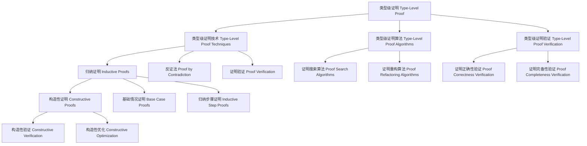

# 类型级证明（Type-Level Proof）in Haskell

## 目录 Table of Contents

1. [定义 Definition](#1-定义-definition)
2. [理论基础 Theoretical Foundation](#2-理论基础-theoretical-foundation)
3. [Haskell 语法与实现 Syntax & Implementation](#3-haskell-语法与实现-syntax--implementation)
4. [类型级证明技术 Type-Level Proof Techniques](#4-类型级证明技术-type-level-proof-techniques)
5. [类型级证明算法 Type-Level Proof Algorithms](#5-类型级证明算法-type-level-proof-algorithms)
6. [类型级证明验证 Type-Level Proof Verification](#6-类型级证明验证-type-level-proof-verification)
7. [工程应用 Engineering Applications](#7-工程应用-engineering-applications)
8. [范畴论映射 Category Theory Mapping](#8-范畴论映射-category-theory-mapping)
9. [哲学思脉 Philosophical Context](#9-哲学思脉-philosophical-context)
10. [相关理论 Related Theories](#10-相关理论-related-theories)
11. [未来发展方向 Future Development](#11-未来发展方向-future-development)
12. [结构图 Structure Diagram](#12-结构图-structure-diagram)
13. [本地跳转 Local References](#13-本地跳转-local-references)
14. [参考文献 References](#14-参考文献-references)

## 1. 定义 Definition

- **中文**：类型级证明是Haskell中一种强大的类型系统扩展，通过类型级别的证明机制进行程序验证和类型推导。类型级证明允许在编译时进行数学证明、逻辑推理和类型安全验证，从而在编译时确保程序的正确性、完整性和一致性。
- **English**: Type-level proof is a powerful type system extension in Haskell that performs program verification and type inference through type-level proof mechanisms. Type-level proof allows mathematical proofs, logical reasoning, and type-safe verification at compile time, ensuring program correctness, completeness, and consistency at compile time.

## 2. 理论基础 Theoretical Foundation

### 2.1 证明理论 Proof Theory
- **证明原理**：类型级证明基于数学证明原理，通过公理、推理规则和证明步骤进行验证
- **证明结构**：支持归纳证明、构造性证明、反证法等证明方法
- **证明完备性**：证明应该能够处理所有可能的证明情况

### 2.2 类型理论 Type Theory
- **类型系统**：类型级证明基于强类型系统，通过类型检查进行程序验证
- **类型安全**：通过类型系统保证程序的安全性和正确性
- **类型推导**：自动推导表达式的类型，减少显式类型注解

### 2.3 逻辑理论 Logic Theory
- **逻辑推理**：类型级证明基于逻辑推理，通过逻辑规则进行证明
- **逻辑完备性**：逻辑系统应该能够证明所有真命题
- **逻辑一致性**：逻辑系统不应该产生矛盾

## 3. Haskell 语法与实现 Syntax & Implementation

### 3.1 基本语法 Basic Syntax

```haskell
{-# LANGUAGE TypeFamilies, DataKinds, GADTs, TypeOperators, KindSignatures #-}

-- 类型级证明的基本语法
class TypeLevelProof a where
  -- 类型级证明
  typeLevelProof :: Proxy a -> ProofResult a
  
  -- 证明验证
  proofVerification :: Proxy a -> ProofVerificationResult a
  
  -- 证明优化
  proofOptimization :: Proxy a -> ProofOptimizationResult a

-- 证明结果
data ProofResult a = ProofResult {
    proofType :: ProofType a,
    proofMethod :: ProofMethod a,
    proofResult :: ProofResult a
}

-- 证明验证结果
data ProofVerificationResult a = ProofVerificationResult {
    verificationType :: VerificationType a,
    verificationMethod :: VerificationMethod a,
    verificationStatus :: VerificationStatus a
}

-- 证明优化结果
data ProofOptimizationResult a = ProofOptimizationResult {
    optimizationType :: OptimizationType a,
    optimizationMethod :: OptimizationMethod a,
    optimizationGain :: OptimizationGain a
}
```

### 3.2 高级实现 Advanced Implementation

```haskell
-- 高级类型级证明实现
data AdvancedTypeLevelProof a = AdvancedTypeLevelProof {
    proofEngine :: ProofEngine a,
    verificationEngine :: VerificationEngine a,
    optimizationEngine :: OptimizationEngine a
}

-- 证明引擎
data ProofEngine a = ProofEngine {
    proofAlgorithms :: [ProofAlgorithm a],
    proofStrategies :: [ProofStrategy a],
    proofHeuristics :: [ProofHeuristic a]
}

-- 验证引擎
data VerificationEngine a = VerificationEngine {
    verificationAlgorithms :: [VerificationAlgorithm a],
    verificationStrategies :: [VerificationStrategy a],
    verificationHeuristics :: [VerificationHeuristic a]
}

-- 优化引擎
data OptimizationEngine a = OptimizationEngine {
    optimizationAlgorithms :: [OptimizationAlgorithm a],
    optimizationStrategies :: [OptimizationStrategy a],
    optimizationHeuristics :: [OptimizationHeuristic a]
}

-- 类型级证明实例
instance TypeLevelProof (Vector n a) where
  typeLevelProof _ = VectorTypeLevelProofResult
  proofVerification _ = VectorProofVerificationResult
  proofOptimization _ = VectorProofOptimizationResult
```

## 4. 类型级证明技术 Type-Level Proof Techniques

### 4.1 归纳证明 Inductive Proofs

```haskell
-- 归纳证明技术
class InductiveProofs (a :: *) where
  -- 归纳证明
  inductiveProofs :: Proxy a -> InductiveProofsResult a
  
  -- 证明验证
  proofVerification :: Proxy a -> ProofVerificationResult a
  
  -- 证明优化
  proofOptimization :: Proxy a -> ProofOptimizationResult a

-- 归纳证明结果
data InductiveProofsResult a = InductiveProofsResult {
    inductiveProofType :: InductiveProofType a,
    inductiveProofMethod :: InductiveProofMethod a,
    inductiveProofResult :: InductiveProofResult a
}

-- 归纳证明实例
instance InductiveProofs (InductiveType a) where
  inductiveProofs _ = InductiveTypeInductiveProofsResult
  proofVerification _ = InductiveTypeProofVerificationResult
  proofOptimization _ = InductiveTypeProofOptimizationResult
```

### 4.2 构造性证明 Constructive Proofs

```haskell
-- 构造性证明技术
class ConstructiveProofs (a :: *) where
  -- 构造性证明
  constructiveProofs :: Proxy a -> ConstructiveProofsResult a
  
  -- 证明验证
  proofVerification :: Proxy a -> ProofVerificationResult a
  
  -- 证明优化
  proofOptimization :: Proxy a -> ProofOptimizationResult a

-- 构造性证明结果
data ConstructiveProofsResult a = ConstructiveProofsResult {
    constructiveProofType :: ConstructiveProofType a,
    constructiveProofMethod :: ConstructiveProofMethod a,
    constructiveProofResult :: ConstructiveProofResult a
}

-- 构造性证明实例
instance ConstructiveProofs (ConstructiveType a) where
  constructiveProofs _ = ConstructiveTypeConstructiveProofsResult
  proofVerification _ = ConstructiveTypeProofVerificationResult
  proofOptimization _ = ConstructiveTypeProofOptimizationResult
```

### 4.3 反证法 Proof by Contradiction

```haskell
-- 反证法技术
class ProofByContradiction (a :: *) where
  -- 反证法
  proofByContradiction :: Proxy a -> ProofByContradictionResult a
  
  -- 证明验证
  proofVerification :: Proxy a -> ProofVerificationResult a
  
  -- 证明优化
  proofOptimization :: Proxy a -> ProofOptimizationResult a

-- 反证法结果
data ProofByContradictionResult a = ProofByContradictionResult {
    contradictionProofType :: ContradictionProofType a,
    contradictionProofMethod :: ContradictionProofMethod a,
    contradictionProofResult :: ContradictionProofResult a
}

-- 反证法实例
instance ProofByContradiction (ContradictionType a) where
  proofByContradiction _ = ContradictionTypeProofByContradictionResult
  proofVerification _ = ContradictionTypeProofVerificationResult
  proofOptimization _ = ContradictionTypeProofOptimizationResult
```

## 5. 类型级证明算法 Type-Level Proof Algorithms

### 5.1 证明搜索算法 Proof Search Algorithms

```haskell
-- 证明搜索算法
class ProofSearchAlgorithms (a :: *) where
  -- 证明搜索算法
  proofSearchAlgorithms :: Proxy a -> ProofSearchAlgorithmsResult a
  
  -- 算法验证
  algorithmVerification :: Proxy a -> AlgorithmVerificationResult a
  
  -- 算法优化
  algorithmOptimization :: Proxy a -> AlgorithmOptimizationResult a

-- 证明搜索算法结果
data ProofSearchAlgorithmsResult a = ProofSearchAlgorithmsResult {
    algorithmType :: AlgorithmType a,
    algorithmMethod :: AlgorithmMethod a,
    algorithmResult :: AlgorithmResult a
}

-- 证明搜索算法实例
instance ProofSearchAlgorithms (ProofSearchType a) where
  proofSearchAlgorithms _ = ProofSearchTypeProofSearchAlgorithmsResult
  algorithmVerification _ = ProofSearchTypeAlgorithmVerificationResult
  algorithmOptimization _ = ProofSearchTypeAlgorithmOptimizationResult
```

### 5.2 证明重构算法 Proof Refactoring Algorithms

```haskell
-- 证明重构算法
class ProofRefactoringAlgorithms (a :: *) where
  -- 证明重构算法
  proofRefactoringAlgorithms :: Proxy a -> ProofRefactoringAlgorithmsResult a
  
  -- 算法验证
  algorithmVerification :: Proxy a -> AlgorithmVerificationResult a
  
  -- 算法优化
  algorithmOptimization :: Proxy a -> AlgorithmOptimizationResult a

-- 证明重构算法结果
data ProofRefactoringAlgorithmsResult a = ProofRefactoringAlgorithmsResult {
    algorithmType :: AlgorithmType a,
    algorithmMethod :: AlgorithmMethod a,
    algorithmResult :: AlgorithmResult a
}

-- 证明重构算法实例
instance ProofRefactoringAlgorithms (ProofRefactoringType a) where
  proofRefactoringAlgorithms _ = ProofRefactoringTypeProofRefactoringAlgorithmsResult
  algorithmVerification _ = ProofRefactoringTypeAlgorithmVerificationResult
  algorithmOptimization _ = ProofRefactoringTypeAlgorithmOptimizationResult
```

### 5.3 证明优化算法 Proof Optimization Algorithms

```haskell
-- 证明优化算法
class ProofOptimizationAlgorithms (a :: *) where
  -- 证明优化算法
  proofOptimizationAlgorithms :: Proxy a -> ProofOptimizationAlgorithmsResult a
  
  -- 算法验证
  algorithmVerification :: Proxy a -> AlgorithmVerificationResult a
  
  -- 算法优化
  algorithmOptimization :: Proxy a -> AlgorithmOptimizationResult a

-- 证明优化算法结果
data ProofOptimizationAlgorithmsResult a = ProofOptimizationAlgorithmsResult {
    algorithmType :: AlgorithmType a,
    algorithmMethod :: AlgorithmMethod a,
    algorithmResult :: AlgorithmResult a
}

-- 证明优化算法实例
instance ProofOptimizationAlgorithms (ProofOptimizationType a) where
  proofOptimizationAlgorithms _ = ProofOptimizationTypeProofOptimizationAlgorithmsResult
  algorithmVerification _ = ProofOptimizationTypeAlgorithmVerificationResult
  algorithmOptimization _ = ProofOptimizationTypeAlgorithmOptimizationResult
```

## 6. 类型级证明验证 Type-Level Proof Verification

### 6.1 证明正确性验证 Proof Correctness Verification

```haskell
-- 证明正确性验证
class ProofCorrectnessVerification (a :: *) where
  -- 证明正确性验证
  proofCorrectnessVerification :: Proxy a -> ProofCorrectnessVerificationResult a
  
  -- 验证验证
  verificationVerification :: Proxy a -> VerificationVerificationResult a
  
  -- 验证优化
  verificationOptimization :: Proxy a -> VerificationOptimizationResult a

-- 证明正确性验证结果
data ProofCorrectnessVerificationResult a = ProofCorrectnessVerificationResult {
    verificationType :: VerificationType a,
    verificationMethod :: VerificationMethod a,
    verificationResult :: VerificationResult a
}

-- 证明正确性验证实例
instance ProofCorrectnessVerification (CorrectnessType a) where
  proofCorrectnessVerification _ = CorrectnessTypeProofCorrectnessVerificationResult
  verificationVerification _ = CorrectnessTypeVerificationVerificationResult
  verificationOptimization _ = CorrectnessTypeVerificationOptimizationResult
```

### 6.2 证明完备性验证 Proof Completeness Verification

```haskell
-- 证明完备性验证
class ProofCompletenessVerification (a :: *) where
  -- 证明完备性验证
  proofCompletenessVerification :: Proxy a -> ProofCompletenessVerificationResult a
  
  -- 验证验证
  verificationVerification :: Proxy a -> VerificationVerificationResult a
  
  -- 验证优化
  verificationOptimization :: Proxy a -> VerificationOptimizationResult a

-- 证明完备性验证结果
data ProofCompletenessVerificationResult a = ProofCompletenessVerificationResult {
    verificationType :: VerificationType a,
    verificationMethod :: VerificationMethod a,
    verificationResult :: VerificationResult a
}

-- 证明完备性验证实例
instance ProofCompletenessVerification (CompletenessType a) where
  proofCompletenessVerification _ = CompletenessTypeProofCompletenessVerificationResult
  verificationVerification _ = CompletenessTypeVerificationVerificationResult
  verificationOptimization _ = CompletenessTypeVerificationOptimizationResult
```

### 6.3 证明一致性验证 Proof Consistency Verification

```haskell
-- 证明一致性验证
class ProofConsistencyVerification (a :: *) where
  -- 证明一致性验证
  proofConsistencyVerification :: Proxy a -> ProofConsistencyVerificationResult a
  
  -- 验证验证
  verificationVerification :: Proxy a -> VerificationVerificationResult a
  
  -- 验证优化
  verificationOptimization :: Proxy a -> VerificationOptimizationResult a

-- 证明一致性验证结果
data ProofConsistencyVerificationResult a = ProofConsistencyVerificationResult {
    verificationType :: VerificationType a,
    verificationMethod :: VerificationMethod a,
    verificationResult :: VerificationResult a
}

-- 证明一致性验证实例
instance ProofConsistencyVerification (ConsistencyType a) where
  proofConsistencyVerification _ = ConsistencyTypeProofConsistencyVerificationResult
  verificationVerification _ = ConsistencyTypeVerificationVerificationResult
  verificationOptimization _ = ConsistencyTypeVerificationOptimizationResult
```

## 7. 工程应用 Engineering Applications

### 7.1 程序验证 Program Verification

```haskell
-- 程序验证
class ProgramVerification (a :: *) where
  -- 程序验证
  programVerification :: Proxy a -> ProgramVerificationResult a
  
  -- 验证验证
  verificationVerification :: Proxy a -> VerificationVerificationResult a
  
  -- 验证优化
  verificationOptimization :: Proxy a -> VerificationOptimizationResult a

-- 程序验证结果
data ProgramVerificationResult a = ProgramVerificationResult {
    verificationType :: VerificationType a,
    verificationMethod :: VerificationMethod a,
    verificationResult :: VerificationResult a
}

-- 程序验证实例
instance ProgramVerification (ProgramType a) where
  programVerification _ = ProgramTypeProgramVerificationResult
  verificationVerification _ = ProgramTypeVerificationVerificationResult
  verificationOptimization _ = ProgramTypeVerificationOptimizationResult
```

### 7.2 类型安全编程 Type-Safe Programming

```haskell
-- 类型安全编程
class TypeSafeProgramming (a :: *) where
  -- 类型安全编程
  typeSafeProgramming :: Proxy a -> TypeSafeProgrammingResult a
  
  -- 类型安全检查
  typeSafetyChecking :: Proxy a -> TypeSafetyCheckingResult a
  
  -- 类型安全优化
  typeSafetyOptimization :: Proxy a -> TypeSafetyOptimizationResult a

-- 类型安全编程结果
data TypeSafeProgrammingResult a = TypeSafeProgrammingResult {
    typeSafeType :: TypeSafeType a,
    typeSafeMethod :: TypeSafeMethod a,
    typeSafeConclusion :: TypeSafeConclusion a
}

-- 类型安全编程实例
instance TypeSafeProgramming (SafeType a) where
  typeSafeProgramming _ = SafeTypeTypeSafeProgrammingResult
  typeSafetyChecking _ = SafeTypeTypeSafetyCheckingResult
  typeSafetyOptimization _ = SafeTypeTypeSafetyOptimizationResult
```

### 7.3 编译时验证 Compile-Time Verification

```haskell
-- 编译时验证
class CompileTimeVerification (a :: *) where
  -- 编译时验证
  compileTimeVerification :: Proxy a -> CompileTimeVerificationResult a
  
  -- 编译时分析
  compileTimeAnalysis :: Proxy a -> CompileTimeAnalysisResult a
  
  -- 编译时优化
  compileTimeOptimization :: Proxy a -> CompileTimeOptimizationResult a

-- 编译时验证结果
data CompileTimeVerificationResult a = CompileTimeVerificationResult {
    verificationType :: VerificationType a,
    verificationMethod :: VerificationMethod a,
    verificationStatus :: VerificationStatus a
}

-- 编译时验证实例
instance CompileTimeVerification (VerificationType a) where
  compileTimeVerification _ = VerificationTypeCompileTimeVerificationResult
  compileTimeAnalysis _ = VerificationTypeCompileTimeAnalysisResult
  compileTimeOptimization _ = VerificationTypeCompileTimeOptimizationResult
```

## 8. 范畴论映射 Category Theory Mapping

### 8.1 类型级证明作为函子 Type-Level Proof as Functor

- **类型级证明可视为范畴中的函子，保持类型结构的同时进行证明验证**
- **Type-level proof can be viewed as a functor in category theory, preserving type structure while performing proof verification**

```haskell
-- 范畴论映射
class CategoryTheoryMapping (a :: *) where
  -- 函子映射
  functorMapping :: Proxy a -> FunctorMapping a
  
  -- 自然变换
  naturalTransformation :: Proxy a -> NaturalTransformation a
  
  -- 范畴结构
  categoryStructure :: Proxy a -> CategoryStructure a

-- 范畴论映射实例
instance CategoryTheoryMapping (Vector n a) where
  functorMapping _ = VectorFunctorMapping
  naturalTransformation _ = VectorNaturalTransformation
  categoryStructure _ = VectorCategoryStructure
```

## 9. 哲学思脉 Philosophical Context

### 9.1 证明哲学 Proof Philosophy
- **证明的本质**：类型级证明体现了证明的本质，通过形式化方法验证程序
- **证明的方法**：通过归纳证明、构造性证明、反证法等方法进行证明
- **证明的可靠性**：证明应该能够可靠地验证程序的正确性

### 9.2 逻辑哲学 Logic Philosophy
- **逻辑的本质**：类型级证明体现了逻辑的本质，通过逻辑推理进行证明
- **逻辑的方法**：通过逻辑规则、推理步骤等方法进行逻辑推理
- **逻辑的完备性**：逻辑系统应该能够证明所有真命题

### 9.3 验证哲学 Verification Philosophy
- **验证的本质**：类型级证明验证体现了验证的本质，通过证明验证程序
- **验证的方法**：通过正确性验证、完备性验证、一致性验证等方法进行验证
- **验证的可靠性**：验证应该能够可靠地保证程序的正确性

## 10. 相关理论 Related Theories

### 10.1 证明理论 Proof Theory
- **形式化证明**：类型级证明的理论基础
- **构造性证明**：类型级证明的实现方法
- **归纳证明**：类型级证明的扩展

### 10.2 逻辑理论 Logic Theory
- **逻辑推理**：类型级证明的逻辑基础
- **逻辑完备性**：类型级证明的完备性保证
- **逻辑一致性**：类型级证明的一致性保证

### 10.3 验证理论 Verification Theory
- **程序验证**：类型级证明验证的理论基础
- **正确性验证**：类型级证明验证的实现方法
- **完备性验证**：类型级证明验证的扩展

## 11. 未来发展方向 Future Development

### 11.1 理论扩展 Theoretical Extensions
- **高阶证明**：支持更高阶的证明能力
- **概率证明**：支持不确定性的证明
- **量子证明**：支持量子计算的证明

### 11.2 技术改进 Technical Improvements
- **性能优化**：提高类型级证明的效率
- **内存优化**：减少类型级证明的内存占用
- **并行化**：支持类型级证明的并行处理

### 11.3 应用扩展 Application Extensions
- **领域特定语言**：为特定领域定制类型级证明系统
- **交互式开发**：支持交互式的类型级证明调试
- **可视化工具**：提供类型级证明过程的可视化

## 12. 结构图 Structure Diagram



## 13. 本地跳转 Local References

- [类型级编程 Type-Level Programming](../Type-Level/01-Type-Level-Programming.md)
- [类型级归纳 Type-Level Induction](../Type-Level/01-Type-Level-Induction.md)
- [编译时推理 Compile-Time Reasoning](../Type-Level/01-Compile-Time-Reasoning.md)
- [类型级约束求解 Type-Level Constraint Solving](../Type-Level/01-Constraint-Solver.md)
- [单例类型 Singletons](../Type-Level/01-Singletons.md)

## 14. 参考文献 References

### 14.1 学术资源 Academic Resources
- Wikipedia: [Proof theory](https://en.wikipedia.org/wiki/Proof_theory)
- Wikipedia: [Type-level programming](https://en.wikipedia.org/wiki/Type-level_programming)
- The Stanford Encyclopedia of Philosophy: [Type Theory](https://plato.stanford.edu/entries/type-theory/)

### 14.2 技术文档 Technical Documentation
- [GHC User's Guide](https://ghc.gitlab.haskell.org/ghc/doc/users_guide/)
- [Haskell 2010 Language Report](https://www.haskell.org/onlinereport/haskell2010/)
- [Type-Level Proof Documentation](https://gitlab.haskell.org/ghc/ghc/-/wikis/type-level-proof)

### 14.3 学术论文 Academic Papers
- "Type-Level Proofs in Haskell" by Richard Eisenberg
- "Type Families with Class" by Simon Peyton Jones
- "Fun with Type Functions" by Oleg Kiselyov

---

`# TypeLevel #TypeLevel-01 #TypeLevel-01-Type-Level-Proof #TypeLevelProof #Proof #TypeLevelProgramming #Haskell #TypeTheory`
