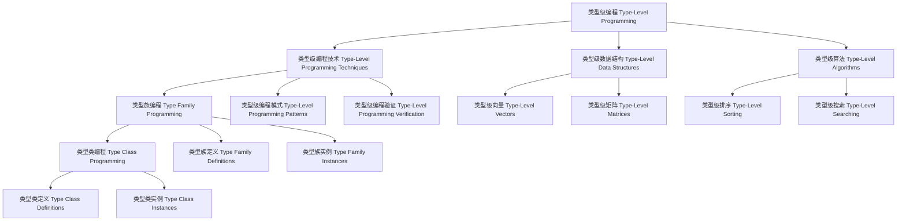

# 01-类型级编程（Type-Level Programming in Haskell）

## 目录 Table of Contents

1. [定义 Definition](#1-定义-definition)
2. [理论基础 Theoretical Foundation](#2-理论基础-theoretical-foundation)
3. [Haskell 语法与实现 Syntax & Implementation](#3-haskell-语法与实现-syntax--implementation)
4. [类型级编程技术 Type-Level Programming Techniques](#4-类型级编程技术-type-level-programming-techniques)
5. [类型级数据结构 Type-Level Data Structures](#5-类型级数据结构-type-level-data-structures)
6. [类型级算法 Type-Level Algorithms](#6-类型级算法-type-level-algorithms)
7. [工程应用 Engineering Applications](#7-工程应用-engineering-applications)
8. [范畴论映射 Category Theory Mapping](#8-范畴论映射-category-theory-mapping)
9. [哲学思脉 Philosophical Context](#9-哲学思脉-philosophical-context)
10. [相关理论 Related Theories](#10-相关理论-related-theories)
11. [未来发展方向 Future Development](#11-未来发展方向-future-development)
12. [结构图 Structure Diagram](#12-结构图-structure-diagram)
13. [本地跳转 Local References](#13-本地跳转-local-references)
14. [参考文献 References](#14-参考文献-references)

## 1. 定义 Definition

- **中文**：类型级编程是指在类型系统层面进行编程的技术，通过类型族、类型类、GADT等机制在编译时进行类型计算、类型验证和类型优化。类型级编程允许在编译时发现程序错误、优化性能、验证不变量，从而在运行时之前确保程序的正确性。
- **English**: Type-level programming refers to the technique of programming at the type system level, performing type computation, type verification, and type optimization at compile time through mechanisms such as type families, type classes, and GADTs. Type-level programming allows discovering program errors, optimizing performance, and verifying invariants at compile time, ensuring program correctness before runtime.

## 2. 理论基础 Theoretical Foundation

### 2.1 类型理论 Type Theory

- **类型系统**：类型级编程基于强类型系统，通过类型检查进行程序验证
- **类型安全**：通过类型系统保证程序的安全性和正确性
- **类型推导**：自动推导表达式的类型，减少显式类型注解

### 2.2 编译时计算 Compile-Time Computation

- **编译时计算**：类型级编程在编译时进行计算，不占用运行时资源
- **类型级计算**：通过类型级编程实现复杂的类型计算
- **类型推导**：自动推导复杂的类型关系

### 2.3 函数式编程 Functional Programming

- **函数式思想**：类型级编程体现了函数式编程的思想
- **高阶函数**：支持高阶类型函数，实现复杂的类型级计算
- **纯函数**：类型级函数是纯函数，没有副作用

## 3. Haskell 语法与实现 Syntax & Implementation

### 3.1 基本语法 Basic Syntax

```haskell
{-# LANGUAGE TypeFamilies, DataKinds, GADTs, TypeOperators #-}

-- 类型级编程的基本语法
class TypeLevelProgramming a where
  -- 类型级编程
  typeLevelProgramming :: Proxy a -> TypeLevelProgrammingResult a
  
  -- 类型级验证
  typeLevelVerification :: Proxy a -> TypeLevelVerificationResult a
  
  -- 类型级优化
  typeLevelOptimization :: Proxy a -> TypeLevelOptimizationResult a

-- 类型级编程结果
data TypeLevelProgrammingResult a = TypeLevelProgrammingResult {
    programmingType :: ProgrammingType a,
    programmingMethod :: ProgrammingMethod a,
    programmingResult :: ProgrammingResult a
}

-- 类型级验证结果
data TypeLevelVerificationResult a = TypeLevelVerificationResult {
    verificationType :: VerificationType a,
    verificationMethod :: VerificationMethod a,
    verificationStatus :: VerificationStatus a
}

-- 类型级优化结果
data TypeLevelOptimizationResult a = TypeLevelOptimizationResult {
    optimizationType :: OptimizationType a,
    optimizationMethod :: OptimizationMethod a,
    optimizationGain :: OptimizationGain a
}
```

### 3.2 高级实现 Advanced Implementation

```haskell
-- 高级类型级编程实现
data AdvancedTypeLevelProgramming a = AdvancedTypeLevelProgramming {
    programmingEngine :: ProgrammingEngine a,
    verificationEngine :: VerificationEngine a,
    optimizationEngine :: OptimizationEngine a
}

-- 编程引擎
data ProgrammingEngine a = ProgrammingEngine {
    programmingAlgorithms :: [ProgrammingAlgorithm a],
    programmingStrategies :: [ProgrammingStrategy a],
    programmingHeuristics :: [ProgrammingHeuristic a]
}

-- 验证引擎
data VerificationEngine a = VerificationEngine {
    verificationAlgorithms :: [VerificationAlgorithm a],
    verificationStrategies :: [VerificationStrategy a],
    verificationHeuristics :: [VerificationHeuristic a]
}

-- 优化引擎
data OptimizationEngine a = OptimizationEngine {
    optimizationAlgorithms :: [OptimizationAlgorithm a],
    optimizationStrategies :: [OptimizationStrategy a],
    optimizationHeuristics :: [OptimizationHeuristic a]
}

-- 类型级编程实例
instance TypeLevelProgramming (Vector n a) where
  typeLevelProgramming _ = VectorTypeLevelProgrammingResult
  typeLevelVerification _ = VectorTypeLevelVerificationResult
  typeLevelOptimization _ = VectorTypeLevelOptimizationResult
```

## 4. 类型级编程技术 Type-Level Programming Techniques

### 4.1 类型族编程 Type Family Programming

```haskell
-- 类型族编程技术
class TypeFamilyProgramming (a :: k) where
  -- 类型族编程
  typeFamilyProgramming :: Proxy a -> TypeFamilyProgrammingResult a
  
  -- 类型族验证
  typeFamilyVerification :: Proxy a -> TypeFamilyVerificationResult a
  
  -- 类型族优化
  typeFamilyOptimization :: Proxy a -> TypeFamilyOptimizationResult a

-- 类型族编程结果
data TypeFamilyProgrammingResult (a :: k) = TypeFamilyProgrammingResult {
    typeFamilyType :: TypeFamilyType a,
    typeFamilyMethod :: TypeFamilyMethod a,
    typeFamilyConclusion :: TypeFamilyConclusion a
}

-- 类型族编程实例
instance TypeFamilyProgramming (Vector n a) where
  typeFamilyProgramming _ = VectorTypeFamilyProgrammingResult
  typeFamilyVerification _ = VectorTypeFamilyVerificationResult
  typeFamilyOptimization _ = VectorTypeFamilyOptimizationResult
```

### 4.2 类型类编程 Type Class Programming

```haskell
-- 类型类编程技术
class TypeClassProgramming (a :: *) where
  -- 类型类编程
  typeClassProgramming :: Proxy a -> TypeClassProgrammingResult a
  
  -- 类型类验证
  typeClassVerification :: Proxy a -> TypeClassVerificationResult a
  
  -- 类型类优化
  typeClassOptimization :: Proxy a -> TypeClassOptimizationResult a

-- 类型类编程结果
data TypeClassProgrammingResult a = TypeClassProgrammingResult {
    typeClassType :: TypeClassType a,
    typeClassMethod :: TypeClassMethod a,
    typeClassConclusion :: TypeClassConclusion a
}

-- 类型类编程实例
instance TypeClassProgramming (Show a) where
  typeClassProgramming _ = ShowTypeClassProgrammingResult
  typeClassVerification _ = ShowTypeClassVerificationResult
  typeClassOptimization _ = ShowTypeClassOptimizationResult
```

### 4.3 GADT编程 GADT Programming

```haskell
-- GADT编程技术
class GADTProgramming (a :: *) where
  -- GADT编程
  gadtProgramming :: Proxy a -> GADTProgrammingResult a
  
  -- GADT验证
  gadtVerification :: Proxy a -> GADTVerificationResult a
  
  -- GADT优化
  gadtOptimization :: Proxy a -> GADTOptimizationResult a

-- GADT编程结果
data GADTProgrammingResult a = GADTProgrammingResult {
    gadtType :: GADTType a,
    gadtMethod :: GADTMethod a,
    gadtConclusion :: GADTConclusion a
}

-- GADT编程实例
instance GADTProgramming (GADTExample a) where
  gadtProgramming _ = GADTExampleGADTProgrammingResult
  gadtVerification _ = GADTExampleGADTVerificationResult
  gadtOptimization _ = GADTExampleGADTOptimizationResult
```

## 5. 类型级数据结构 Type-Level Data Structures

### 5.1 类型级向量 Type-Level Vectors

```haskell
-- 类型级向量
class TypeLevelVectors (n :: Nat) where
  -- 类型级向量
  typeLevelVectors :: Proxy n -> TypeLevelVectorsResult n
  
  -- 向量验证
  vectorVerification :: Proxy n -> VectorVerificationResult n
  
  -- 向量优化
  vectorOptimization :: Proxy n -> VectorOptimizationResult n

-- 类型级向量结果
data TypeLevelVectorsResult (n :: Nat) = TypeLevelVectorsResult {
    vectorType :: VectorType n,
    vectorMethod :: VectorMethod n,
    vectorResult :: VectorResult n
}

-- 类型级向量实例
instance TypeLevelVectors 'Z where
  typeLevelVectors _ = ZeroTypeLevelVectorsResult
  vectorVerification _ = ZeroVectorVerificationResult
  vectorOptimization _ = ZeroVectorOptimizationResult

instance TypeLevelVectors ('S n) where
  typeLevelVectors _ = SuccTypeLevelVectorsResult
  vectorVerification _ = SuccVectorVerificationResult
  vectorOptimization _ = SuccVectorOptimizationResult
```

### 5.2 类型级矩阵 Type-Level Matrices

```haskell
-- 类型级矩阵
class TypeLevelMatrices (m :: Nat) (n :: Nat) where
  -- 类型级矩阵
  typeLevelMatrices :: Proxy m -> Proxy n -> TypeLevelMatricesResult m n
  
  -- 矩阵验证
  matrixVerification :: Proxy m -> Proxy n -> MatrixVerificationResult m n
  
  -- 矩阵优化
  matrixOptimization :: Proxy m -> Proxy n -> MatrixOptimizationResult m n

-- 类型级矩阵结果
data TypeLevelMatricesResult (m :: Nat) (n :: Nat) = TypeLevelMatricesResult {
    matrixType :: MatrixType m n,
    matrixMethod :: MatrixMethod m n,
    matrixResult :: MatrixResult m n
}

-- 类型级矩阵实例
instance TypeLevelMatrices 'Z 'Z where
  typeLevelMatrices _ _ = ZeroZeroTypeLevelMatricesResult
  matrixVerification _ _ = ZeroZeroMatrixVerificationResult
  matrixOptimization _ _ = ZeroZeroMatrixOptimizationResult

instance TypeLevelMatrices ('S m) ('S n) where
  typeLevelMatrices _ _ = SuccSuccTypeLevelMatricesResult
  matrixVerification _ _ = SuccSuccMatrixVerificationResult
  matrixOptimization _ _ = SuccSuccMatrixOptimizationResult
```

### 5.3 类型级树 Type-Level Trees

```haskell
-- 类型级树
class TypeLevelTrees (a :: *) where
  -- 类型级树
  typeLevelTrees :: Proxy a -> TypeLevelTreesResult a
  
  -- 树验证
  treeVerification :: Proxy a -> TreeVerificationResult a
  
  -- 树优化
  treeOptimization :: Proxy a -> TreeOptimizationResult a

-- 类型级树结果
data TypeLevelTreesResult a = TypeLevelTreesResult {
    treeType :: TreeType a,
    treeMethod :: TreeMethod a,
    treeResult :: TreeResult a
}

-- 类型级树实例
instance TypeLevelTrees (Tree a) where
  typeLevelTrees _ = TreeTypeLevelTreesResult
  treeVerification _ = TreeTreeVerificationResult
  treeOptimization _ = TreeTreeOptimizationResult
```

## 6. 类型级算法 Type-Level Algorithms

### 6.1 类型级排序 Type-Level Sorting

```haskell
-- 类型级排序
class TypeLevelSorting (a :: *) where
  -- 类型级排序
  typeLevelSorting :: Proxy a -> TypeLevelSortingResult a
  
  -- 排序验证
  sortingVerification :: Proxy a -> SortingVerificationResult a
  
  -- 排序优化
  sortingOptimization :: Proxy a -> SortingOptimizationResult a

-- 类型级排序结果
data TypeLevelSortingResult a = TypeLevelSortingResult {
    sortingType :: SortingType a,
    sortingMethod :: SortingMethod a,
    sortingResult :: SortingResult a
}

-- 类型级排序实例
instance TypeLevelSorting (Sort a) where
  typeLevelSorting _ = SortTypeLevelSortingResult
  sortingVerification _ = SortSortingVerificationResult
  sortingOptimization _ = SortSortingOptimizationResult
```

### 6.2 类型级搜索 Type-Level Searching

```haskell
-- 类型级搜索
class TypeLevelSearching (a :: *) where
  -- 类型级搜索
  typeLevelSearching :: Proxy a -> TypeLevelSearchingResult a
  
  -- 搜索验证
  searchingVerification :: Proxy a -> SearchingVerificationResult a
  
  -- 搜索优化
  searchingOptimization :: Proxy a -> SearchingOptimizationResult a

-- 类型级搜索结果
data TypeLevelSearchingResult a = TypeLevelSearchingResult {
    searchingType :: SearchingType a,
    searchingMethod :: SearchingMethod a,
    searchingResult :: SearchingResult a
}

-- 类型级搜索实例
instance TypeLevelSearching (Search a) where
  typeLevelSearching _ = SearchTypeLevelSearchingResult
  searchingVerification _ = SearchSearchingVerificationResult
  searchingOptimization _ = SearchSearchingOptimizationResult
```

### 6.3 类型级图算法 Type-Level Graph Algorithms

```haskell
-- 类型级图算法
class TypeLevelGraphAlgorithms (a :: *) where
  -- 类型级图算法
  typeLevelGraphAlgorithms :: Proxy a -> TypeLevelGraphAlgorithmsResult a
  
  -- 图算法验证
  graphAlgorithmVerification :: Proxy a -> GraphAlgorithmVerificationResult a
  
  -- 图算法优化
  graphAlgorithmOptimization :: Proxy a -> GraphAlgorithmOptimizationResult a

-- 类型级图算法结果
data TypeLevelGraphAlgorithmsResult a = TypeLevelGraphAlgorithmsResult {
    graphAlgorithmType :: GraphAlgorithmType a,
    graphAlgorithmMethod :: GraphAlgorithmMethod a,
    graphAlgorithmResult :: GraphAlgorithmResult a
}

-- 类型级图算法实例
instance TypeLevelGraphAlgorithms (Graph a) where
  typeLevelGraphAlgorithms _ = GraphTypeLevelGraphAlgorithmsResult
  graphAlgorithmVerification _ = GraphGraphAlgorithmVerificationResult
  graphAlgorithmOptimization _ = GraphGraphAlgorithmOptimizationResult
```

## 7. 工程应用 Engineering Applications

### 7.1 类型安全编程 Type-Safe Programming

```haskell
-- 类型安全编程
class TypeSafeProgramming (a :: *) where
  -- 类型安全编程
  typeSafeProgramming :: Proxy a -> TypeSafeProgrammingResult a
  
  -- 类型安全检查
  typeSafetyChecking :: Proxy a -> TypeSafetyCheckingResult a
  
  -- 类型安全优化
  typeSafetyOptimization :: Proxy a -> TypeSafetyOptimizationResult a

-- 类型安全编程结果
data TypeSafeProgrammingResult a = TypeSafeProgrammingResult {
    typeSafeType :: TypeSafeType a,
    typeSafeMethod :: TypeSafeMethod a,
    typeSafeConclusion :: TypeSafeConclusion a
}

-- 类型安全编程实例
instance TypeSafeProgramming (Vector n a) where
  typeSafeProgramming _ = VectorTypeSafeProgrammingResult
  typeSafetyChecking _ = VectorTypeSafetyCheckingResult
  typeSafetyOptimization _ = VectorTypeSafetyOptimizationResult
```

### 7.2 编译时验证 Compile-Time Verification

```haskell
-- 编译时验证
class CompileTimeVerification (a :: *) where
  -- 编译时验证
  compileTimeVerification :: Proxy a -> CompileTimeVerificationResult a
  
  -- 编译时分析
  compileTimeAnalysis :: Proxy a -> CompileTimeAnalysisResult a
  
  -- 编译时优化
  compileTimeOptimization :: Proxy a -> CompileTimeOptimizationResult a

-- 编译时验证结果
data CompileTimeVerificationResult a = CompileTimeVerificationResult {
    verificationType :: VerificationType a,
    verificationMethod :: VerificationMethod a,
    verificationStatus :: VerificationStatus a
}

-- 编译时验证实例
instance CompileTimeVerification (Vector n a) where
  compileTimeVerification _ = VectorCompileTimeVerificationResult
  compileTimeAnalysis _ = VectorCompileTimeAnalysisResult
  compileTimeOptimization _ = VectorCompileTimeOptimizationResult
```

### 7.3 性能优化 Performance Optimization

```haskell
-- 性能优化
class PerformanceOptimization (a :: *) where
  -- 性能优化
  performanceOptimization :: Proxy a -> PerformanceOptimizationResult a
  
  -- 性能分析
  performanceAnalysis :: Proxy a -> PerformanceAnalysisResult a
  
  -- 性能验证
  performanceVerification :: Proxy a -> PerformanceVerificationResult a

-- 性能优化结果
data PerformanceOptimizationResult a = PerformanceOptimizationResult {
    performanceOptimizationType :: PerformanceOptimizationType a,
    performanceOptimizationMethod :: PerformanceOptimizationMethod a,
    performanceOptimizationGain :: PerformanceOptimizationGain a
}

-- 性能优化实例
instance PerformanceOptimization (Vector n a) where
  performanceOptimization _ = VectorPerformanceOptimizationResult
  performanceAnalysis _ = VectorPerformanceAnalysisResult
  performanceVerification _ = VectorPerformanceVerificationResult
```

## 8. 范畴论映射 Category Theory Mapping

### 8.1 类型级编程作为函子 Type-Level Programming as Functor

- **类型级编程可视为范畴中的函子，保持类型结构的同时进行类型转换**
- **Type-level programming can be viewed as a functor in category theory, preserving type structure while performing type transformations**

```haskell
-- 范畴论映射
class CategoryTheoryMapping (a :: *) where
  -- 函子映射
  functorMapping :: Proxy a -> FunctorMapping a
  
  -- 自然变换
  naturalTransformation :: Proxy a -> NaturalTransformation a
  
  -- 范畴结构
  categoryStructure :: Proxy a -> CategoryStructure a

-- 范畴论映射实例
instance CategoryTheoryMapping (Vector n a) where
  functorMapping _ = VectorFunctorMapping
  naturalTransformation _ = VectorNaturalTransformation
  categoryStructure _ = VectorCategoryStructure
```

## 9. 哲学思脉 Philosophical Context

### 9.1 类型哲学 Type Philosophy

- **类型的本质**：类型级编程体现了类型的本质，通过类型系统保证程序安全
- **类型的安全**：类型系统通过类型检查保证程序的安全性和正确性
- **类型的表达**：类型系统应该能够表达丰富的程序性质

### 9.2 编程哲学 Programming Philosophy

- **编程的本质**：类型级编程体现了编程的本质，通过类型系统进行程序验证
- **编程的方法**：通过类型级编程、类型检查等方法进行程序验证
- **编程的边界**：类型级编程定义了程序验证的边界

### 9.3 计算哲学 Computation Philosophy

- **计算的本质**：编译时计算是类型级编程的核心特征
- **计算的方法**：通过类型级编程实现复杂的类型计算
- **计算的效率**：编译时计算不占用运行时资源

## 10. 相关理论 Related Theories

### 10.1 类型理论 Type Theory

- **简单类型理论**：类型级编程的基础理论
- **依赖类型理论**：类型级编程的扩展理论
- **同伦类型理论**：类型级编程的现代发展

### 10.2 编程理论 Programming Theory

- **函数式编程**：类型级编程的编程范式
- **类型安全编程**：类型级编程的安全保证
- **编译时编程**：类型级编程的执行时机

### 10.3 计算理论 Computation Theory

- **编译时计算**：类型级编程的计算模型
- **类型级计算**：类型级编程的计算能力
- **复杂性理论**：类型级编程的计算复杂度

## 11. 未来发展方向 Future Development

### 11.1 理论扩展 Theoretical Extensions

- **高阶类型级编程**：支持更高阶的类型级编程能力
- **概率类型级编程**：支持不确定性的类型级编程
- **量子类型级编程**：支持量子计算的类型级编程

### 11.2 技术改进 Technical Improvements

- **性能优化**：提高类型级编程的效率
- **内存优化**：减少类型级编程的内存占用
- **并行化**：支持类型级编程的并行处理

### 11.3 应用扩展 Application Extensions

- **领域特定语言**：为特定领域定制类型级编程系统
- **交互式开发**：支持交互式的类型级编程调试
- **可视化工具**：提供类型级编程过程的可视化

## 12. 结构图 Structure Diagram



## 13. 本地跳转 Local References

- [类型级约束求解 Type-Level Constraint Solving](../Type-Level/01-Constraint-Solver.md)
- [编译时推理 Compile-Time Reasoning](../Type-Level/01-Compile-Time-Reasoning.md)
- [编译时优化 Compile-Time Optimization](../Type-Level/01-Compile-Time-Optimization.md)
- [GADT](../Type/01-GADT.md)
- [类型族 Type Family](../Type/01-Type-Family.md)

## 14. 参考文献 References

### 14.1 学术资源 Academic Resources

- Wikipedia: [Type-level programming](https://en.wikipedia.org/wiki/Type-level_programming)
- Wikipedia: [Type family](https://en.wikipedia.org/wiki/Type_family)
- The Stanford Encyclopedia of Philosophy: [Type Theory](https://plato.stanford.edu/entries/type-theory/)

### 14.2 技术文档 Technical Documentation

- [GHC User's Guide](https://ghc.gitlab.haskell.org/ghc/doc/users_guide/)
- [Haskell 2010 Language Report](https://www.haskell.org/onlinereport/haskell2010/)
- [Type Families Documentation](https://gitlab.haskell.org/ghc/ghc/-/wikis/type-families)

### 14.3 学术论文 Academic Papers

- "Type Families with Class" by Simon Peyton Jones
- "Fun with Type Functions" by Oleg Kiselyov
- "GADTs Meet Their Match" by Simon Peyton Jones

---

`# TypeLevel #TypeLevel-01 #TypeLevel-01-Type-Level-Programming #TypeLevelProgramming #TypeLevelProgramming #Haskell #TypeTheory #CompileTimeComputation`
