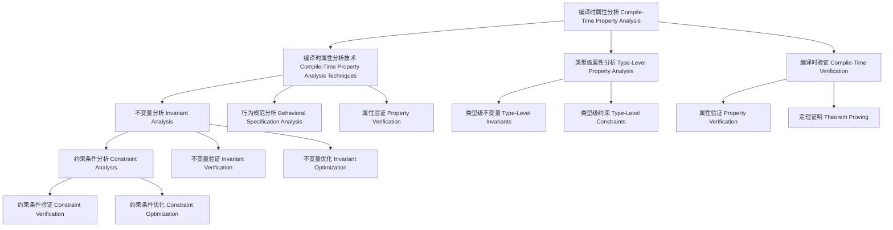

# 02-编译时属性分析（Compile-Time Property Analysis in Haskell）

## 目录 Table of Contents

- [02-编译时属性分析（Compile-Time Property Analysis in Haskell）](#02-编译时属性分析compile-time-property-analysis-in-haskell)
  - [目录 Table of Contents](#目录-table-of-contents)
  - [1. 定义 Definition](#1-定义-definition)
  - [2. 理论基础 Theoretical Foundation](#2-理论基础-theoretical-foundation)
    - [2.1 属性理论 Property Theory](#21-属性理论-property-theory)
    - [2.2 类型理论 Type Theory](#22-类型理论-type-theory)
    - [2.3 形式化验证 Formal Verification](#23-形式化验证-formal-verification)
  - [3. Haskell 语法与实现 Syntax \& Implementation](#3-haskell-语法与实现-syntax--implementation)
    - [3.1 基本语法 Basic Syntax](#31-基本语法-basic-syntax)
    - [3.2 高级实现 Advanced Implementation](#32-高级实现-advanced-implementation)
  - [4. 编译时属性分析技术 Compile-Time Property Analysis Techniques](#4-编译时属性分析技术-compile-time-property-analysis-techniques)
    - [4.1 不变量分析 Invariant Analysis](#41-不变量分析-invariant-analysis)
    - [4.2 约束条件分析 Constraint Analysis](#42-约束条件分析-constraint-analysis)
    - [4.3 行为规范分析 Behavioral Specification Analysis](#43-行为规范分析-behavioral-specification-analysis)
  - [5. 类型级属性分析 Type-Level Property Analysis](#5-类型级属性分析-type-level-property-analysis)
    - [5.1 类型级不变量 Type-Level Invariants](#51-类型级不变量-type-level-invariants)
    - [5.2 类型级约束 Type-Level Constraints](#52-类型级约束-type-level-constraints)
    - [5.3 类型级行为规范 Type-Level Behavioral Specifications](#53-类型级行为规范-type-level-behavioral-specifications)
  - [6. 编译时验证 Compile-Time Verification](#6-编译时验证-compile-time-verification)
    - [6.1 属性验证 Property Verification](#61-属性验证-property-verification)
    - [6.2 定理证明 Theorem Proving](#62-定理证明-theorem-proving)
    - [6.3 模型检查 Model Checking](#63-模型检查-model-checking)
  - [7. 工程应用 Engineering Applications](#7-工程应用-engineering-applications)
    - [7.1 程序验证 Program Verification](#71-程序验证-program-verification)
    - [7.2 形式化验证 Formal Verification](#72-形式化验证-formal-verification)
    - [7.3 安全验证 Security Verification](#73-安全验证-security-verification)
  - [8. 范畴论映射 Category Theory Mapping](#8-范畴论映射-category-theory-mapping)
    - [8.1 编译时属性分析作为函子 Compile-Time Property Analysis as Functor](#81-编译时属性分析作为函子-compile-time-property-analysis-as-functor)
  - [9. 哲学思脉 Philosophical Context](#9-哲学思脉-philosophical-context)
    - [9.1 属性哲学 Property Philosophy](#91-属性哲学-property-philosophy)
    - [9.2 验证哲学 Verification Philosophy](#92-验证哲学-verification-philosophy)
    - [9.3 分析哲学 Analysis Philosophy](#93-分析哲学-analysis-philosophy)
  - [10. 相关理论 Related Theories](#10-相关理论-related-theories)
    - [10.1 属性理论 Property Theory](#101-属性理论-property-theory)
    - [10.2 验证理论 Verification Theory](#102-验证理论-verification-theory)
    - [10.3 分析理论 Analysis Theory](#103-分析理论-analysis-theory)
  - [11. 未来发展方向 Future Development](#11-未来发展方向-future-development)
    - [11.1 理论扩展 Theoretical Extensions](#111-理论扩展-theoretical-extensions)
    - [11.2 技术改进 Technical Improvements](#112-技术改进-technical-improvements)
    - [11.3 应用扩展 Application Extensions](#113-应用扩展-application-extensions)
  - [12. 结构图 Structure Diagram](#12-结构图-structure-diagram)
  - [13. 本地跳转 Local References](#13-本地跳转-local-references)
  - [14. 参考文献 References](#14-参考文献-references)
    - [14.1 学术资源 Academic Resources](#141-学术资源-academic-resources)
    - [14.2 技术文档 Technical Documentation](#142-技术文档-technical-documentation)
    - [14.3 学术论文 Academic Papers](#143-学术论文-academic-papers)

## 1. 定义 Definition

- **中文**：编译时属性分析是指在编译阶段通过类型系统、类型族、类型类等机制分析程序属性的技术。编译时属性分析允许在编译时验证程序的不变量、约束条件和行为规范，从而在运行时之前确保程序的正确性和可靠性。
- **English**: Compile-time property analysis refers to the technique of analyzing program properties during the compilation phase through type systems, type families, type classes, and other mechanisms. Compile-time property analysis allows verifying program invariants, constraints, and behavioral specifications at compile time, ensuring program correctness and reliability before runtime.

## 2. 理论基础 Theoretical Foundation

### 2.1 属性理论 Property Theory

- **属性定义**：程序属性是程序必须满足的条件和规范
- **属性分类**：包括不变量、约束条件、行为规范等
- **属性验证**：通过形式化方法验证程序属性

### 2.2 类型理论 Type Theory

- **类型系统**：编译时属性分析基于强类型系统，通过类型检查进行程序验证
- **类型安全**：通过类型系统保证程序的安全性和正确性
- **类型推导**：自动推导表达式的类型，减少显式类型注解

### 2.3 形式化验证 Formal Verification

- **形式化方法**：编译时属性分析使用形式化方法进行程序验证
- **定理证明**：通过定理证明验证程序属性
- **模型检查**：通过模型检查验证程序属性

## 3. Haskell 语法与实现 Syntax & Implementation

### 3.1 基本语法 Basic Syntax

```haskell
{-# LANGUAGE TypeFamilies, DataKinds, GADTs, TypeOperators #-}

-- 编译时属性分析的基本语法
class CompileTimePropertyAnalysis a where
  -- 编译时属性分析
  compileTimePropertyAnalysis :: Proxy a -> PropertyAnalysisResult a
  
  -- 属性验证
  propertyVerification :: Proxy a -> PropertyVerificationResult a
  
  -- 属性优化
  propertyOptimization :: Proxy a -> PropertyOptimizationResult a

-- 属性分析结果
data PropertyAnalysisResult a = PropertyAnalysisResult {
    analysisType :: AnalysisType a,
    analysisMethod :: AnalysisMethod a,
    analysisResult :: AnalysisResult a
}

-- 属性验证结果
data PropertyVerificationResult a = PropertyVerificationResult {
    verificationType :: VerificationType a,
    verificationMethod :: VerificationMethod a,
    verificationStatus :: VerificationStatus a
}

-- 属性优化结果
data PropertyOptimizationResult a = PropertyOptimizationResult {
    optimizationType :: OptimizationType a,
    optimizationMethod :: OptimizationMethod a,
    optimizationGain :: OptimizationGain a
}
```

### 3.2 高级实现 Advanced Implementation

```haskell
-- 高级编译时属性分析实现
data AdvancedCompileTimePropertyAnalysis a = AdvancedCompileTimePropertyAnalysis {
    analysisEngine :: AnalysisEngine a,
    verificationEngine :: VerificationEngine a,
    optimizationEngine :: OptimizationEngine a
}

-- 分析引擎
data AnalysisEngine a = AnalysisEngine {
    analysisAlgorithms :: [AnalysisAlgorithm a],
    analysisStrategies :: [AnalysisStrategy a],
    analysisHeuristics :: [AnalysisHeuristic a]
}

-- 验证引擎
data VerificationEngine a = VerificationEngine {
    verificationAlgorithms :: [VerificationAlgorithm a],
    verificationStrategies :: [VerificationStrategy a],
    verificationHeuristics :: [VerificationHeuristic a]
}

-- 优化引擎
data OptimizationEngine a = OptimizationEngine {
    optimizationAlgorithms :: [OptimizationAlgorithm a],
    optimizationStrategies :: [OptimizationStrategy a],
    optimizationHeuristics :: [OptimizationHeuristic a]
}

-- 编译时属性分析实例
instance CompileTimePropertyAnalysis (Vector n a) where
  compileTimePropertyAnalysis _ = VectorCompileTimePropertyAnalysisResult
  propertyVerification _ = VectorPropertyVerificationResult
  propertyOptimization _ = VectorPropertyOptimizationResult
```

## 4. 编译时属性分析技术 Compile-Time Property Analysis Techniques

### 4.1 不变量分析 Invariant Analysis

```haskell
-- 不变量分析技术
class InvariantAnalysis (a :: *) where
  -- 不变量分析
  invariantAnalysis :: Proxy a -> InvariantAnalysisResult a
  
  -- 不变量验证
  invariantVerification :: Proxy a -> InvariantVerificationResult a
  
  -- 不变量优化
  invariantOptimization :: Proxy a -> InvariantOptimizationResult a

-- 不变量分析结果
data InvariantAnalysisResult a = InvariantAnalysisResult {
    invariantType :: InvariantType a,
    invariantMethod :: InvariantMethod a,
    invariantResult :: InvariantResult a
}

-- 不变量分析实例
instance InvariantAnalysis (Vector n a) where
  invariantAnalysis _ = VectorInvariantAnalysisResult
  invariantVerification _ = VectorInvariantVerificationResult
  invariantOptimization _ = VectorInvariantOptimizationResult
```

### 4.2 约束条件分析 Constraint Analysis

```haskell
-- 约束条件分析技术
class ConstraintAnalysis (a :: *) where
  -- 约束条件分析
  constraintAnalysis :: Proxy a -> ConstraintAnalysisResult a
  
  -- 约束条件验证
  constraintVerification :: Proxy a -> ConstraintVerificationResult a
  
  -- 约束条件优化
  constraintOptimization :: Proxy a -> ConstraintOptimizationResult a

-- 约束条件分析结果
data ConstraintAnalysisResult a = ConstraintAnalysisResult {
    constraintType :: ConstraintType a,
    constraintMethod :: ConstraintMethod a,
    constraintResult :: ConstraintResult a
}

-- 约束条件分析实例
instance ConstraintAnalysis (Show a) where
  constraintAnalysis _ = ShowConstraintAnalysisResult
  constraintVerification _ = ShowConstraintVerificationResult
  constraintOptimization _ = ShowConstraintOptimizationResult
```

### 4.3 行为规范分析 Behavioral Specification Analysis

```haskell
-- 行为规范分析技术
class BehavioralSpecificationAnalysis (a :: *) where
  -- 行为规范分析
  behavioralSpecificationAnalysis :: Proxy a -> BehavioralSpecificationAnalysisResult a
  
  -- 行为规范验证
  behavioralSpecificationVerification :: Proxy a -> BehavioralSpecificationVerificationResult a
  
  -- 行为规范优化
  behavioralSpecificationOptimization :: Proxy a -> BehavioralSpecificationOptimizationResult a

-- 行为规范分析结果
data BehavioralSpecificationAnalysisResult a = BehavioralSpecificationAnalysisResult {
    behavioralSpecificationType :: BehavioralSpecificationType a,
    behavioralSpecificationMethod :: BehavioralSpecificationMethod a,
    behavioralSpecificationResult :: BehavioralSpecificationResult a
}

-- 行为规范分析实例
instance BehavioralSpecificationAnalysis (BehavioralType a) where
  behavioralSpecificationAnalysis _ = BehavioralTypeBehavioralSpecificationAnalysisResult
  behavioralSpecificationVerification _ = BehavioralTypeBehavioralSpecificationVerificationResult
  behavioralSpecificationOptimization _ = BehavioralTypeBehavioralSpecificationOptimizationResult
```

## 5. 类型级属性分析 Type-Level Property Analysis

### 5.1 类型级不变量 Type-Level Invariants

```haskell
-- 类型级不变量
class TypeLevelInvariants (a :: k) where
  -- 类型级不变量
  typeLevelInvariants :: Proxy a -> TypeLevelInvariantsResult a
  
  -- 类型级不变量验证
  typeLevelInvariantVerification :: Proxy a -> TypeLevelInvariantVerificationResult a
  
  -- 类型级不变量优化
  typeLevelInvariantOptimization :: Proxy a -> TypeLevelInvariantOptimizationResult a

-- 类型级不变量结果
data TypeLevelInvariantsResult (a :: k) = TypeLevelInvariantsResult {
    typeLevelInvariantType :: TypeLevelInvariantType a,
    typeLevelInvariantMethod :: TypeLevelInvariantMethod a,
    typeLevelInvariantResult :: TypeLevelInvariantResult a
}

-- 类型级不变量实例
instance TypeLevelInvariants (Vector n a) where
  typeLevelInvariants _ = VectorTypeLevelInvariantsResult
  typeLevelInvariantVerification _ = VectorTypeLevelInvariantVerificationResult
  typeLevelInvariantOptimization _ = VectorTypeLevelInvariantOptimizationResult
```

### 5.2 类型级约束 Type-Level Constraints

```haskell
-- 类型级约束
class TypeLevelConstraints (a :: k) where
  -- 类型级约束
  typeLevelConstraints :: Proxy a -> TypeLevelConstraintsResult a
  
  -- 类型级约束验证
  typeLevelConstraintVerification :: Proxy a -> TypeLevelConstraintVerificationResult a
  
  -- 类型级约束优化
  typeLevelConstraintOptimization :: Proxy a -> TypeLevelConstraintOptimizationResult a

-- 类型级约束结果
data TypeLevelConstraintsResult (a :: k) = TypeLevelConstraintsResult {
    typeLevelConstraintType :: TypeLevelConstraintType a,
    typeLevelConstraintMethod :: TypeLevelConstraintMethod a,
    typeLevelConstraintResult :: TypeLevelConstraintResult a
}

-- 类型级约束实例
instance TypeLevelConstraints (Show a) where
  typeLevelConstraints _ = ShowTypeLevelConstraintsResult
  typeLevelConstraintVerification _ = ShowTypeLevelConstraintVerificationResult
  typeLevelConstraintOptimization _ = ShowTypeLevelConstraintOptimizationResult
```

### 5.3 类型级行为规范 Type-Level Behavioral Specifications

```haskell
-- 类型级行为规范
class TypeLevelBehavioralSpecifications (a :: k) where
  -- 类型级行为规范
  typeLevelBehavioralSpecifications :: Proxy a -> TypeLevelBehavioralSpecificationsResult a
  
  -- 类型级行为规范验证
  typeLevelBehavioralSpecificationVerification :: Proxy a -> TypeLevelBehavioralSpecificationVerificationResult a
  
  -- 类型级行为规范优化
  typeLevelBehavioralSpecificationOptimization :: Proxy a -> TypeLevelBehavioralSpecificationOptimizationResult a

-- 类型级行为规范结果
data TypeLevelBehavioralSpecificationsResult (a :: k) = TypeLevelBehavioralSpecificationsResult {
    typeLevelBehavioralSpecificationType :: TypeLevelBehavioralSpecificationType a,
    typeLevelBehavioralSpecificationMethod :: TypeLevelBehavioralSpecificationMethod a,
    typeLevelBehavioralSpecificationResult :: TypeLevelBehavioralSpecificationResult a
}

-- 类型级行为规范实例
instance TypeLevelBehavioralSpecifications (BehavioralType a) where
  typeLevelBehavioralSpecifications _ = BehavioralTypeTypeLevelBehavioralSpecificationsResult
  typeLevelBehavioralSpecificationVerification _ = BehavioralTypeTypeLevelBehavioralSpecificationVerificationResult
  typeLevelBehavioralSpecificationOptimization _ = BehavioralTypeTypeLevelBehavioralSpecificationOptimizationResult
```

## 6. 编译时验证 Compile-Time Verification

### 6.1 属性验证 Property Verification

```haskell
-- 属性验证
class PropertyVerification (a :: *) where
  -- 属性验证
  propertyVerification :: Proxy a -> PropertyVerificationResult a
  
  -- 验证验证
  verificationVerification :: Proxy a -> VerificationVerificationResult a
  
  -- 验证优化
  verificationOptimization :: Proxy a -> VerificationOptimizationResult a

-- 属性验证结果
data PropertyVerificationResult a = PropertyVerificationResult {
    verificationType :: VerificationType a,
    verificationMethod :: VerificationMethod a,
    verificationStatus :: VerificationStatus a
}

-- 属性验证实例
instance PropertyVerification (Vector n a) where
  propertyVerification _ = VectorPropertyVerificationResult
  verificationVerification _ = VectorVerificationVerificationResult
  verificationOptimization _ = VectorVerificationOptimizationResult
```

### 6.2 定理证明 Theorem Proving

```haskell
-- 定理证明
class TheoremProving (a :: *) where
  -- 定理证明
  theoremProving :: Proxy a -> TheoremProvingResult a
  
  -- 证明验证
  proofVerification :: Proxy a -> ProofVerificationResult a
  
  -- 证明优化
  proofOptimization :: Proxy a -> ProofOptimizationResult a

-- 定理证明结果
data TheoremProvingResult a = TheoremProvingResult {
    proofType :: ProofType a,
    proofMethod :: ProofMethod a,
    proofResult :: ProofResult a
}

-- 定理证明实例
instance TheoremProving (TheoremType a) where
  theoremProving _ = TheoremTypeTheoremProvingResult
  proofVerification _ = TheoremTypeProofVerificationResult
  proofOptimization _ = TheoremTypeProofOptimizationResult
```

### 6.3 模型检查 Model Checking

```haskell
-- 模型检查
class ModelChecking (a :: *) where
  -- 模型检查
  modelChecking :: Proxy a -> ModelCheckingResult a
  
  -- 检查验证
  checkingVerification :: Proxy a -> CheckingVerificationResult a
  
  -- 检查优化
  checkingOptimization :: Proxy a -> CheckingOptimizationResult a

-- 模型检查结果
data ModelCheckingResult a = ModelCheckingResult {
    checkingType :: CheckingType a,
    checkingMethod :: CheckingMethod a,
    checkingResult :: CheckingResult a
}

-- 模型检查实例
instance ModelChecking (ModelType a) where
  modelChecking _ = ModelTypeModelCheckingResult
  checkingVerification _ = ModelTypeCheckingVerificationResult
  checkingOptimization _ = ModelTypeCheckingOptimizationResult
```

## 7. 工程应用 Engineering Applications

### 7.1 程序验证 Program Verification

```haskell
-- 程序验证
class ProgramVerification (a :: *) where
  -- 程序验证
  programVerification :: Proxy a -> ProgramVerificationResult a
  
  -- 程序验证验证
  programVerificationVerification :: Proxy a -> ProgramVerificationVerificationResult a
  
  -- 程序验证优化
  programVerificationOptimization :: Proxy a -> ProgramVerificationOptimizationResult a

-- 程序验证结果
data ProgramVerificationResult a = ProgramVerificationResult {
    programVerificationType :: ProgramVerificationType a,
    programVerificationMethod :: ProgramVerificationMethod a,
    programVerificationResult :: ProgramVerificationResult a
}

-- 程序验证实例
instance ProgramVerification (ProgramType a) where
  programVerification _ = ProgramTypeProgramVerificationResult
  programVerificationVerification _ = ProgramTypeProgramVerificationVerificationResult
  programVerificationOptimization _ = ProgramTypeProgramVerificationOptimizationResult
```

### 7.2 形式化验证 Formal Verification

```haskell
-- 形式化验证
class FormalVerification (a :: *) where
  -- 形式化验证
  formalVerification :: Proxy a -> FormalVerificationResult a
  
  -- 形式化验证验证
  formalVerificationVerification :: Proxy a -> FormalVerificationVerificationResult a
  
  -- 形式化验证优化
  formalVerificationOptimization :: Proxy a -> FormalVerificationOptimizationResult a

-- 形式化验证结果
data FormalVerificationResult a = FormalVerificationResult {
    formalVerificationType :: FormalVerificationType a,
    formalVerificationMethod :: FormalVerificationMethod a,
    formalVerificationResult :: FormalVerificationResult a
}

-- 形式化验证实例
instance FormalVerification (FormalType a) where
  formalVerification _ = FormalTypeFormalVerificationResult
  formalVerificationVerification _ = FormalTypeFormalVerificationVerificationResult
  formalVerificationOptimization _ = FormalTypeFormalVerificationOptimizationResult
```

### 7.3 安全验证 Security Verification

```haskell
-- 安全验证
class SecurityVerification (a :: *) where
  -- 安全验证
  securityVerification :: Proxy a -> SecurityVerificationResult a
  
  -- 安全验证验证
  securityVerificationVerification :: Proxy a -> SecurityVerificationVerificationResult a
  
  -- 安全验证优化
  securityVerificationOptimization :: Proxy a -> SecurityVerificationOptimizationResult a

-- 安全验证结果
data SecurityVerificationResult a = SecurityVerificationResult {
    securityVerificationType :: SecurityVerificationType a,
    securityVerificationMethod :: SecurityVerificationMethod a,
    securityVerificationResult :: SecurityVerificationResult a
}

-- 安全验证实例
instance SecurityVerification (SecurityType a) where
  securityVerification _ = SecurityTypeSecurityVerificationResult
  securityVerificationVerification _ = SecurityTypeSecurityVerificationVerificationResult
  securityVerificationOptimization _ = SecurityTypeSecurityVerificationOptimizationResult
```

## 8. 范畴论映射 Category Theory Mapping

### 8.1 编译时属性分析作为函子 Compile-Time Property Analysis as Functor

- **编译时属性分析可视为范畴中的函子，保持类型结构的同时进行属性分析**
- **Compile-time property analysis can be viewed as a functor in category theory, preserving type structure while performing property analysis**

```haskell
-- 范畴论映射
class CategoryTheoryMapping (a :: *) where
  -- 函子映射
  functorMapping :: Proxy a -> FunctorMapping a
  
  -- 自然变换
  naturalTransformation :: Proxy a -> NaturalTransformation a
  
  -- 范畴结构
  categoryStructure :: Proxy a -> CategoryStructure a

-- 范畴论映射实例
instance CategoryTheoryMapping (Vector n a) where
  functorMapping _ = VectorFunctorMapping
  naturalTransformation _ = VectorNaturalTransformation
  categoryStructure _ = VectorCategoryStructure
```

## 9. 哲学思脉 Philosophical Context

### 9.1 属性哲学 Property Philosophy

- **属性的本质**：编译时属性分析体现了属性的本质，通过属性分析保证程序正确性
- **属性的方法**：通过形式化方法、定理证明等方法进行属性分析
- **属性的边界**：属性分析定义了程序正确性的边界

### 9.2 验证哲学 Verification Philosophy

- **验证的本质**：编译时验证是编译时属性分析的核心特征
- **验证的方法**：通过定理证明、模型检查等方法进行验证
- **验证的可靠性**：验证应该能够可靠地保证程序的正确性

### 9.3 分析哲学 Analysis Philosophy

- **分析的本质**：编译时分析是理解程序属性的过程
- **分析的方法**：通过类型检查、约束检查等方法进行分析
- **分析的深度**：分析应该能够深入理解程序的本质

## 10. 相关理论 Related Theories

### 10.1 属性理论 Property Theory

- **程序属性**：编译时属性分析的理论基础
- **形式化属性**：编译时属性分析的扩展理论
- **行为属性**：编译时属性分析的现代发展

### 10.2 验证理论 Verification Theory

- **形式化验证**：编译时验证的理论基础
- **定理证明**：编译时验证的证明方法
- **模型检查**：编译时验证的检查方法

### 10.3 分析理论 Analysis Theory

- **静态分析**：编译时分析的理论基础
- **类型分析**：编译时分析的实现方法
- **约束分析**：编译时分析的扩展

## 11. 未来发展方向 Future Development

### 11.1 理论扩展 Theoretical Extensions

- **高阶属性分析**：支持更高阶的属性分析能力
- **概率属性分析**：支持不确定性的属性分析
- **量子属性分析**：支持量子计算的属性分析

### 11.2 技术改进 Technical Improvements

- **性能优化**：提高编译时属性分析的效率
- **内存优化**：减少编译时属性分析的内存占用
- **并行化**：支持编译时属性分析的并行处理

### 11.3 应用扩展 Application Extensions

- **领域特定语言**：为特定领域定制编译时属性分析系统
- **交互式开发**：支持交互式的编译时属性分析调试
- **可视化工具**：提供编译时属性分析过程的可视化

## 12. 结构图 Structure Diagram



## 13. 本地跳转 Local References

- [类型级编程 Type-Level Programming](../Type-Level/01-Type-Level-Programming.md)
- [编译时推理 Compile-Time Reasoning](../Type-Level/01-Compile-Time-Reasoning.md)
- [编译时优化 Compile-Time Optimization](../Type-Level/01-Compile-Time-Optimization.md)
- [类型级约束求解 Type-Level Constraint Solving](../Type-Level/01-Constraint-Solver.md)
- [编译时自动化 Compile-Time Automation](../Type-Level/01-Compile-Time-Automation.md)

## 14. 参考文献 References

### 14.1 学术资源 Academic Resources

- Wikipedia: [Formal verification](https://en.wikipedia.org/wiki/Formal_verification)
- Wikipedia: [Type-level programming](https://en.wikipedia.org/wiki/Type-level_programming)
- The Stanford Encyclopedia of Philosophy: [Type Theory](https://plato.stanford.edu/entries/type-theory/)

### 14.2 技术文档 Technical Documentation

- [GHC User's Guide](https://ghc.gitlab.haskell.org/ghc/doc/users_guide/)
- [Haskell 2010 Language Report](https://www.haskell.org/onlinereport/haskell2010/)
- [Property-Based Testing Documentation](https://gitlab.haskell.org/ghc/ghc/-/wikis/property-based-testing)

### 14.3 学术论文 Academic Papers

- "Property-Based Testing with QuickCheck" by John Hughes
- "Type Families with Class" by Simon Peyton Jones
- "Fun with Type Functions" by Oleg Kiselyov

---

`# TypeLevel #TypeLevel-01 #TypeLevel-01-Compile-Time-Property-Analysis #CompileTimePropertyAnalysis #PropertyAnalysis #TypeLevelProgramming #Haskell #TypeTheory`
