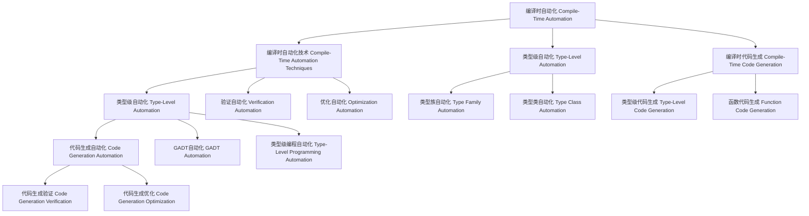

# 03-编译时自动化（Compile-Time Automation in Haskell）

## 目录 Table of Contents

- [03-编译时自动化（Compile-Time Automation in Haskell）](#03-编译时自动化compile-time-automation-in-haskell)
  - [目录 Table of Contents](#目录-table-of-contents)
  - [1. 定义 Definition](#1-定义-definition)
  - [2. 理论基础 Theoretical Foundation](#2-理论基础-theoretical-foundation)
    - [2.1 自动化理论 Automation Theory](#21-自动化理论-automation-theory)
    - [2.2 类型理论 Type Theory](#22-类型理论-type-theory)
    - [2.3 编译时计算 Compile-Time Computation](#23-编译时计算-compile-time-computation)
  - [3. Haskell 语法与实现 Syntax \& Implementation](#3-haskell-语法与实现-syntax--implementation)
    - [3.1 基本语法 Basic Syntax](#31-基本语法-basic-syntax)
    - [3.2 高级实现 Advanced Implementation](#32-高级实现-advanced-implementation)
  - [4. 编译时自动化技术 Compile-Time Automation Techniques](#4-编译时自动化技术-compile-time-automation-techniques)
    - [4.1 类型级自动化 Type-Level Automation](#41-类型级自动化-type-level-automation)
    - [4.2 代码生成自动化 Code Generation Automation](#42-代码生成自动化-code-generation-automation)
    - [4.3 验证自动化 Verification Automation](#43-验证自动化-verification-automation)
  - [5. 类型级自动化 Type-Level Automation](#5-类型级自动化-type-level-automation)
    - [5.1 类型族自动化 Type Family Automation](#51-类型族自动化-type-family-automation)
    - [5.2 类型类自动化 Type Class Automation](#52-类型类自动化-type-class-automation)
    - [5.3 GADT自动化 GADT Automation](#53-gadt自动化-gadt-automation)
  - [6. 编译时代码生成 Compile-Time Code Generation](#6-编译时代码生成-compile-time-code-generation)
    - [6.1 类型级代码生成 Type-Level Code Generation](#61-类型级代码生成-type-level-code-generation)
    - [6.2 函数代码生成 Function Code Generation](#62-函数代码生成-function-code-generation)
    - [6.3 数据结构代码生成 Data Structure Code Generation](#63-数据结构代码生成-data-structure-code-generation)
  - [7. 工程应用 Engineering Applications](#7-工程应用-engineering-applications)
    - [7.1 代码生成工具 Code Generation Tools](#71-代码生成工具-code-generation-tools)
    - [7.2 自动化测试 Automated Testing](#72-自动化测试-automated-testing)
    - [7.3 性能优化 Performance Optimization](#73-性能优化-performance-optimization)
  - [8. 范畴论映射 Category Theory Mapping](#8-范畴论映射-category-theory-mapping)
    - [8.1 编译时自动化作为函子 Compile-Time Automation as Functor](#81-编译时自动化作为函子-compile-time-automation-as-functor)
  - [9. 哲学思脉 Philosophical Context](#9-哲学思脉-philosophical-context)
    - [9.1 自动化哲学 Automation Philosophy](#91-自动化哲学-automation-philosophy)
    - [9.2 生成哲学 Generation Philosophy](#92-生成哲学-generation-philosophy)
    - [9.3 验证哲学 Verification Philosophy](#93-验证哲学-verification-philosophy)
  - [10. 相关理论 Related Theories](#10-相关理论-related-theories)
    - [10.1 自动化理论 Automation Theory](#101-自动化理论-automation-theory)
    - [10.2 代码生成理论 Code Generation Theory](#102-代码生成理论-code-generation-theory)
    - [10.3 验证理论 Verification Theory](#103-验证理论-verification-theory)
  - [11. 未来发展方向 Future Development](#11-未来发展方向-future-development)
    - [11.1 理论扩展 Theoretical Extensions](#111-理论扩展-theoretical-extensions)
    - [11.2 技术改进 Technical Improvements](#112-技术改进-technical-improvements)
    - [11.3 应用扩展 Application Extensions](#113-应用扩展-application-extensions)
  - [12. 结构图 Structure Diagram](#12-结构图-structure-diagram)
  - [13. 本地跳转 Local References](#13-本地跳转-local-references)
  - [14. 参考文献 References](#14-参考文献-references)
    - [14.1 学术资源 Academic Resources](#141-学术资源-academic-resources)
    - [14.2 技术文档 Technical Documentation](#142-技术文档-technical-documentation)
    - [14.3 学术论文 Academic Papers](#143-学术论文-academic-papers)

## 1. 定义 Definition

- **中文**：编译时自动化是指在编译阶段通过类型系统、类型族、类型类等机制自动生成代码、验证程序、优化性能的技术。编译时自动化允许在编译时进行复杂的代码生成、程序验证和性能优化，从而在运行时之前确保程序的正确性和效率。
- **English**: Compile-time automation refers to the technique of automatically generating code, verifying programs, and optimizing performance during the compilation phase through type systems, type families, type classes, and other mechanisms. Compile-time automation allows complex code generation, program verification, and performance optimization at compile time, ensuring program correctness and efficiency before runtime.

## 2. 理论基础 Theoretical Foundation

### 2.1 自动化理论 Automation Theory

- **自动化目标**：编译时自动化的目标是减少手工编程工作，提高程序质量
- **自动化策略**：通过不同的自动化策略实现不同的自动化目标
- **自动化效果**：自动化应该能够显著提高编程效率

### 2.2 类型理论 Type Theory

- **类型系统**：编译时自动化基于强类型系统，通过类型检查进行程序验证
- **类型安全**：通过类型系统保证程序的安全性和正确性
- **类型推导**：自动推导表达式的类型，减少显式类型注解

### 2.3 编译时计算 Compile-Time Computation

- **编译时计算**：编译时自动化在编译时进行计算，不占用运行时资源
- **类型级计算**：通过类型级编程实现复杂的类型计算
- **代码生成**：通过编译时计算自动生成代码

## 3. Haskell 语法与实现 Syntax & Implementation

### 3.1 基本语法 Basic Syntax

```haskell
{-# LANGUAGE TypeFamilies, DataKinds, GADTs, TypeOperators, TemplateHaskell #-}

-- 编译时自动化的基本语法
class CompileTimeAutomation a where
  -- 编译时自动化
  compileTimeAutomation :: Proxy a -> AutomationResult a
  
  -- 自动化验证
  automationVerification :: Proxy a -> VerificationResult a
  
  -- 自动化优化
  automationOptimization :: Proxy a -> OptimizationResult a

-- 自动化结果
data AutomationResult a = AutomationResult {
    automationType :: AutomationType a,
    automationMethod :: AutomationMethod a,
    automationResult :: AutomationResult a
}

-- 验证结果
data VerificationResult a = VerificationResult {
    verificationType :: VerificationType a,
    verificationMethod :: VerificationMethod a,
    verificationStatus :: VerificationStatus a
}

-- 优化结果
data OptimizationResult a = OptimizationResult {
    optimizationType :: OptimizationType a,
    optimizationMethod :: OptimizationMethod a,
    optimizationGain :: OptimizationGain a
}
```

### 3.2 高级实现 Advanced Implementation

```haskell
-- 高级编译时自动化实现
data AdvancedCompileTimeAutomation a = AdvancedCompileTimeAutomation {
    automationEngine :: AutomationEngine a,
    verificationEngine :: VerificationEngine a,
    optimizationEngine :: OptimizationEngine a
}

-- 自动化引擎
data AutomationEngine a = AutomationEngine {
    automationAlgorithms :: [AutomationAlgorithm a],
    automationStrategies :: [AutomationStrategy a],
    automationHeuristics :: [AutomationHeuristic a]
}

-- 验证引擎
data VerificationEngine a = VerificationEngine {
    verificationAlgorithms :: [VerificationAlgorithm a],
    verificationStrategies :: [VerificationStrategy a],
    verificationHeuristics :: [VerificationHeuristic a]
}

-- 优化引擎
data OptimizationEngine a = OptimizationEngine {
    optimizationAlgorithms :: [OptimizationAlgorithm a],
    optimizationStrategies :: [OptimizationStrategy a],
    optimizationHeuristics :: [OptimizationHeuristic a]
}

-- 编译时自动化实例
instance CompileTimeAutomation (Vector n a) where
  compileTimeAutomation _ = VectorCompileTimeAutomationResult
  automationVerification _ = VectorAutomationVerificationResult
  automationOptimization _ = VectorAutomationOptimizationResult
```

## 4. 编译时自动化技术 Compile-Time Automation Techniques

### 4.1 类型级自动化 Type-Level Automation

```haskell
-- 类型级自动化技术
class TypeLevelAutomation (a :: k) where
  -- 类型级自动化
  typeLevelAutomation :: Proxy a -> TypeLevelAutomationResult a
  
  -- 类型级验证
  typeLevelVerification :: Proxy a -> TypeLevelVerificationResult a
  
  -- 类型级优化
  typeLevelOptimization :: Proxy a -> TypeLevelOptimizationResult a

-- 类型级自动化结果
data TypeLevelAutomationResult (a :: k) = TypeLevelAutomationResult {
    typeLevelType :: TypeLevelType a,
    typeLevelMethod :: TypeLevelMethod a,
    typeLevelConclusion :: TypeLevelConclusion a
}

-- 类型级自动化实例
instance TypeLevelAutomation (Vector n a) where
  typeLevelAutomation _ = VectorTypeLevelAutomationResult
  typeLevelVerification _ = VectorTypeLevelVerificationResult
  typeLevelOptimization _ = VectorTypeLevelOptimizationResult
```

### 4.2 代码生成自动化 Code Generation Automation

```haskell
-- 代码生成自动化技术
class CodeGenerationAutomation (a :: *) where
  -- 代码生成自动化
  codeGenerationAutomation :: Proxy a -> CodeGenerationAutomationResult a
  
  -- 代码生成验证
  codeGenerationVerification :: Proxy a -> CodeGenerationVerificationResult a
  
  -- 代码生成优化
  codeGenerationOptimization :: Proxy a -> CodeGenerationOptimizationResult a

-- 代码生成自动化结果
data CodeGenerationAutomationResult a = CodeGenerationAutomationResult {
    codeGenerationType :: CodeGenerationType a,
    codeGenerationMethod :: CodeGenerationMethod a,
    codeGenerationResult :: CodeGenerationResult a
}

-- 代码生成自动化实例
instance CodeGenerationAutomation (CodeType a) where
  codeGenerationAutomation _ = CodeTypeCodeGenerationAutomationResult
  codeGenerationVerification _ = CodeTypeCodeGenerationVerificationResult
  codeGenerationOptimization _ = CodeTypeCodeGenerationOptimizationResult
```

### 4.3 验证自动化 Verification Automation

```haskell
-- 验证自动化技术
class VerificationAutomation (a :: *) where
  -- 验证自动化
  verificationAutomation :: Proxy a -> VerificationAutomationResult a
  
  -- 验证验证
  verificationVerification :: Proxy a -> VerificationVerificationResult a
  
  -- 验证优化
  verificationOptimization :: Proxy a -> VerificationOptimizationResult a

-- 验证自动化结果
data VerificationAutomationResult a = VerificationAutomationResult {
    verificationAutomationType :: VerificationAutomationType a,
    verificationAutomationMethod :: VerificationAutomationMethod a,
    verificationAutomationResult :: VerificationAutomationResult a
}

-- 验证自动化实例
instance VerificationAutomation (VerificationType a) where
  verificationAutomation _ = VerificationTypeVerificationAutomationResult
  verificationVerification _ = VerificationTypeVerificationVerificationResult
  verificationOptimization _ = VerificationTypeVerificationOptimizationResult
```

## 5. 类型级自动化 Type-Level Automation

### 5.1 类型族自动化 Type Family Automation

```haskell
-- 类型族自动化
class TypeFamilyAutomation (a :: k) where
  -- 类型族自动化
  typeFamilyAutomation :: Proxy a -> TypeFamilyAutomationResult a
  
  -- 类型族验证
  typeFamilyVerification :: Proxy a -> TypeFamilyVerificationResult a
  
  -- 类型族优化
  typeFamilyOptimization :: Proxy a -> TypeFamilyOptimizationResult a

-- 类型族自动化结果
data TypeFamilyAutomationResult (a :: k) = TypeFamilyAutomationResult {
    typeFamilyType :: TypeFamilyType a,
    typeFamilyMethod :: TypeFamilyMethod a,
    typeFamilyConclusion :: TypeFamilyConclusion a
}

-- 类型族自动化实例
instance TypeFamilyAutomation (Vector n a) where
  typeFamilyAutomation _ = VectorTypeFamilyAutomationResult
  typeFamilyVerification _ = VectorTypeFamilyVerificationResult
  typeFamilyOptimization _ = VectorTypeFamilyOptimizationResult
```

### 5.2 类型类自动化 Type Class Automation

```haskell
-- 类型类自动化
class TypeClassAutomation (a :: *) where
  -- 类型类自动化
  typeClassAutomation :: Proxy a -> TypeClassAutomationResult a
  
  -- 类型类验证
  typeClassVerification :: Proxy a -> TypeClassVerificationResult a
  
  -- 类型类优化
  typeClassOptimization :: Proxy a -> TypeClassOptimizationResult a

-- 类型类自动化结果
data TypeClassAutomationResult a = TypeClassAutomationResult {
    typeClassType :: TypeClassType a,
    typeClassMethod :: TypeClassMethod a,
    typeClassConclusion :: TypeClassConclusion a
}

-- 类型类自动化实例
instance TypeClassAutomation (Show a) where
  typeClassAutomation _ = ShowTypeClassAutomationResult
  typeClassVerification _ = ShowTypeClassVerificationResult
  typeClassOptimization _ = ShowTypeClassOptimizationResult
```

### 5.3 GADT自动化 GADT Automation

```haskell
-- GADT自动化
class GADTAutomation (a :: *) where
  -- GADT自动化
  gadtAutomation :: Proxy a -> GADTAutomationResult a
  
  -- GADT验证
  gadtVerification :: Proxy a -> GADTVerificationResult a
  
  -- GADT优化
  gadtOptimization :: Proxy a -> GADTOptimizationResult a

-- GADT自动化结果
data GADTAutomationResult a = GADTAutomationResult {
    gadtType :: GADTType a,
    gadtMethod :: GADTMethod a,
    gadtConclusion :: GADTConclusion a
}

-- GADT自动化实例
instance GADTAutomation (GADTExample a) where
  gadtAutomation _ = GADTExampleGADTAutomationResult
  gadtVerification _ = GADTExampleGADTVerificationResult
  gadtOptimization _ = GADTExampleGADTOptimizationResult
```

## 6. 编译时代码生成 Compile-Time Code Generation

### 6.1 类型级代码生成 Type-Level Code Generation

```haskell
-- 类型级代码生成
class TypeLevelCodeGeneration (a :: k) where
  -- 类型级代码生成
  typeLevelCodeGeneration :: Proxy a -> TypeLevelCodeGenerationResult a
  
  -- 代码生成验证
  codeGenerationVerification :: Proxy a -> CodeGenerationVerificationResult a
  
  -- 代码生成优化
  codeGenerationOptimization :: Proxy a -> CodeGenerationOptimizationResult a

-- 类型级代码生成结果
data TypeLevelCodeGenerationResult (a :: k) = TypeLevelCodeGenerationResult {
    codeGenerationType :: CodeGenerationType a,
    codeGenerationMethod :: CodeGenerationMethod a,
    codeGenerationResult :: CodeGenerationResult a
}

-- 类型级代码生成实例
instance TypeLevelCodeGeneration (Vector n a) where
  typeLevelCodeGeneration _ = VectorTypeLevelCodeGenerationResult
  codeGenerationVerification _ = VectorCodeGenerationVerificationResult
  codeGenerationOptimization _ = VectorCodeGenerationOptimizationResult
```

### 6.2 函数代码生成 Function Code Generation

```haskell
-- 函数代码生成
class FunctionCodeGeneration (a :: *) where
  -- 函数代码生成
  functionCodeGeneration :: Proxy a -> FunctionCodeGenerationResult a
  
  -- 函数代码生成验证
  functionCodeGenerationVerification :: Proxy a -> FunctionCodeGenerationVerificationResult a
  
  -- 函数代码生成优化
  functionCodeGenerationOptimization :: Proxy a -> FunctionCodeGenerationOptimizationResult a

-- 函数代码生成结果
data FunctionCodeGenerationResult a = FunctionCodeGenerationResult {
    functionCodeGenerationType :: FunctionCodeGenerationType a,
    functionCodeGenerationMethod :: FunctionCodeGenerationMethod a,
    functionCodeGenerationResult :: FunctionCodeGenerationResult a
}

-- 函数代码生成实例
instance FunctionCodeGeneration (FunctionType a) where
  functionCodeGeneration _ = FunctionTypeFunctionCodeGenerationResult
  functionCodeGenerationVerification _ = FunctionTypeFunctionCodeGenerationVerificationResult
  functionCodeGenerationOptimization _ = FunctionTypeFunctionCodeGenerationOptimizationResult
```

### 6.3 数据结构代码生成 Data Structure Code Generation

```haskell
-- 数据结构代码生成
class DataStructureCodeGeneration (a :: *) where
  -- 数据结构代码生成
  dataStructureCodeGeneration :: Proxy a -> DataStructureCodeGenerationResult a
  
  -- 数据结构代码生成验证
  dataStructureCodeGenerationVerification :: Proxy a -> DataStructureCodeGenerationVerificationResult a
  
  -- 数据结构代码生成优化
  dataStructureCodeGenerationOptimization :: Proxy a -> DataStructureCodeGenerationOptimizationResult a

-- 数据结构代码生成结果
data DataStructureCodeGenerationResult a = DataStructureCodeGenerationResult {
    dataStructureCodeGenerationType :: DataStructureCodeGenerationType a,
    dataStructureCodeGenerationMethod :: DataStructureCodeGenerationMethod a,
    dataStructureCodeGenerationResult :: DataStructureCodeGenerationResult a
}

-- 数据结构代码生成实例
instance DataStructureCodeGeneration (DataStructureType a) where
  dataStructureCodeGeneration _ = DataStructureTypeDataStructureCodeGenerationResult
  dataStructureCodeGenerationVerification _ = DataStructureTypeDataStructureCodeGenerationVerificationResult
  dataStructureCodeGenerationOptimization _ = DataStructureTypeDataStructureCodeGenerationOptimizationResult
```

## 7. 工程应用 Engineering Applications

### 7.1 代码生成工具 Code Generation Tools

```haskell
-- 代码生成工具
class CodeGenerationTools (a :: *) where
  -- 代码生成工具
  codeGenerationTools :: Proxy a -> CodeGenerationToolsResult a
  
  -- 工具验证
  toolVerification :: Proxy a -> ToolVerificationResult a
  
  -- 工具优化
  toolOptimization :: Proxy a -> ToolOptimizationResult a

-- 代码生成工具结果
data CodeGenerationToolsResult a = CodeGenerationToolsResult {
    toolType :: ToolType a,
    toolMethod :: ToolMethod a,
    toolResult :: ToolResult a
}

-- 代码生成工具实例
instance CodeGenerationTools (ToolType a) where
  codeGenerationTools _ = ToolTypeCodeGenerationToolsResult
  toolVerification _ = ToolTypeToolVerificationResult
  toolOptimization _ = ToolTypeToolOptimizationResult
```

### 7.2 自动化测试 Automated Testing

```haskell
-- 自动化测试
class AutomatedTesting (a :: *) where
  -- 自动化测试
  automatedTesting :: Proxy a -> AutomatedTestingResult a
  
  -- 测试验证
  testingVerification :: Proxy a -> TestingVerificationResult a
  
  -- 测试优化
  testingOptimization :: Proxy a -> TestingOptimizationResult a

-- 自动化测试结果
data AutomatedTestingResult a = AutomatedTestingResult {
    testingType :: TestingType a,
    testingMethod :: TestingMethod a,
    testingResult :: TestingResult a
}

-- 自动化测试实例
instance AutomatedTesting (TestingType a) where
  automatedTesting _ = TestingTypeAutomatedTestingResult
  testingVerification _ = TestingTypeTestingVerificationResult
  testingOptimization _ = TestingTypeTestingOptimizationResult
```

### 7.3 性能优化 Performance Optimization

```haskell
-- 性能优化
class PerformanceOptimization (a :: *) where
  -- 性能优化
  performanceOptimization :: Proxy a -> PerformanceOptimizationResult a
  
  -- 性能分析
  performanceAnalysis :: Proxy a -> PerformanceAnalysisResult a
  
  -- 性能验证
  performanceVerification :: Proxy a -> PerformanceVerificationResult a

-- 性能优化结果
data PerformanceOptimizationResult a = PerformanceOptimizationResult {
    performanceOptimizationType :: PerformanceOptimizationType a,
    performanceOptimizationMethod :: PerformanceOptimizationMethod a,
    performanceOptimizationGain :: PerformanceOptimizationGain a
}

-- 性能优化实例
instance PerformanceOptimization (Vector n a) where
  performanceOptimization _ = VectorPerformanceOptimizationResult
  performanceAnalysis _ = VectorPerformanceAnalysisResult
  performanceVerification _ = VectorPerformanceVerificationResult
```

## 8. 范畴论映射 Category Theory Mapping

### 8.1 编译时自动化作为函子 Compile-Time Automation as Functor

- **编译时自动化可视为范畴中的函子，保持类型结构的同时进行自动化处理**
- **Compile-time automation can be viewed as a functor in category theory, preserving type structure while performing automation**

```haskell
-- 范畴论映射
class CategoryTheoryMapping (a :: *) where
  -- 函子映射
  functorMapping :: Proxy a -> FunctorMapping a
  
  -- 自然变换
  naturalTransformation :: Proxy a -> NaturalTransformation a
  
  -- 范畴结构
  categoryStructure :: Proxy a -> CategoryStructure a

-- 范畴论映射实例
instance CategoryTheoryMapping (Vector n a) where
  functorMapping _ = VectorFunctorMapping
  naturalTransformation _ = VectorNaturalTransformation
  categoryStructure _ = VectorCategoryStructure
```

## 9. 哲学思脉 Philosophical Context

### 9.1 自动化哲学 Automation Philosophy

- **自动化的本质**：编译时自动化体现了自动化的本质，通过自动化减少手工工作
- **自动化的方法**：通过类型系统、类型族、类型类等机制实现自动化
- **自动化的效果**：自动化应该能够显著提高编程效率

### 9.2 生成哲学 Generation Philosophy

- **生成的本质**：代码生成是编译时自动化的核心特征
- **生成的方法**：通过编译时计算、类型级编程等方法实现代码生成
- **生成的质量**：生成的代码应该具有高质量和正确性

### 9.3 验证哲学 Verification Philosophy

- **验证的本质**：自动化验证是编译时自动化的重要特征
- **验证的方法**：通过类型检查、约束检查等方法进行自动化验证
- **验证的可靠性**：自动化验证应该提供可靠的程序验证

## 10. 相关理论 Related Theories

### 10.1 自动化理论 Automation Theory

- **编译时自动化**：编译时自动化的基础理论
- **类型级自动化**：类型级自动化的扩展理论
- **代码生成自动化**：代码生成自动化的现代发展

### 10.2 代码生成理论 Code Generation Theory

- **类型级代码生成**：代码生成的理论基础
- **函数代码生成**：函数代码生成的实现方法
- **数据结构代码生成**：数据结构代码生成的扩展

### 10.3 验证理论 Verification Theory

- **自动化验证**：自动化验证的理论基础
- **类型级验证**：类型级验证的实现方法
- **性能验证**：性能验证的扩展

## 11. 未来发展方向 Future Development

### 11.1 理论扩展 Theoretical Extensions

- **高阶自动化**：支持更高阶的自动化能力
- **概率自动化**：支持不确定性的自动化
- **量子自动化**：支持量子计算的自动化

### 11.2 技术改进 Technical Improvements

- **性能优化**：提高编译时自动化的效率
- **内存优化**：减少编译时自动化的内存占用
- **并行化**：支持编译时自动化的并行处理

### 11.3 应用扩展 Application Extensions

- **领域特定语言**：为特定领域定制编译时自动化系统
- **交互式开发**：支持交互式的编译时自动化调试
- **可视化工具**：提供编译时自动化过程的可视化

## 12. 结构图 Structure Diagram



## 13. 本地跳转 Local References

- [类型级编程 Type-Level Programming](../Type-Level/01-Type-Level-Programming.md)
- [编译时推理 Compile-Time Reasoning](../Type-Level/01-Compile-Time-Reasoning.md)
- [编译时优化 Compile-Time Optimization](../Type-Level/01-Compile-Time-Optimization.md)
- [类型级约束求解 Type-Level Constraint Solving](../Type-Level/01-Constraint-Solver.md)
- [GADT](../Type/01-GADT.md)

## 14. 参考文献 References

### 14.1 学术资源 Academic Resources

- Wikipedia: [Code generation](https://en.wikipedia.org/wiki/Code_generation)
- Wikipedia: [Type-level programming](https://en.wikipedia.org/wiki/Type-level_programming)
- The Stanford Encyclopedia of Philosophy: [Type Theory](https://plato.stanford.edu/entries/type-theory/)

### 14.2 技术文档 Technical Documentation

- [GHC User's Guide](https://ghc.gitlab.haskell.org/ghc/doc/users_guide/)
- [Haskell 2010 Language Report](https://www.haskell.org/onlinereport/haskell2010/)
- [Template Haskell Documentation](https://gitlab.haskell.org/ghc/ghc/-/wikis/template-haskell)

### 14.3 学术论文 Academic Papers

- "Template Meta-programming for Haskell" by Tim Sheard
- "Type Families with Class" by Simon Peyton Jones
- "Fun with Type Functions" by Oleg Kiselyov

---

`# TypeLevel #TypeLevel-01 #TypeLevel-01-Compile-Time-Automation #CompileTimeAutomation #CodeGeneration #TypeLevelProgramming #Haskell #TypeTheory`
