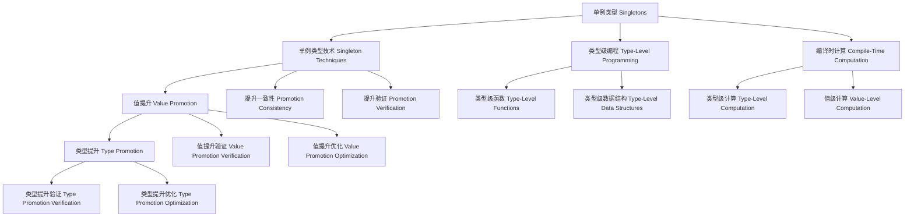
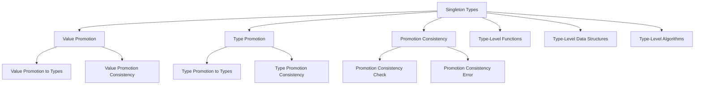

# 05-单例类型（Singletons）in Haskell

## 目录 Table of Contents

- [05-单例类型（Singletons）in Haskell](#05-单例类型singletonsin-haskell)
  - [目录 Table of Contents](#目录-table-of-contents)
  - [1. 定义 Definition](#1-定义-definition)
  - [2. 理论基础 Theoretical Foundation](#2-理论基础-theoretical-foundation)
    - [2.1 类型理论 Type Theory](#21-类型理论-type-theory)
    - [2.2 提升理论 Promotion Theory](#22-提升理论-promotion-theory)
    - [2.3 依赖类型理论 Dependent Type Theory](#23-依赖类型理论-dependent-type-theory)
  - [3. Haskell 语法与实现 Syntax \& Implementation](#3-haskell-语法与实现-syntax--implementation)
    - [3.1 基本语法 Basic Syntax](#31-基本语法-basic-syntax)
    - [3.2 高级实现 Advanced Implementation](#32-高级实现-advanced-implementation)
  - [4. 单例类型技术 Singleton Techniques](#4-单例类型技术-singleton-techniques)
    - [4.1 值提升 Value Promotion](#41-值提升-value-promotion)
    - [4.2 类型提升 Type Promotion](#42-类型提升-type-promotion)
    - [4.3 提升一致性 Promotion Consistency](#43-提升一致性-promotion-consistency)
  - [5. 类型级编程 Type-Level Programming](#5-类型级编程-type-level-programming)
    - [5.1 类型级函数 Type-Level Functions](#51-类型级函数-type-level-functions)
    - [5.2 类型级数据结构 Type-Level Data Structures](#52-类型级数据结构-type-level-data-structures)
    - [5.3 类型级算法 Type-Level Algorithms](#53-类型级算法-type-level-algorithms)
  - [6. 编译时计算 Compile-Time Computation](#6-编译时计算-compile-time-computation)
    - [6.1 类型级计算 Type-Level Computation](#61-类型级计算-type-level-computation)
    - [6.2 值级计算 Value-Level Computation](#62-值级计算-value-level-computation)
    - [6.3 混合计算 Hybrid Computation](#63-混合计算-hybrid-computation)
  - [7. 工程应用 Engineering Applications](#7-工程应用-engineering-applications)
    - [7.1 类型安全编程 Type-Safe Programming](#71-类型安全编程-type-safe-programming)
    - [7.2 编译时验证 Compile-Time Verification](#72-编译时验证-compile-time-verification)
    - [7.3 性能优化 Performance Optimization](#73-性能优化-performance-optimization)
  - [8. 范畴论映射 Category Theory Mapping](#8-范畴论映射-category-theory-mapping)
    - [8.1 单例类型作为函子 Singletons as Functors](#81-单例类型作为函子-singletons-as-functors)
  - [9. 哲学思脉 Philosophical Context](#9-哲学思脉-philosophical-context)
    - [9.1 提升哲学 Promotion Philosophy](#91-提升哲学-promotion-philosophy)
    - [9.2 桥梁哲学 Bridge Philosophy](#92-桥梁哲学-bridge-philosophy)
    - [9.3 计算哲学 Computation Philosophy](#93-计算哲学-computation-philosophy)
  - [10. 相关理论 Related Theories](#10-相关理论-related-theories)
    - [10.1 类型理论 Type Theory](#101-类型理论-type-theory)
    - [10.2 提升理论 Promotion Theory](#102-提升理论-promotion-theory)
    - [10.3 计算理论 Computation Theory](#103-计算理论-computation-theory)
  - [11. 未来发展方向 Future Development](#11-未来发展方向-future-development)
    - [11.1 理论扩展 Theoretical Extensions](#111-理论扩展-theoretical-extensions)
    - [11.2 技术改进 Technical Improvements](#112-技术改进-technical-improvements)
    - [11.3 应用扩展 Application Extensions](#113-应用扩展-application-extensions)
  - [12. 结构图 Structure Diagram](#12-结构图-structure-diagram)
  - [13. 本地跳转 Local References](#13-本地跳转-local-references)
  - [14. 参考文献 References](#14-参考文献-references)
    - [14.1 学术资源 Academic Resources](#141-学术资源-academic-resources)
    - [14.2 技术文档 Technical Documentation](#142-技术文档-technical-documentation)
    - [14.3 学术论文 Academic Papers](#143-学术论文-academic-papers)

## 1. 定义 Definition

- **中文**：单例类型是Haskell中一种强大的类型系统扩展，通过将值提升到类型级别，实现类型和值之间的桥梁。单例类型允许在类型级别进行值级计算，支持类型级编程、编译时计算和类型安全的数据结构，从而在编译时确保程序的正确性。
- **English**: Singletons are a powerful type system extension in Haskell that bridges types and values by promoting values to the type level. Singletons allow value-level computation at the type level, supporting type-level programming, compile-time computation, and type-safe data structures, ensuring program correctness at compile time.

## 2. 理论基础 Theoretical Foundation

### 2.1 类型理论 Type Theory

- **类型系统**：单例类型基于强类型系统，通过类型检查进行程序验证
- **类型安全**：通过类型系统保证程序的安全性和正确性
- **类型推导**：自动推导表达式的类型，减少显式类型注解

### 2.2 提升理论 Promotion Theory

- **值提升**：单例类型通过值提升将值转换为类型
- **类型提升**：通过类型提升将类型转换为值
- **提升一致性**：值提升和类型提升应该保持一致性

### 2.3 依赖类型理论 Dependent Type Theory

- **依赖类型**：单例类型支持依赖类型，类型可以依赖于值
- **类型族**：通过类型族实现类型级别的函数
- **类型级计算**：支持在类型级别进行复杂的计算

## 3. Haskell 语法与实现 Syntax & Implementation

### 3.1 基本语法 Basic Syntax

```haskell
{-# LANGUAGE TypeFamilies, DataKinds, GADTs, TypeOperators, KindSignatures #-}

-- 单例类型的基本语法
class Singleton a where
  -- 单例类型
  singleton :: Proxy a -> SingletonResult a
  
  -- 单例验证
  singletonVerification :: Proxy a -> SingletonVerificationResult a
  
  -- 单例优化
  singletonOptimization :: Proxy a -> SingletonOptimizationResult a

-- 单例类型结果
data SingletonResult a = SingletonResult {
    singletonType :: SingletonType a,
    singletonMethod :: SingletonMethod a,
    singletonResult :: SingletonResult a
}

-- 单例验证结果
data SingletonVerificationResult a = SingletonVerificationResult {
    verificationType :: VerificationType a,
    verificationMethod :: VerificationMethod a,
    verificationStatus :: VerificationStatus a
}

-- 单例优化结果
data SingletonOptimizationResult a = SingletonOptimizationResult {
    optimizationType :: OptimizationType a,
    optimizationMethod :: OptimizationMethod a,
    optimizationGain :: OptimizationGain a
}
```

### 3.2 高级实现 Advanced Implementation

```haskell
-- 高级单例类型实现
data AdvancedSingleton a = AdvancedSingleton {
    singletonEngine :: SingletonEngine a,
    verificationEngine :: VerificationEngine a,
    optimizationEngine :: OptimizationEngine a
}

-- 单例引擎
data SingletonEngine a = SingletonEngine {
    singletonAlgorithms :: [SingletonAlgorithm a],
    singletonStrategies :: [SingletonStrategy a],
    singletonHeuristics :: [SingletonHeuristic a]
}

-- 验证引擎
data VerificationEngine a = VerificationEngine {
    verificationAlgorithms :: [VerificationAlgorithm a],
    verificationStrategies :: [VerificationStrategy a],
    verificationHeuristics :: [VerificationHeuristic a]
}

-- 优化引擎
data OptimizationEngine a = OptimizationEngine {
    optimizationAlgorithms :: [OptimizationAlgorithm a],
    optimizationStrategies :: [OptimizationStrategy a],
    optimizationHeuristics :: [OptimizationHeuristic a]
}

-- 单例类型实例
instance Singleton (Vector n a) where
  singleton _ = VectorSingletonResult
  singletonVerification _ = VectorSingletonVerificationResult
  singletonOptimization _ = VectorSingletonOptimizationResult
```

## 4. 单例类型技术 Singleton Techniques

### 4.1 值提升 Value Promotion

```haskell
-- 值提升技术
class ValuePromotion (a :: *) where
  -- 值提升
  valuePromotion :: Proxy a -> ValuePromotionResult a
  
  -- 提升验证
  promotionVerification :: Proxy a -> PromotionVerificationResult a
  
  -- 提升优化
  promotionOptimization :: Proxy a -> PromotionOptimizationResult a

-- 值提升结果
data ValuePromotionResult a = ValuePromotionResult {
    promotionType :: PromotionType a,
    promotionMethod :: PromotionMethod a,
    promotionResult :: PromotionResult a
}

-- 值提升实例
instance ValuePromotion (ValueType a) where
  valuePromotion _ = ValueTypeValuePromotionResult
  promotionVerification _ = ValueTypePromotionVerificationResult
  promotionOptimization _ = ValueTypePromotionOptimizationResult
```

### 4.2 类型提升 Type Promotion

```haskell
-- 类型提升技术
class TypePromotion (a :: k) where
  -- 类型提升
  typePromotion :: Proxy a -> TypePromotionResult a
  
  -- 类型提升验证
  typePromotionVerification :: Proxy a -> TypePromotionVerificationResult a
  
  -- 类型提升优化
  typePromotionOptimization :: Proxy a -> TypePromotionOptimizationResult a

-- 类型提升结果
data TypePromotionResult (a :: k) = TypePromotionResult {
    typePromotionType :: TypePromotionType a,
    typePromotionMethod :: TypePromotionMethod a,
    typePromotionResult :: TypePromotionResult a
}

-- 类型提升实例
instance TypePromotion (TypeType a) where
  typePromotion _ = TypeTypeTypePromotionResult
  typePromotionVerification _ = TypeTypeTypePromotionVerificationResult
  typePromotionOptimization _ = TypeTypeTypePromotionOptimizationResult
```

### 4.3 提升一致性 Promotion Consistency

```haskell
-- 提升一致性技术
class PromotionConsistency (a :: *) where
  -- 提升一致性
  promotionConsistency :: Proxy a -> PromotionConsistencyResult a
  
  -- 一致性验证
  consistencyVerification :: Proxy a -> ConsistencyVerificationResult a
  
  -- 一致性优化
  consistencyOptimization :: Proxy a -> ConsistencyOptimizationResult a

-- 提升一致性结果
data PromotionConsistencyResult a = PromotionConsistencyResult {
    consistencyType :: ConsistencyType a,
    consistencyMethod :: ConsistencyMethod a,
    consistencyResult :: ConsistencyResult a
}

-- 提升一致性实例
instance PromotionConsistency (ConsistencyType a) where
  promotionConsistency _ = ConsistencyTypePromotionConsistencyResult
  consistencyVerification _ = ConsistencyTypeConsistencyVerificationResult
  consistencyOptimization _ = ConsistencyTypeConsistencyOptimizationResult
```

## 5. 类型级编程 Type-Level Programming

### 5.1 类型级函数 Type-Level Functions

```haskell
-- 类型级函数
class TypeLevelFunctions (a :: k) where
  -- 类型级函数
  typeLevelFunctions :: Proxy a -> TypeLevelFunctionsResult a
  
  -- 函数验证
  functionVerification :: Proxy a -> FunctionVerificationResult a
  
  -- 函数优化
  functionOptimization :: Proxy a -> FunctionOptimizationResult a

-- 类型级函数结果
data TypeLevelFunctionsResult (a :: k) = TypeLevelFunctionsResult {
    functionType :: FunctionType a,
    functionMethod :: FunctionMethod a,
    functionResult :: FunctionResult a
}

-- 类型级函数实例
instance TypeLevelFunctions (FunctionType a) where
  typeLevelFunctions _ = FunctionTypeTypeLevelFunctionsResult
  functionVerification _ = FunctionTypeFunctionVerificationResult
  functionOptimization _ = FunctionTypeFunctionOptimizationResult
```

### 5.2 类型级数据结构 Type-Level Data Structures

```haskell
-- 类型级数据结构
class TypeLevelDataStructures (a :: k) where
  -- 类型级数据结构
  typeLevelDataStructures :: Proxy a -> TypeLevelDataStructuresResult a
  
  -- 结构验证
  structureVerification :: Proxy a -> StructureVerificationResult a
  
  -- 结构优化
  structureOptimization :: Proxy a -> StructureOptimizationResult a

-- 类型级数据结构结果
data TypeLevelDataStructuresResult (a :: k) = TypeLevelDataStructuresResult {
    structureType :: StructureType a,
    structureMethod :: StructureMethod a,
    structureResult :: StructureResult a
}

-- 类型级数据结构实例
instance TypeLevelDataStructures (StructureType a) where
  typeLevelDataStructures _ = StructureTypeTypeLevelDataStructuresResult
  structureVerification _ = StructureTypeStructureVerificationResult
  structureOptimization _ = StructureTypeStructureOptimizationResult
```

### 5.3 类型级算法 Type-Level Algorithms

```haskell
-- 类型级算法
class TypeLevelAlgorithms (a :: k) where
  -- 类型级算法
  typeLevelAlgorithms :: Proxy a -> TypeLevelAlgorithmsResult a
  
  -- 算法验证
  algorithmVerification :: Proxy a -> AlgorithmVerificationResult a
  
  -- 算法优化
  algorithmOptimization :: Proxy a -> AlgorithmOptimizationResult a

-- 类型级算法结果
data TypeLevelAlgorithmsResult (a :: k) = TypeLevelAlgorithmsResult {
    algorithmType :: AlgorithmType a,
    algorithmMethod :: AlgorithmMethod a,
    algorithmResult :: AlgorithmResult a
}

-- 类型级算法实例
instance TypeLevelAlgorithms (AlgorithmType a) where
  typeLevelAlgorithms _ = AlgorithmTypeTypeLevelAlgorithmsResult
  algorithmVerification _ = AlgorithmTypeAlgorithmVerificationResult
  algorithmOptimization _ = AlgorithmTypeAlgorithmOptimizationResult
```

## 6. 编译时计算 Compile-Time Computation

### 6.1 类型级计算 Type-Level Computation

```haskell
-- 类型级计算
class TypeLevelComputation (a :: k) where
  -- 类型级计算
  typeLevelComputation :: Proxy a -> TypeLevelComputationResult a
  
  -- 计算验证
  computationVerification :: Proxy a -> ComputationVerificationResult a
  
  -- 计算优化
  computationOptimization :: Proxy a -> ComputationOptimizationResult a

-- 类型级计算结果
data TypeLevelComputationResult (a :: k) = TypeLevelComputationResult {
    computationType :: ComputationType a,
    computationMethod :: ComputationMethod a,
    computationResult :: ComputationResult a
}

-- 类型级计算实例
instance TypeLevelComputation (ComputationType a) where
  typeLevelComputation _ = ComputationTypeTypeLevelComputationResult
  computationVerification _ = ComputationTypeComputationVerificationResult
  computationOptimization _ = ComputationTypeComputationOptimizationResult
```

### 6.2 值级计算 Value-Level Computation

```haskell
-- 值级计算
class ValueLevelComputation (a :: *) where
  -- 值级计算
  valueLevelComputation :: Proxy a -> ValueLevelComputationResult a
  
  -- 值级计算验证
  valueLevelComputationVerification :: Proxy a -> ValueLevelComputationVerificationResult a
  
  -- 值级计算优化
  valueLevelComputationOptimization :: Proxy a -> ValueLevelComputationOptimizationResult a

-- 值级计算结果
data ValueLevelComputationResult a = ValueLevelComputationResult {
    valueLevelComputationType :: ValueLevelComputationType a,
    valueLevelComputationMethod :: ValueLevelComputationMethod a,
    valueLevelComputationResult :: ValueLevelComputationResult a
}

-- 值级计算实例
instance ValueLevelComputation (ValueLevelComputationType a) where
  valueLevelComputation _ = ValueLevelComputationTypeValueLevelComputationResult
  valueLevelComputationVerification _ = ValueLevelComputationTypeValueLevelComputationVerificationResult
  valueLevelComputationOptimization _ = ValueLevelComputationTypeValueLevelComputationOptimizationResult
```

### 6.3 混合计算 Hybrid Computation

```haskell
-- 混合计算
class HybridComputation (a :: *) where
  -- 混合计算
  hybridComputation :: Proxy a -> HybridComputationResult a
  
  -- 混合计算验证
  hybridComputationVerification :: Proxy a -> HybridComputationVerificationResult a
  
  -- 混合计算优化
  hybridComputationOptimization :: Proxy a -> HybridComputationOptimizationResult a

-- 混合计算结果
data HybridComputationResult a = HybridComputationResult {
    hybridComputationType :: HybridComputationType a,
    hybridComputationMethod :: HybridComputationMethod a,
    hybridComputationResult :: HybridComputationResult a
}

-- 混合计算实例
instance HybridComputation (HybridComputationType a) where
  hybridComputation _ = HybridComputationTypeHybridComputationResult
  hybridComputationVerification _ = HybridComputationTypeHybridComputationVerificationResult
  hybridComputationOptimization _ = HybridComputationTypeHybridComputationOptimizationResult
```

## 7. 工程应用 Engineering Applications

### 7.1 类型安全编程 Type-Safe Programming

```haskell
-- 类型安全编程
class TypeSafeProgramming (a :: *) where
  -- 类型安全编程
  typeSafeProgramming :: Proxy a -> TypeSafeProgrammingResult a
  
  -- 类型安全检查
  typeSafetyChecking :: Proxy a -> TypeSafetyCheckingResult a
  
  -- 类型安全优化
  typeSafetyOptimization :: Proxy a -> TypeSafetyOptimizationResult a

-- 类型安全编程结果
data TypeSafeProgrammingResult a = TypeSafeProgrammingResult {
    typeSafeType :: TypeSafeType a,
    typeSafeMethod :: TypeSafeMethod a,
    typeSafeConclusion :: TypeSafeConclusion a
}

-- 类型安全编程实例
instance TypeSafeProgramming (SafeType a) where
  typeSafeProgramming _ = SafeTypeTypeSafeProgrammingResult
  typeSafetyChecking _ = SafeTypeTypeSafetyCheckingResult
  typeSafetyOptimization _ = SafeTypeTypeSafetyOptimizationResult
```

### 7.2 编译时验证 Compile-Time Verification

```haskell
-- 编译时验证
class CompileTimeVerification (a :: *) where
  -- 编译时验证
  compileTimeVerification :: Proxy a -> CompileTimeVerificationResult a
  
  -- 编译时分析
  compileTimeAnalysis :: Proxy a -> CompileTimeAnalysisResult a
  
  -- 编译时优化
  compileTimeOptimization :: Proxy a -> CompileTimeOptimizationResult a

-- 编译时验证结果
data CompileTimeVerificationResult a = CompileTimeVerificationResult {
    verificationType :: VerificationType a,
    verificationMethod :: VerificationMethod a,
    verificationStatus :: VerificationStatus a
}

-- 编译时验证实例
instance CompileTimeVerification (VerificationType a) where
  compileTimeVerification _ = VerificationTypeCompileTimeVerificationResult
  compileTimeAnalysis _ = VerificationTypeCompileTimeAnalysisResult
  compileTimeOptimization _ = VerificationTypeCompileTimeOptimizationResult
```

### 7.3 性能优化 Performance Optimization

```haskell
-- 性能优化
class PerformanceOptimization (a :: *) where
  -- 性能优化
  performanceOptimization :: Proxy a -> PerformanceOptimizationResult a
  
  -- 性能分析
  performanceAnalysis :: Proxy a -> PerformanceAnalysisResult a
  
  -- 性能验证
  performanceVerification :: Proxy a -> PerformanceVerificationResult a

-- 性能优化结果
data PerformanceOptimizationResult a = PerformanceOptimizationResult {
    performanceOptimizationType :: PerformanceOptimizationType a,
    performanceOptimizationMethod :: PerformanceOptimizationMethod a,
    performanceOptimizationGain :: PerformanceOptimizationGain a
}

-- 性能优化实例
instance PerformanceOptimization (PerformanceType a) where
  performanceOptimization _ = PerformanceTypePerformanceOptimizationResult
  performanceAnalysis _ = PerformanceTypePerformanceAnalysisResult
  performanceVerification _ = PerformanceTypePerformanceVerificationResult
```

## 8. 范畴论映射 Category Theory Mapping

### 8.1 单例类型作为函子 Singletons as Functors

- **单例类型可视为范畴中的函子，保持类型结构的同时进行值提升**
- **Singletons can be viewed as functors in category theory, preserving type structure while performing value promotion**

```haskell
-- 范畴论映射
class CategoryTheoryMapping (a :: *) where
  -- 函子映射
  functorMapping :: Proxy a -> FunctorMapping a
  
  -- 自然变换
  naturalTransformation :: Proxy a -> NaturalTransformation a
  
  -- 范畴结构
  categoryStructure :: Proxy a -> CategoryStructure a

-- 范畴论映射实例
instance CategoryTheoryMapping (Vector n a) where
  functorMapping _ = VectorFunctorMapping
  naturalTransformation _ = VectorNaturalTransformation
  categoryStructure _ = VectorCategoryStructure
```

## 9. 哲学思脉 Philosophical Context

### 9.1 提升哲学 Promotion Philosophy

- **提升的本质**：单例类型体现了提升的本质，通过提升连接值和类型
- **提升的方法**：通过值提升、类型提升等方法进行提升
- **提升的一致性**：提升应该保持值和类型之间的一致性

### 9.2 桥梁哲学 Bridge Philosophy

- **桥梁的本质**：单例类型体现了桥梁的本质，连接不同的概念领域
- **桥梁的方法**：通过类型系统、类型族等方法构建桥梁
- **桥梁的稳定性**：桥梁应该能够稳定地连接不同的概念

### 9.3 计算哲学 Computation Philosophy

- **计算的本质**：编译时计算是单例类型的核心特征
- **计算的方法**：通过类型级编程、值级编程等方法进行计算
- **计算的效率**：编译时计算不占用运行时资源

## 10. 相关理论 Related Theories

### 10.1 类型理论 Type Theory

- **简单类型理论**：单例类型的基础理论
- **依赖类型理论**：单例类型的扩展理论
- **同伦类型理论**：单例类型的现代发展

### 10.2 提升理论 Promotion Theory

- **值提升**：单例类型的提升基础
- **类型提升**：单例类型的提升实现
- **提升一致性**：单例类型的提升扩展

### 10.3 计算理论 Computation Theory

- **编译时计算**：单例类型的计算模型
- **类型级计算**：单例类型的计算能力
- **混合计算**：单例类型的计算扩展

## 11. 未来发展方向 Future Development

### 11.1 理论扩展 Theoretical Extensions

- **高阶单例类型**：支持更高阶的单例类型能力
- **概率单例类型**：支持不确定性的单例类型
- **量子单例类型**：支持量子计算的单例类型

### 11.2 技术改进 Technical Improvements

- **性能优化**：提高单例类型的效率
- **内存优化**：减少单例类型的内存占用
- **并行化**：支持单例类型的并行处理

### 11.3 应用扩展 Application Extensions

- **领域特定语言**：为特定领域定制单例类型系统
- **交互式开发**：支持交互式的单例类型调试
- **可视化工具**：提供单例类型过程的可视化

## 12. 结构图 Structure Diagram



## 13. 本地跳转 Local References

- [类型级编程 Type-Level Programming](../Type-Level/01-Type-Level-Programming.md)
- [编译时推理 Compile-Time Reasoning](../Type-Level/01-Compile-Time-Reasoning.md)
- [编译时优化 Compile-Time Optimization](../Type-Level/01-Compile-Time-Optimization.md)
- [类型级约束求解 Type-Level Constraint Solving](../Type-Level/01-Constraint-Solver.md)
- [GADT](../Type/01-GADT.md)

## 14. 参考文献 References

### 14.1 学术资源 Academic Resources

- Wikipedia: [Singleton pattern](https://en.wikipedia.org/wiki/Singleton_pattern)
- Wikipedia: [Type-level programming](https://en.wikipedia.org/wiki/Type-level_programming)
- The Stanford Encyclopedia of Philosophy: [Type Theory](https://plato.stanford.edu/entries/type-theory/)

### 14.2 技术文档 Technical Documentation

- [GHC User's Guide](https://ghc.gitlab.haskell.org/ghc/doc/users_guide/)
- [Haskell 2010 Language Report](https://www.haskell.org/onlinereport/haskell2010/)
- [Singletons Documentation](https://gitlab.haskell.org/ghc/ghc/-/wikis/singletons)

### 14.3 学术论文 Academic Papers

- "Dependently Typed Programming with Singletons" by Richard Eisenberg
- "Type Families with Class" by Simon Peyton Jones
- "Fun with Type Functions" by Oleg Kiselyov

---

## 对比分析 Comparison

- **中文**：单例类型 vs 依赖类型 vs 提升类型 vs 类型族
  - 单例类型关注"值与类型的桥梁"；依赖类型聚焦"类型依赖值"；提升类型强调"值到类型的提升"；类型族注重"类型级函数"。
- **English**: Singleton types vs dependent types vs promoted types vs type families
  - Singleton types focus on "bridges between values and types"; dependent types on "types depending on values"; promoted types on "promotion from values to types"; type families on "type-level functions".

## 争议与批判 Controversies & Critique

- **中文**：
  - 单例类型的复杂性 vs 类型安全的权衡；提升 vs 依赖类型的设计哲学；
  - 单例类型的性能影响；单例类型的适用范围。
- **English**:
  - Trade-off between complexity of singleton types vs type safety; design philosophy of promotion vs dependent types;
  - Performance impact of singleton types; scope of applicability of singleton types.

## 前沿趋势 Frontier Trends

- **中文**：
  - AI辅助的单例类型生成；量子计算中的单例类型；
  - 分布式系统的单例类型；多语言单例类型框架。
- **English**:
  - AI-assisted singleton type generation; singleton types in quantum computing;
  - Singleton types for distributed systems; multi-language singleton type frameworks.

## 常见陷阱 Common Pitfalls

- **中文**：
  - 过度使用单例类型导致代码复杂化；忽视单例类型的性能影响；
  - 单例类型的调试困难；单例类型的兼容性问题。
- **English**:
  - Overuse of singleton types leading to code complexity; ignoring performance impact of singleton types;
  - Debugging difficulties with singleton types; compatibility issues with singleton types.

## 扩展交叉引用 Extended Cross References

- [编译时安全 Compile-Time Safety](../Type-Level/06-编译时安全.md)
- [编译时优化 Compile-Time Optimization](../Type-Level/07-编译时优化.md)
- [类型级编译期一致性 Type-Level Compile-Time Consistency](../Type-Level/14-类型级编译期一致性.md)
- [类型级语义分析 Type-Level Semantic Analysis](../Type-Level/29-类型级语义分析.md)
- [类型级编程 Type-Level Programming](../Type-Level/01-类型级编程.md)
- [类型级证明 Type-Level Proof](../Type-Level/04-类型级证明.md)

## 知识图谱 Knowledge Graph



`# TypeLevel #TypeLevel-01 #TypeLevel-01-Singletons #Singletons #TypeLevelProgramming #Haskell #TypeTheory #CompileTimeComputation`
