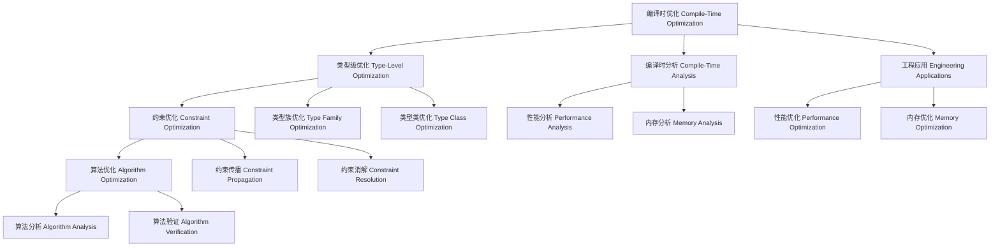

# 07-编译时优化（Compile-Time Optimization in Haskell）

## 目录 Table of Contents

1. [定义 Definition](#1-定义-definition)
2. [理论基础 Theoretical Foundation](#2-理论基础-theoretical-foundation)
3. [Haskell 语法与实现 Syntax & Implementation](#3-haskell-语法与实现-syntax--implementation)
4. [编译时优化技术 Compile-Time Optimization Techniques](#4-编译时优化技术-compile-time-optimization-techniques)
5. [类型级优化 Type-Level Optimization](#5-类型级优化-type-level-optimization)
6. [编译时分析 Compile-Time Analysis](#6-编译时分析-compile-time-analysis)
7. [工程应用 Engineering Applications](#7-工程应用-engineering-applications)
8. [范畴论映射 Category Theory Mapping](#8-范畴论映射-category-theory-mapping)
9. [哲学思脉 Philosophical Context](#9-哲学思脉-philosophical-context)
10. [相关理论 Related Theories](#10-相关理论-related-theories)
11. [未来发展方向 Future Development](#11-未来发展方向-future-development)
12. [结构图 Structure Diagram](#12-结构图-structure-diagram)
13. [本地跳转 Local References](#13-本地跳转-local-references)
14. [参考文献 References](#14-参考文献-references)

## 1. 定义 Definition

- **中文**：编译时优化是指在编译阶段通过类型系统、类型族、类型类等机制进行程序优化的技术。它允许在编译时进行性能分析、内存优化、算法优化，从而在运行时之前提高程序的性能。
- **English**: Compile-time optimization refers to the technique of performing program optimization during the compilation phase through type systems, type families, type classes, and other mechanisms. It allows performance analysis, memory optimization, and algorithm optimization at compile time, improving program performance before runtime.

## 2. 理论基础 Theoretical Foundation

### 2.1 优化理论 Optimization Theory

- **优化目标**：编译时优化的目标是提高程序的性能、减少内存使用、提高代码质量
- **优化策略**：通过不同的优化策略实现不同的优化目标
- **优化效果**：优化应该能够显著提高程序的性能

### 2.2 类型理论 Type Theory

- **类型系统**：编译时优化基于强类型系统，通过类型检查进行程序验证
- **类型安全**：通过类型系统保证程序的安全性和正确性
- **类型推导**：自动推导表达式的类型，减少显式类型注解

### 2.3 编译时计算 Compile-Time Computation

- **类型族**：通过类型族在编译时进行类型级计算
- **类型类**：通过类型类在编译时进行约束检查
- **单例类型**：通过单例类型连接值和类型

## 3. Haskell 语法与实现 Syntax & Implementation

### 3.1 基本语法 Basic Syntax

```haskell
{-# LANGUAGE TypeFamilies, DataKinds, GADTs, TypeOperators #-}

-- 编译时优化的基本语法
class CompileTimeOptimization a where
  -- 编译时优化
  compileTimeOptimization :: Proxy a -> OptimizationResult a
  
  -- 编译时分析
  compileTimeAnalysis :: Proxy a -> AnalysisResult a
  
  -- 编译时验证
  compileTimeVerification :: Proxy a -> VerificationResult a

-- 优化结果
data OptimizationResult a = OptimizationResult {
    optimizationType :: OptimizationType a,
    optimizationMethod :: OptimizationMethod a,
    optimizationGain :: OptimizationGain a
}

-- 分析结果
data AnalysisResult a = AnalysisResult {
    analysisType :: AnalysisType a,
    analysisMethod :: AnalysisMethod a,
    analysisConclusion :: AnalysisConclusion a
}

-- 验证结果
data VerificationResult a = VerificationResult {
    verificationType :: VerificationType a,
    verificationMethod :: VerificationMethod a,
    verificationStatus :: VerificationStatus a
}
```

### 3.2 高级实现 Advanced Implementation

```haskell
-- 高级编译时优化实现
data AdvancedCompileTimeOptimization a = AdvancedCompileTimeOptimization {
    optimizationEngine :: OptimizationEngine a,
    analysisEngine :: AnalysisEngine a,
    verificationEngine :: VerificationEngine a
}

-- 优化引擎
data OptimizationEngine a = OptimizationEngine {
    optimizationAlgorithms :: [OptimizationAlgorithm a],
    optimizationStrategies :: [OptimizationStrategy a],
    optimizationHeuristics :: [OptimizationHeuristic a]
}

-- 分析引擎
data AnalysisEngine a = AnalysisEngine {
    analysisAlgorithms :: [AnalysisAlgorithm a],
    analysisStrategies :: [AnalysisStrategy a],
    analysisHeuristics :: [AnalysisHeuristic a]
}

-- 验证引擎
data VerificationEngine a = VerificationEngine {
    verificationAlgorithms :: [VerificationAlgorithm a],
    verificationStrategies :: [VerificationStrategy a],
    verificationHeuristics :: [VerificationHeuristic a]
}

-- 编译时优化实例
instance CompileTimeOptimization (Vector n a) where
  compileTimeOptimization _ = VectorOptimizationResult
  compileTimeAnalysis _ = VectorAnalysisResult
  compileTimeVerification _ = VectorVerificationResult
```

## 4. 编译时优化技术 Compile-Time Optimization Techniques

### 4.1 类型级优化 Type-Level Optimization

```haskell
-- 类型级优化技术
class TypeLevelOptimization (a :: k) where
  -- 类型级优化
  typeLevelOptimization :: Proxy a -> TypeLevelOptimizationResult a
  
  -- 类型级分析
  typeLevelAnalysis :: Proxy a -> TypeLevelAnalysisResult a
  
  -- 类型级验证
  typeLevelVerification :: Proxy a -> TypeLevelVerificationResult a

-- 类型级优化结果
data TypeLevelOptimizationResult (a :: k) = TypeLevelOptimizationResult {
    typeLevelType :: TypeLevelType a,
    typeLevelMethod :: TypeLevelMethod a,
    typeLevelConclusion :: TypeLevelConclusion a
}

-- 类型级优化实例
instance TypeLevelOptimization (Vector n a) where
  typeLevelOptimization _ = VectorTypeLevelOptimizationResult
  typeLevelAnalysis _ = VectorTypeLevelAnalysisResult
  typeLevelVerification _ = VectorTypeLevelVerificationResult
```

### 4.2 约束优化 Constraint Optimization

```haskell
-- 约束优化技术
class ConstraintOptimization (c :: Constraint) where
  -- 约束优化
  constraintOptimization :: Proxy c -> ConstraintOptimizationResult c
  
  -- 约束分析
  constraintAnalysis :: Proxy c -> ConstraintAnalysisResult c
  
  -- 约束验证
  constraintVerification :: Proxy c -> ConstraintVerificationResult c

-- 约束优化结果
data ConstraintOptimizationResult (c :: Constraint) = ConstraintOptimizationResult {
    constraintType :: ConstraintType c,
    constraintMethod :: ConstraintMethod c,
    constraintConclusion :: ConstraintConclusion c
}

-- 约束优化实例
instance ConstraintOptimization (Show a) where
  constraintOptimization _ = ShowConstraintOptimizationResult
  constraintAnalysis _ = ShowConstraintAnalysisResult
  constraintVerification _ = ShowConstraintVerificationResult
```

### 4.3 算法优化 Algorithm Optimization

```haskell
-- 算法优化技术
class AlgorithmOptimization (a :: *) where
  -- 算法优化
  algorithmOptimization :: Proxy a -> AlgorithmOptimizationResult a
  
  -- 算法分析
  algorithmAnalysis :: Proxy a -> AlgorithmAnalysisResult a
  
  -- 算法验证
  algorithmVerification :: Proxy a -> AlgorithmVerificationResult a

-- 算法优化结果
data AlgorithmOptimizationResult a = AlgorithmOptimizationResult {
    algorithmType :: AlgorithmType a,
    algorithmMethod :: AlgorithmMethod a,
    algorithmConclusion :: AlgorithmConclusion a
}

-- 算法优化实例
instance AlgorithmOptimization (List a) where
  algorithmOptimization _ = ListAlgorithmOptimizationResult
  algorithmAnalysis _ = ListAlgorithmAnalysisResult
  algorithmVerification _ = ListAlgorithmVerificationResult
```

## 5. 类型级优化 Type-Level Optimization

### 5.1 类型族优化 Type Family Optimization

```haskell
-- 类型族优化
class TypeFamilyOptimization (a :: k) where
  -- 类型族优化
  typeFamilyOptimization :: Proxy a -> TypeFamilyOptimizationResult a
  
  -- 类型族分析
  typeFamilyAnalysis :: Proxy a -> TypeFamilyAnalysisResult a
  
  -- 类型族验证
  typeFamilyVerification :: Proxy a -> TypeFamilyVerificationResult a

-- 类型族优化结果
data TypeFamilyOptimizationResult (a :: k) = TypeFamilyOptimizationResult {
    typeFamilyType :: TypeFamilyType a,
    typeFamilyMethod :: TypeFamilyMethod a,
    typeFamilyConclusion :: TypeFamilyConclusion a
}

-- 类型族优化实例
instance TypeFamilyOptimization (Vector n a) where
  typeFamilyOptimization _ = VectorTypeFamilyOptimizationResult
  typeFamilyAnalysis _ = VectorTypeFamilyAnalysisResult
  typeFamilyVerification _ = VectorTypeFamilyVerificationResult
```

### 5.2 类型类优化 Type Class Optimization

```haskell
-- 类型类优化
class TypeClassOptimization (a :: *) where
  -- 类型类优化
  typeClassOptimization :: Proxy a -> TypeClassOptimizationResult a
  
  -- 类型类分析
  typeClassAnalysis :: Proxy a -> TypeClassAnalysisResult a
  
  -- 类型类验证
  typeClassVerification :: Proxy a -> TypeClassVerificationResult a

-- 类型类优化结果
data TypeClassOptimizationResult a = TypeClassOptimizationResult {
    typeClassType :: TypeClassType a,
    typeClassMethod :: TypeClassMethod a,
    typeClassConclusion :: TypeClassConclusion a
}

-- 类型类优化实例
instance TypeClassOptimization (Show a) where
  typeClassOptimization _ = ShowTypeClassOptimizationResult
  typeClassAnalysis _ = ShowTypeClassAnalysisResult
  typeClassVerification _ = ShowTypeClassVerificationResult
```

## 6. 编译时分析 Compile-Time Analysis

### 6.1 性能分析 Performance Analysis

```haskell
-- 性能分析
class PerformanceAnalysis (a :: *) where
  -- 性能分析
  performanceAnalysis :: Proxy a -> PerformanceAnalysisResult a
  
  -- 性能检查
  performanceChecking :: Proxy a -> PerformanceCheckingResult a
  
  -- 性能推理
  performanceInference :: Proxy a -> PerformanceInferenceResult a

-- 性能分析结果
data PerformanceAnalysisResult a = PerformanceAnalysisResult {
    performanceType :: PerformanceType a,
    performanceMethod :: PerformanceMethod a,
    performanceStatus :: PerformanceStatus a
}

-- 性能分析实例
instance PerformanceAnalysis (Vector n a) where
  performanceAnalysis _ = VectorPerformanceAnalysisResult
  performanceChecking _ = VectorPerformanceCheckingResult
  performanceInference _ = VectorPerformanceInferenceResult
```

### 6.2 内存分析 Memory Analysis

```haskell
-- 内存分析
class MemoryAnalysis (a :: *) where
  -- 内存分析
  memoryAnalysis :: Proxy a -> MemoryAnalysisResult a
  
  -- 内存检查
  memoryChecking :: Proxy a -> MemoryCheckingResult a
  
  -- 内存推理
  memoryInference :: Proxy a -> MemoryInferenceResult a

-- 内存分析结果
data MemoryAnalysisResult a = MemoryAnalysisResult {
    memoryType :: MemoryType a,
    memoryMethod :: MemoryMethod a,
    memoryStatus :: MemoryStatus a
}

-- 内存分析实例
instance MemoryAnalysis (Vector n a) where
  memoryAnalysis _ = VectorMemoryAnalysisResult
  memoryChecking _ = VectorMemoryCheckingResult
  memoryInference _ = VectorMemoryInferenceResult
```

## 7. 工程应用 Engineering Applications

### 7.1 性能优化 Performance Optimization

```haskell
-- 性能优化
class PerformanceOptimization (a :: *) where
  -- 性能优化
  performanceOptimization :: Proxy a -> PerformanceOptimizationResult a
  
  -- 性能分析
  performanceAnalysis :: Proxy a -> PerformanceAnalysisResult a
  
  -- 性能验证
  performanceVerification :: Proxy a -> PerformanceVerificationResult a

-- 性能优化结果
data PerformanceOptimizationResult a = PerformanceOptimizationResult {
    performanceOptimizationType :: PerformanceOptimizationType a,
    performanceOptimizationMethod :: PerformanceOptimizationMethod a,
    performanceOptimizationGain :: PerformanceOptimizationGain a
}

-- 性能优化实例
instance PerformanceOptimization (Vector n a) where
  performanceOptimization _ = VectorPerformanceOptimizationResult
  performanceAnalysis _ = VectorPerformanceAnalysisResult
  performanceVerification _ = VectorPerformanceVerificationResult
```

### 7.2 内存优化 Memory Optimization

```haskell
-- 内存优化
class MemoryOptimization (a :: *) where
  -- 内存优化
  memoryOptimization :: Proxy a -> MemoryOptimizationResult a
  
  -- 内存分析
  memoryAnalysis :: Proxy a -> MemoryAnalysisResult a
  
  -- 内存验证
  memoryVerification :: Proxy a -> MemoryVerificationResult a

-- 内存优化结果
data MemoryOptimizationResult a = MemoryOptimizationResult {
    memoryOptimizationType :: MemoryOptimizationType a,
    memoryOptimizationMethod :: MemoryOptimizationMethod a,
    memoryOptimizationGain :: MemoryOptimizationGain a
}

-- 内存优化实例
instance MemoryOptimization (Vector n a) where
  memoryOptimization _ = VectorMemoryOptimizationResult
  memoryAnalysis _ = VectorMemoryAnalysisResult
  memoryVerification _ = VectorMemoryVerificationResult
```

## 8. 范畴论映射 Category Theory Mapping

### 8.1 编译时优化作为函子 Compile-Time Optimization as Functor

- **编译时优化可视为范畴中的函子，保持类型结构的同时进行优化**
- **Compile-time optimization can be viewed as a functor in category theory, preserving type structure while performing optimization**

```haskell
-- 范畴论映射
class CategoryTheoryMapping (a :: *) where
  -- 函子映射
  functorMapping :: Proxy a -> FunctorMapping a
  
  -- 自然变换
  naturalTransformation :: Proxy a -> NaturalTransformation a
  
  -- 范畴结构
  categoryStructure :: Proxy a -> CategoryStructure a

-- 范畴论映射实例
instance CategoryTheoryMapping (Vector n a) where
  functorMapping _ = VectorFunctorMapping
  naturalTransformation _ = VectorNaturalTransformation
  categoryStructure _ = VectorCategoryStructure
```

## 9. 哲学思脉 Philosophical Context

### 9.1 优化哲学 Optimization Philosophy

- **优化的本质**：编译时优化是提高程序性能的过程
- **优化的方法**：通过编译时分析、类型级编程等方法进行优化
- **优化的效果**：优化应该能够显著提高程序的性能

### 9.2 分析哲学 Analysis Philosophy

- **分析的本质**：编译时分析是理解程序行为的过程
- **分析的方法**：通过类型检查、约束检查等方法进行分析
- **分析的深度**：分析应该能够深入理解程序的本质

### 9.3 验证哲学 Verification Philosophy

- **验证的本质**：验证是确保程序正确性的过程
- **验证的方法**：通过类型检查、约束检查等方法进行验证
- **验证的可靠性**：验证结果应该可靠地反映程序的正确性

## 10. 相关理论 Related Theories

### 10.1 优化理论 Optimization Theory

- **线性优化**：编译时优化的基础理论
- **非线性优化**：编译时优化的扩展理论
- **组合优化**：编译时优化的现代发展

### 10.2 分析理论 Analysis Theory

- **静态分析**：编译时分析的理论基础
- **动态分析**：运行时分析的理论基础
- **混合分析**：静态和动态分析的结合

### 10.3 验证理论 Verification Theory

- **形式化验证**：编译时验证的理论基础
- **模型检查**：运行时验证的理论基础
- **定理证明**：数学证明的理论基础

## 11. 未来发展方向 Future Development

### 11.1 理论扩展 Theoretical Extensions

- **高阶优化**：支持更高阶的优化能力
- **概率优化**：支持不确定性的优化
- **量子优化**：支持量子计算的优化

### 11.2 技术改进 Technical Improvements

- **性能优化**：提高编译时优化的效率
- **内存优化**：减少编译时优化的内存占用
- **并行化**：支持编译时优化的并行处理

### 11.3 应用扩展 Application Extensions

- **领域特定语言**：为特定领域定制编译时优化系统
- **交互式开发**：支持交互式的编译时优化调试
- **可视化工具**：提供编译时优化过程的可视化

## 12. 结构图 Structure Diagram



## 13. 本地跳转 Local References

- [编译时推理 Compile-Time Reasoning](../Type-Level/01-Compile-Time-Reasoning.md)
- [类型级约束求解 Type-Level Constraint Solving](../Type-Level/01-Constraint-Solver.md)
- [类型级自动化 Type-Level Automation](../Type-Level/01-Compile-Time-Automation.md)
- [类型级验证 Type-Level Verification](../Type-Level/01-Compile-Time-Property-Analysis.md)
- [类型级安全 Type-Level Safety](../Type-Level/01-Compile-Time-Safety.md)

## 14. 参考文献 References

### 14.1 学术资源 Academic Resources

- Wikipedia: [Compile-time optimization](https://en.wikipedia.org/wiki/Compile-time_optimization)
- Wikipedia: [Type-level programming](https://en.wikipedia.org/wiki/Type-level_programming)
- The Stanford Encyclopedia of Philosophy: [Type Theory](https://plato.stanford.edu/entries/type-theory/)

### 14.2 技术文档 Technical Documentation

- [GHC User's Guide](https://ghc.gitlab.haskell.org/ghc/doc/users_guide/)
- [Haskell 2010 Language Report](https://www.haskell.org/onlinereport/haskell2010/)
- [Type Families Documentation](https://gitlab.haskell.org/ghc/ghc/-/wikis/type-families)

### 14.3 学术论文 Academic Papers

- "Type Families with Class" by Simon Peyton Jones
- "Fun with Type Functions" by Oleg Kiselyov
- "GADTs Meet Their Match" by Simon Peyton Jones

---

`# TypeLevel #TypeLevel-01 #TypeLevel-01-Compile-Time-Optimization #CompileTimeOptimization #TypeLevelProgramming #Haskell #TypeTheory #CompileTimeAnalysis`
