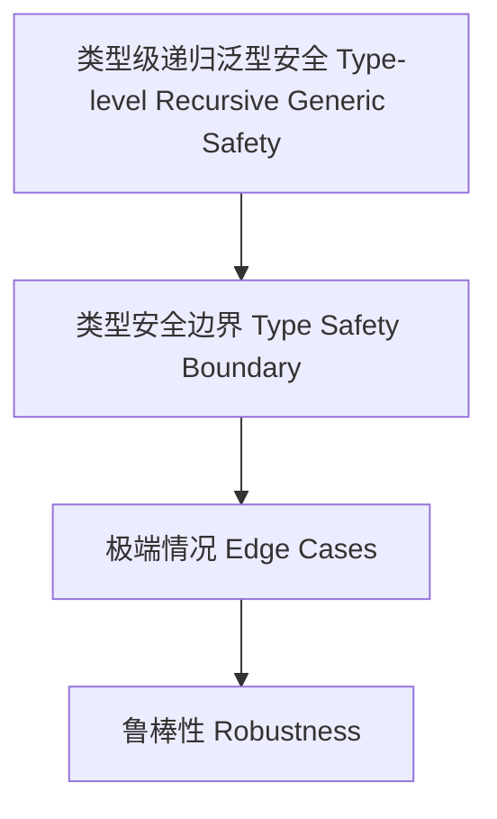

# 类型级递归泛型安全（Type-Level Recursive Generic Safety in Haskell）

## 定义 Definition

- **中文**：类型级递归泛型安全是指在类型系统层面对递归泛型结构和算法的类型安全边界、极端情况与鲁棒性进行分析和保障的机制。
- **English**: Type-level recursive generic safety refers to mechanisms at the type system level for analyzing and ensuring type safety boundaries, edge cases, and robustness of recursive generic structures and algorithms in Haskell.

## Haskell 语法与实现 Syntax & Implementation

```haskell
{-# LANGUAGE TypeFamilies, DataKinds, TypeOperators, GADTs #-}

-- 递归泛型安全示例：类型级列表安全访问

type family SafeHead (xs :: [k]) :: Maybe k where
  SafeHead '[] = 'Nothing
  SafeHead (x ': xs) = 'Just x
```

## 安全机制 Safety Mechanism

- 类型安全边界、极端情况处理、鲁棒性分析
- 类型级递归泛型的错误检测与恢复

## 极端情况与鲁棒性 Edge Cases & Robustness

- 空类型、极深递归、类型族终止性
- 类型级递归泛型的鲁棒性设计

## 形式化证明 Formal Reasoning

- **安全性证明**：SafeHead xs 总是类型安全且不会越界
- **Proof of safety**: SafeHead xs is always type-safe and never out-of-bounds

### 证明示例 Proof Example

- 对 `SafeHead xs` 递归归纳，空表返回 Nothing，非空返回 Just x，类型安全

## 工程应用 Engineering Application

- 类型安全的递归泛型库、鲁棒性增强、错误检测
- Type-safe recursive generic libraries, robustness enhancement, error detection

## 结构图 Structure Diagram



## 本地跳转 Local References

- [类型级递归泛型验证 Type-Level Recursive Generic Verification](../91-Type-Level-Recursive-Generic-Verification/01-Type-Level-Recursive-Generic-Verification-in-Haskell.md)
- [类型级递归泛型约束 Type-Level Recursive Generic Constraint](../78-Type-Level-Recursive-Generic-Constraint/01-Type-Level-Recursive-Generic-Constraint-in-Haskell.md)
- [类型安全 Type Safety](../14-Type-Safety/01-Type-Safety-in-Haskell.md)
