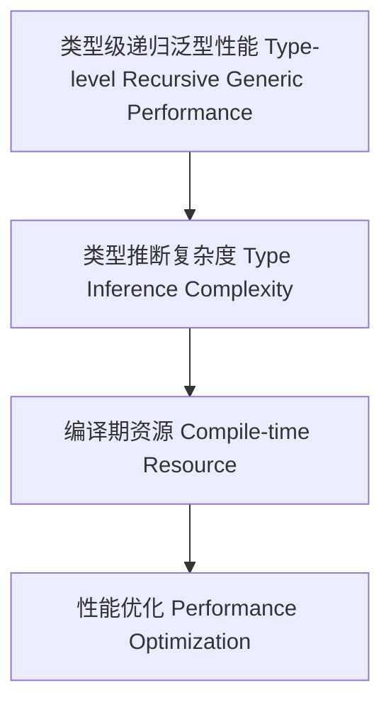

# 类型级递归泛型性能（Type-Level Recursive Generic Performance in Haskell）

## 定义 Definition

- **中文**：类型级递归泛型性能是指在类型系统层面对递归泛型结构和算法的类型推断、编译期复杂度与性能优化进行分析和提升的机制。
- **English**: Type-level recursive generic performance refers to mechanisms at the type system level for analyzing and optimizing type inference, compile-time complexity, and performance of recursive generic structures and algorithms in Haskell.

## Haskell 语法与实现 Syntax & Implementation

```haskell
{-# LANGUAGE TypeFamilies, DataKinds, TypeOperators #-}

-- 递归泛型性能示例：类型级递归深度分析

type family Depth (xs :: [k]) :: Nat where
  Depth '[] = 0
  Depth (x ': xs) = 1 + Depth xs
```

## 性能分析与复杂度 Performance Analysis & Complexity

- 类型推断复杂度、编译期资源消耗、递归深度
- 类型级递归泛型的性能瓶颈与极限

## 优化策略 Optimization Strategies

- 尾递归、分治、类型级缓存、递归深度限制
- 类型级递归泛型的性能提升方法

## 形式化证明 Formal Reasoning

- **复杂度证明**：Depth xs 的递归复杂度为 O(n)
- **Proof of complexity**: The recursion complexity of Depth xs is O(n)

### 证明示例 Proof Example

- 对 `Depth xs` 递归归纳，每步递归消耗一次资源，总复杂度 O(n)

## 工程应用 Engineering Application

- 类型安全的递归泛型性能优化、编译期资源管理、泛型库
- Type-safe recursive generic performance optimization, compile-time resource management, generic libraries

## 结构图 Structure Diagram



## 本地跳转 Local References

- [类型级递归泛型优化 Type-Level Recursive Generic Optimization](../88-Type-Level-Recursive-Generic-Optimization/01-Type-Level-Recursive-Generic-Optimization-in-Haskell.md)
- [类型级递归泛型算法 Type-Level Recursive Generic Algorithm](../72-Type-Level-Recursive-Generic-Algorithm/01-Type-Level-Recursive-Generic-Algorithm-in-Haskell.md)
- [类型安全 Type Safety](../14-Type-Safety/01-Type-Safety-in-Haskell.md)
