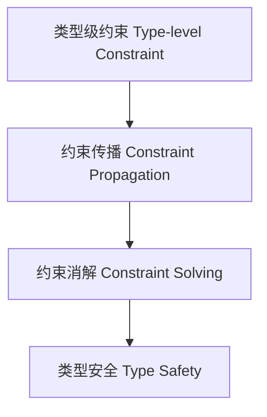

# 类型级约束求解（Type-Level Constraint Solving in Haskell）

## 定义 Definition

- **中文**：类型级约束求解是指在类型系统层面自动推导、传播和消解类型约束的机制，常用于类型类、类型族和依赖类型等高级特性。
- **English**: Type-level constraint solving refers to the mechanism by which the type system automatically infers, propagates, and solves type constraints, commonly used in type classes, type families, and dependent types in Haskell.

## Haskell 语法与实现 Syntax & Implementation

```haskell
{-# LANGUAGE TypeFamilies, ConstraintKinds, TypeOperators, UndecidableInstances #-}
import GHC.Exts (Constraint)

-- 类型级约束合并示例

type family And (a :: Constraint) (b :: Constraint) :: Constraint where
  And a b = (a, b)

class (a ~ b, Show a) => MyConstraint a b
```

## 约束传播与消解 Constraint Propagation & Solving

- 类型类实例选择与约束传递
- 类型族递归中的约束归约
- 依赖类型中的约束自动推导

## 形式化证明 Formal Reasoning

- **约束消解正确性证明**：证明约束合并、传递与消解过程保持类型系统一致性。
- **Proof of constraint solving correctness**: Show that merging, propagating, and solving constraints preserves type system consistency.

### 证明示例 Proof Example

- 对于 `And a b`，可归纳证明 `(a, b)` 同时满足 `a` 和 `b` 的约束。

## 工程应用 Engineering Application

- 类型安全的 API 设计
- 类型驱动的 DSL 约束自动推导
- 复杂泛型编程中的约束管理

## 范畴论映射 Category Theory Mapping

- 约束求解可视为范畴中的限制函子（Limit functor）或拉回（Pullback）结构。

## 结构图 Structure Diagram



## 本地跳转 Local References

- [类型类 Type Class](../07-Type-Class/01-Type-Class-in-Haskell.md)
- [类型族 Type Family](../11-Type-Family/01-Type-Family-in-Haskell.md)
- [依赖类型 Dependent Type](../10-Dependent-Type/01-Dependent-Type-in-Haskell.md)
