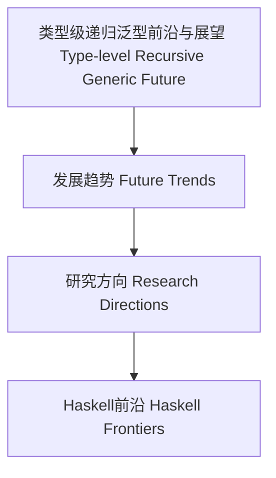

# 类型级递归泛型前沿与展望（Type-Level Recursive Generic Future in Haskell）

## 定义 Definition

- **中文**：类型级递归泛型前沿与展望是指类型级递归泛型技术在未来编程语言、类型系统、自动化推理等领域的发展趋势与研究方向。
- **English**: Type-level recursive generic future refers to the development trends and research directions of type-level recursive generic techniques in future programming languages, type systems, and automated reasoning.

## 未来发展趋势 Future Trends

- 更强的类型级计算能力与类型推理自动化
- 与依赖类型、证明助理、形式化验证的深度融合
- 类型级递归泛型的跨语言标准化与互操作
- 类型级泛型DSL与元编程的自动化演化

## 研究方向 Research Directions

- 类型级递归泛型的可扩展性与性能极限
- 类型级递归泛型的安全性与鲁棒性理论
- 类型级递归泛型与AI辅助编程、自动化证明的结合

## Haskell 相关前沿 Haskell-Related Frontiers

- GHC类型系统扩展、Template Haskell自动化、Liquid Haskell形式化验证
- 类型级递归泛型在大规模工程中的应用与挑战

## 结构图 Structure Diagram

## 本地跳转 Local References

- [类型级递归泛型元编程 Type-Level Recursive Generic Metaprogramming](../99-Type-Level-Recursive-Generic-Metaprogramming/01-Type-Level-Recursive-Generic-Metaprogramming-in-Haskell.md)
- [类型级递归泛型工程实践 Type-Level Recursive Generic Engineering Practice](../103-Type-Level-Recursive-Generic-Engineering-Practice/01-Type-Level-Recursive-Generic-Engineering-Practice-in-Haskell.md)
- [类型安全 Type Safety](../14-Type-Safety/01-Type-Safety-in-Haskell.md)
