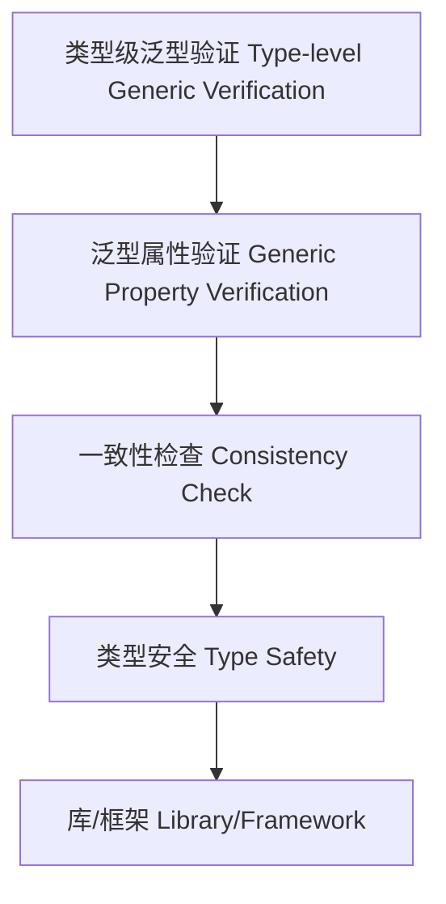
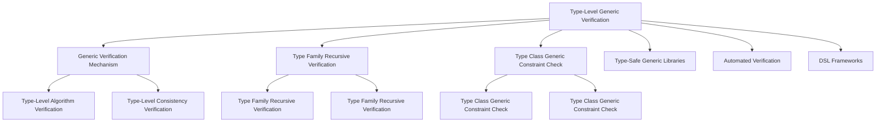

# 11-类型级泛型验证（Type-Level Generic Verification in Haskell）

## 定义 Definition

- **中文**：类型级泛型验证是指在类型系统层面对泛型类型和算法进行自动化验证和一致性检查的机制，提升类型安全和泛型编程的可靠性。
- **English**: Type-level generic verification refers to mechanisms at the type system level for automatically verifying and checking the consistency of generic types and algorithms, improving type safety and the reliability of generic programming in Haskell.

## Haskell 语法与实现 Syntax & Implementation

```haskell
{-# LANGUAGE TypeFamilies, DataKinds, TypeOperators, GADTs #-}

-- 类型级泛型验证示例：类型级列表长度验证

type family Length (xs :: [k]) :: Nat where
  Length '[] = 0
  Length (x ': xs) = 1 + Length xs

-- 验证长度是否为零

type family IsZero (n :: Nat) :: Bool where
  IsZero 0 = 'True
  IsZero n = 'False
```

### 机制与一致性 Mechanism & Consistency

- 机制：以类型族刻画属性（长度、排序、去重、维度等），以约束 `Prop xs ~ 'True` 驱动编译期验证
- 一致性：封闭族带来可预期的归约；开放族需保证全局实例不冲突；可逆族提升推断能力
- 与类型等价：结合 `:~:`/`~` 进行类型改写，实现“验证即约束化”的证明风格

## 泛型验证机制 Generic Verification Mechanism

- 类型族递归验证、类型类泛型约束检查
- 支持类型级泛型算法的自动验证与一致性检查

## 形式化证明 Formal Reasoning

- **泛型验证正确性证明**：归纳证明验证机制能准确检测泛型类型属性
- **Proof of correctness for generic verification**: Inductive proof that the verification mechanism accurately detects generic type properties

### 证明示例 Proof Example

- 对 `IsZero (Length xs)`，对 `xs` 归纳，能准确判断列表是否为空

## 工程应用 Engineering Application

- 类型安全的泛型库、自动化验证、DSL 框架
- Type-safe generic libraries, automated verification, DSL frameworks

## 结构图 Structure Diagram



## 对比分析 Comparison

- **中文**：类型级泛型验证 vs 运行时泛型验证 vs 静态泛型验证 vs 动态泛型验证
  - 类型级泛型验证关注"编译时的类型级泛型验证"；运行时泛型验证聚焦"执行时的泛型验证"；静态泛型验证强调"编译时分析"；动态泛型验证注重"运行时监控"。
- **English**: Type-level generic verification vs runtime generic verification vs static generic verification vs dynamic generic verification
  - Type-level generic verification focuses on "compile-time type-level generic verification"; runtime generic verification on "runtime generic verification"; static generic verification on "compile-time analysis"; dynamic generic verification on "runtime monitoring".

## 争议与批判 Controversies & Critique

- **中文**：
  - 类型级泛型验证 vs 验证复杂性的权衡；形式化泛型验证 vs 非形式化泛型验证；
  - 类型级泛型验证的适用范围；泛型验证系统的完备性问题。
- **English**:
  - Trade-off between type-level generic verification vs verification complexity; formal generic verification vs informal generic verification;
  - Scope of applicability of type-level generic verification; completeness issues in generic verification systems.

## 前沿趋势 Frontier Trends

- **中文**：
  - AI辅助的类型级泛型验证；量子计算中的类型级泛型验证；
  - 分布式系统的类型级泛型验证；多语言类型级泛型验证框架。
- **English**:
  - AI-assisted type-level generic verification; type-level generic verification in quantum computing;
  - Type-level generic verification for distributed systems; multi-language type-level generic verification frameworks.

## 常见陷阱 Common Pitfalls

- **中文**：
  - 过度依赖类型级泛型验证；忽视泛型验证的局限性；
  - 类型级泛型验证的复杂性；泛型验证系统的性能问题。
- **English**:
  - Over-reliance on type-level generic verification; ignoring limitations of generic verification;
  - Complexity of type-level generic verification; performance issues in generic verification systems.

## 扩展交叉引用 Extended Cross References

- [编译时安全 Compile-Time Safety](../Type-Level/06-编译时安全.md)
- [编译时优化 Compile-Time Optimization](../Type-Level/07-编译时优化.md)
- [类型级编译期一致性 Type-Level Compile-Time Consistency](../Type-Level/14-类型级编译期一致性.md)
- [类型级语义分析 Type-Level Semantic Analysis](../Type-Level/29-类型级语义分析.md)
- [类型级编程 Type-Level Programming](../Type-Level/01-类型级编程.md)
- [类型级证明 Type-Level Proof](../Type-Level/04-类型级证明.md)

## 知识图谱 Knowledge Graph



## 本地跳转 Local References

- [类型级泛型 Type-level Generic](../24-Type-Level-Generic/01-Type-Level-Generic-in-Haskell.md)
- [类型级泛型归纳 Type-Level Generic Induction](../45-Type-Level-Generic-Induction/01-Type-Level-Generic-Induction-in-Haskell.md)
- [类型安全 Type Safety](../14-Type-Safety/01-Type-Safety-in-Haskell.md)
