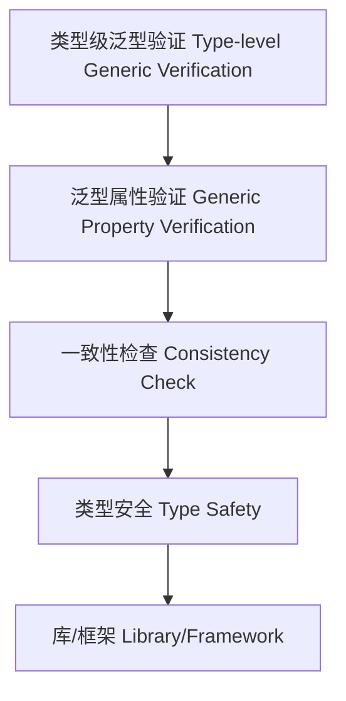

# 11-类型级泛型验证（Type-Level Generic Verification in Haskell）

## 定义 Definition

- **中文**：类型级泛型验证是指在类型系统层面对泛型类型和算法进行自动化验证和一致性检查的机制，提升类型安全和泛型编程的可靠性。
- **English**: Type-level generic verification refers to mechanisms at the type system level for automatically verifying and checking the consistency of generic types and algorithms, improving type safety and the reliability of generic programming in Haskell.

## Haskell 语法与实现 Syntax & Implementation

```haskell
{-# LANGUAGE TypeFamilies, DataKinds, TypeOperators, GADTs #-}

-- 类型级泛型验证示例：类型级列表长度验证

type family Length (xs :: [k]) :: Nat where
  Length '[] = 0
  Length (x ': xs) = 1 + Length xs

-- 验证长度是否为零

type family IsZero (n :: Nat) :: Bool where
  IsZero 0 = 'True
  IsZero n = 'False
```

### 机制与一致性 Mechanism & Consistency

- 机制：以类型族刻画属性（长度、排序、去重、维度等），以约束 `Prop xs ~ 'True` 驱动编译期验证
- 一致性：封闭族带来可预期的归约；开放族需保证全局实例不冲突；可逆族提升推断能力
- 与类型等价：结合 `:~:`/`~` 进行类型改写，实现“验证即约束化”的证明风格

## 泛型验证机制 Generic Verification Mechanism

- 类型族递归验证、类型类泛型约束检查
- 支持类型级泛型算法的自动验证与一致性检查

## 形式化证明 Formal Reasoning

- **泛型验证正确性证明**：归纳证明验证机制能准确检测泛型类型属性
- **Proof of correctness for generic verification**: Inductive proof that the verification mechanism accurately detects generic type properties

### 证明示例 Proof Example

- 对 `IsZero (Length xs)`，对 `xs` 归纳，能准确判断列表是否为空

## 工程应用 Engineering Application

- 类型安全的泛型库、自动化验证、DSL 框架
- Type-safe generic libraries, automated verification, DSL frameworks

## 结构图 Structure Diagram



## 本地跳转 Local References

- [类型级泛型 Type-level Generic](../24-Type-Level-Generic/01-Type-Level-Generic-in-Haskell.md)
- [类型级泛型归纳 Type-Level Generic Induction](../45-Type-Level-Generic-Induction/01-Type-Level-Generic-Induction-in-Haskell.md)
- [类型安全 Type Safety](../14-Type-Safety/01-Type-Safety-in-Haskell.md)
