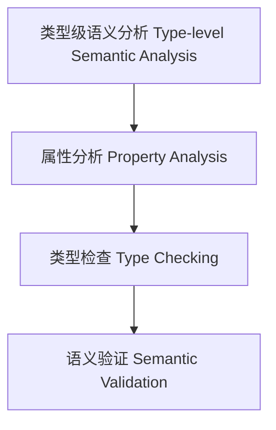

# 类型级语义分析（Type-Level Semantic Analysis in Haskell）

## 定义 Definition

- **中文**：类型级语义分析是指在类型系统层面对类型级结构、表达式等进行属性分析、类型检查与语义验证的机制，支持类型安全的编译期语义分析。
- **English**: Type-level semantic analysis refers to mechanisms at the type system level for property analysis, type checking, and semantic validation of type-level structures and expressions, supporting type-safe compile-time semantic analysis in Haskell.

## Haskell 语法与实现 Syntax & Implementation

```haskell
{-# LANGUAGE GADTs, DataKinds, TypeFamilies #-}

-- 类型级表达式

data Expr a where
  LitInt  :: Int  -> Expr Int
  Add     :: Expr Int -> Expr Int -> Expr Int

-- 类型级语义分析：类型检查

type family TypeCheck (e :: Expr a) :: Bool where
  TypeCheck ('LitInt n) = 'True
  TypeCheck ('Add x y) = TypeCheck x && TypeCheck y
```

## 类型级属性分析与类型检查 Property Analysis & Type Checking

- 类型级表达式的属性分析、类型检查、语义验证
- 支持类型安全的编译期语义分析与错误检测

## 形式化证明 Formal Reasoning

- **语义分析正确性证明**：TypeCheck e 能准确判断表达式类型合法性
- **Proof of semantic analysis correctness**: TypeCheck e can accurately determine the type validity of expressions

### 证明示例 Proof Example

- 对 `TypeCheck e`，归纳每个构造器，类型检查覆盖所有情况

## 工程应用 Engineering Application

- 类型安全的类型级DSL、编译期语义分析、自动化验证
- Type-safe type-level DSLs, compile-time semantic analysis, automated verification

## 结构图 Structure Diagram



## 本地跳转 Local References

- [类型级语义模型 Type-Level Semantics](../107-Type-Level-Semantics/01-Type-Level-Semantics-in-Haskell.md)
- [类型级泛型算法 Type-Level Generic Algorithm](../33-Type-Level-Generic-Algorithm/01-Type-Level-Generic-Algorithm-in-Haskell.md)
- [类型安全 Type Safety](../14-Type-Safety/01-Type-Safety-in-Haskell.md)
