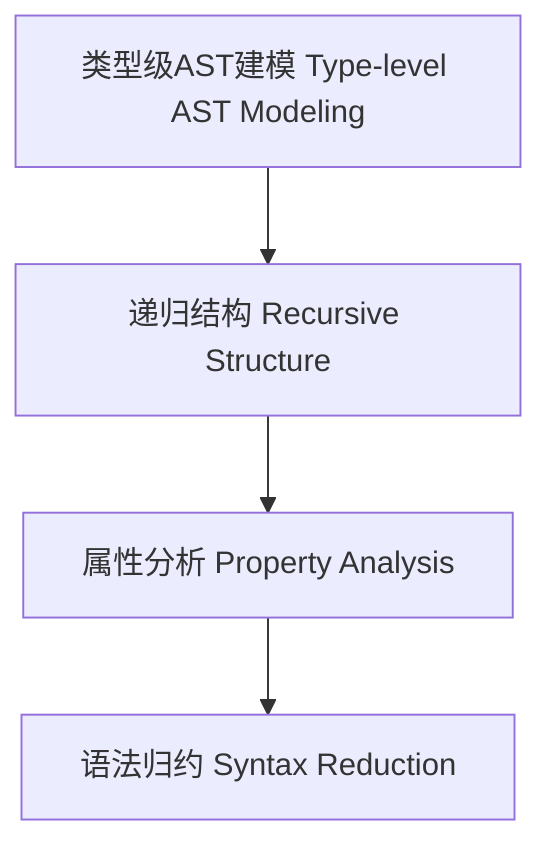

# 类型级AST建模（Type-Level AST Modeling in Haskell）

## 定义 Definition

- **中文**：类型级AST建模是指在类型系统层面对抽象语法树（AST）进行类型级结构建模、递归定义与属性分析的机制，支持类型安全的编译期语法分析。
- **English**: Type-level AST modeling refers to mechanisms at the type system level for modeling, recursively defining, and analyzing properties of abstract syntax trees (ASTs), supporting type-safe compile-time syntax analysis in Haskell.

## Haskell 语法与实现 Syntax & Implementation

```haskell
{-# LANGUAGE GADTs, DataKinds, TypeFamilies #-}

-- 类型级AST建模

data AST a where
  LitInt  :: Int  -> AST Int
  Add     :: AST Int -> AST Int -> AST Int
  Var     :: String -> AST Int
```

## 类型级递归结构与属性分析 Recursive Structure & Property Analysis

- 类型级AST的递归定义、属性分析、结构归约
- 支持类型安全的编译期语法分析与优化

## 形式化证明 Formal Reasoning

- **AST结构归约正确性证明**：递归归约与属性分析覆盖所有AST节点
- **Proof of AST reduction correctness**: Recursive reduction and property analysis cover all AST nodes

### 证明示例 Proof Example

- 对 `AST a` 递归归纳，所有构造器均被分析与归约覆盖

## 工程应用 Engineering Application

- 类型安全的类型级DSL、编译期语法分析、自动化优化
- Type-safe type-level DSLs, compile-time syntax analysis, automated optimization

## 结构图 Structure Diagram



## 本地跳转 Local References

- [类型级语法制导优化 Type-Level Syntax-Directed Optimization](../110-Type-Level-Syntax-Directed-Optimization/01-Type-Level-Syntax-Directed-Optimization-in-Haskell.md)
- [类型级语义分析 Type-Level Semantic Analysis](../111-Type-Level-Semantic-Analysis/01-Type-Level-Semantic-Analysis-in-Haskell.md)
- [类型安全 Type Safety](../14-Type-Safety/01-Type-Safety-in-Haskell.md)
