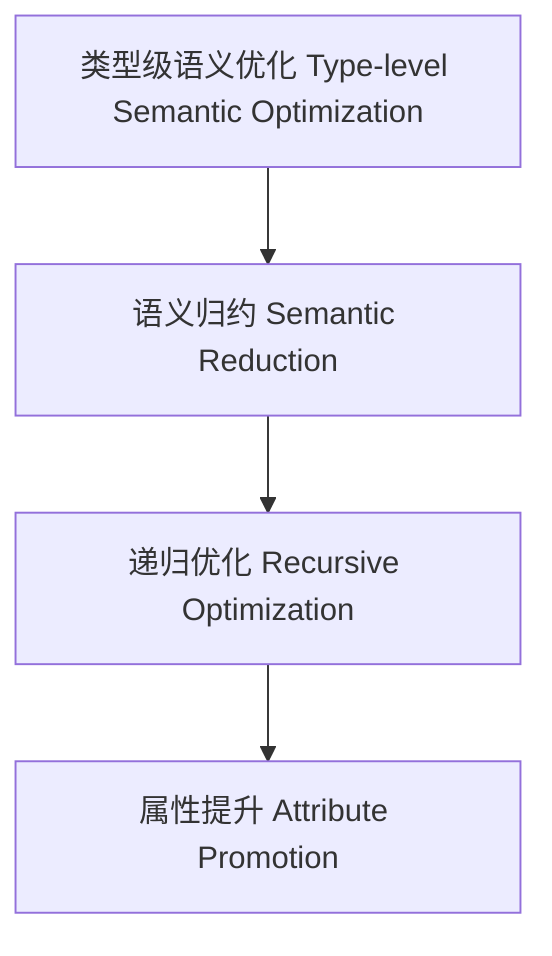

# 类型级语义优化（Type-Level Semantic Optimization in Haskell）

## 定义 Definition

- **中文**：类型级语义优化是指在类型系统层面对类型级结构和表达式进行语义归约、递归优化与属性提升的机制，支持类型安全的编译期语义优化。
- **English**: Type-level semantic optimization refers to mechanisms at the type system level for semantic reduction, recursive optimization, and attribute promotion of type-level structures and expressions, supporting type-safe compile-time semantic optimization in Haskell.

## Haskell 语法与实现 Syntax & Implementation

```haskell
{-# LANGUAGE GADTs, DataKinds, TypeFamilies #-}

-- 类型级表达式

data Expr a where
  LitInt  :: Int  -> Expr Int
  Add     :: Expr Int -> Expr Int -> Expr Int
  Zero    :: Expr Int

-- 类型级语义优化

type family SemOptimize (e :: Expr Int) :: Expr Int where
  SemOptimize ('Add 'Zero x) = SemOptimize x
  SemOptimize ('Add x 'Zero) = SemOptimize x
  SemOptimize ('Add x y) = 'Add (SemOptimize x) (SemOptimize y)
  SemOptimize e = e
```

## 类型级递归优化与属性归约 Recursive Optimization & Attribute Reduction

- 类型级表达式的递归语义优化、属性归约、冗余消除
- 支持类型安全的编译期语义优化

## 形式化证明 Formal Reasoning

- **语义优化正确性证明**：SemOptimize e 与 e 语义等价
- **Proof of semantic optimization correctness**: SemOptimize e is semantically equivalent to e

### 证明示例 Proof Example

- 对 `SemOptimize e`，归纳每个构造器，优化前后语义一致

## 工程应用 Engineering Application

- 类型安全的类型级DSL、编译期语义优化、自动化验证
- Type-safe type-level DSLs, compile-time semantic optimization, automated verification

## 结构图 Structure Diagram



## 本地跳转 Local References

- [类型级语义分析 Type-Level Semantic Analysis](../111-Type-Level-Semantic-Analysis/01-Type-Level-Semantic-Analysis-in-Haskell.md)
- [类型级语法制导优化 Type-Level Syntax-Directed Optimization](../110-Type-Level-Syntax-Directed-Optimization/01-Type-Level-Syntax-Directed-Optimization-in-Haskell.md)
- [类型安全 Type Safety](../14-Type-Safety/01-Type-Safety-in-Haskell.md)
