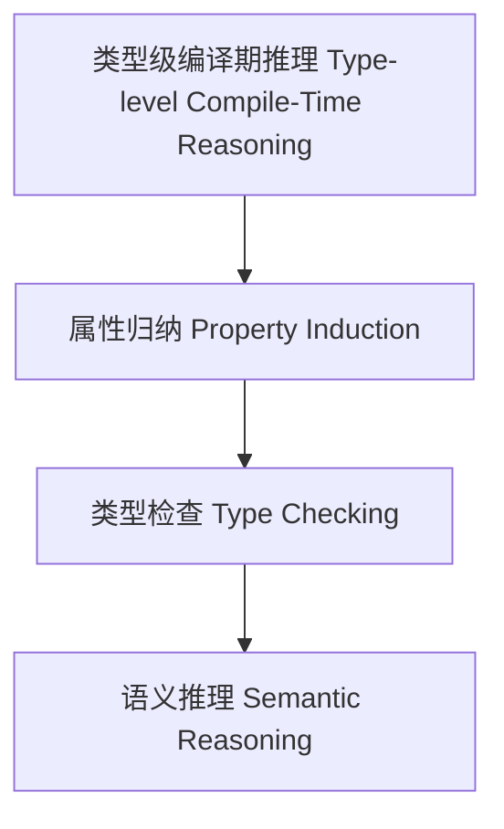

# 类型级编译期推理（Type-Level Compile-Time Reasoning in Haskell）

## 定义 Definition

- **中文**：类型级编译期推理是指在类型系统层面对类型级结构、表达式等进行属性归纳、类型检查与语义推理的机制，支持类型安全的编译期自动化推理。
- **English**: Type-level compile-time reasoning refers to mechanisms at the type system level for property induction, type checking, and semantic reasoning of type-level structures and expressions, supporting type-safe compile-time automated reasoning in Haskell.

## Haskell 语法与实现 Syntax & Implementation

```haskell
{-# LANGUAGE GADTs, DataKinds, TypeFamilies #-}

-- 类型级表达式

data Expr a where
  LitInt  :: Int  -> Expr Int
  Add     :: Expr Int -> Expr Int -> Expr Int

-- 类型级编译期推理：属性归纳

type family Reason (e :: Expr a) :: Bool where
  Reason ('LitInt n) = 'True
  Reason ('Add x y) = Reason x && Reason y
```

## 类型级属性归纳与类型检查 Property Induction & Type Checking

- 类型级表达式的属性归纳、类型检查、语义推理
- 支持类型安全的编译期自动化推理

## 形式化证明 Formal Reasoning

- **编译期推理正确性证明**：Reason e 能准确归纳表达式属性
- **Proof of compile-time reasoning correctness**: Reason e can accurately induct properties of expressions

### 证明示例 Proof Example

- 对 `Reason e`，归纳每个构造器，推理覆盖所有情况

## 工程应用 Engineering Application

- 类型安全的类型级DSL、编译期推理、自动化验证
- Type-safe type-level DSLs, compile-time reasoning, automated verification

## 结构图 Structure Diagram



## 本地跳转 Local References

- [类型级语义分析 Type-Level Semantic Analysis](../111-Type-Level-Semantic-Analysis/01-Type-Level-Semantic-Analysis-in-Haskell.md)
- [类型级AST建模 Type-Level AST Modeling](../112-Type-Level-AST-Modeling/01-Type-Level-AST-Modeling-in-Haskell.md)
- [类型安全 Type Safety](../14-Type-Safety/01-Type-Safety-in-Haskell.md)
