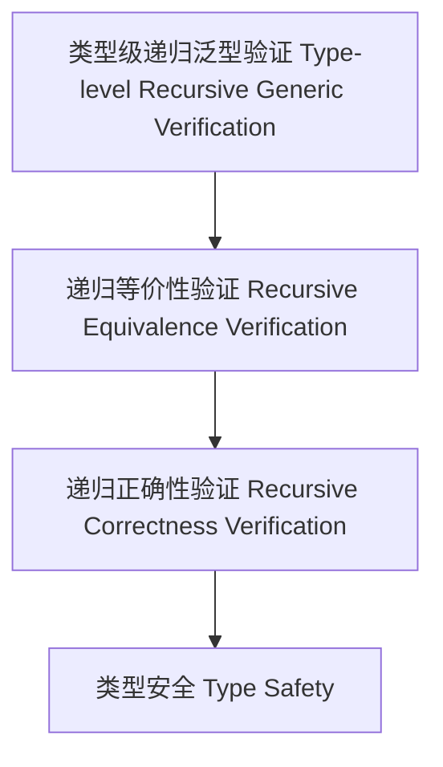
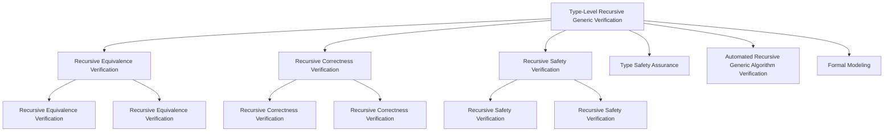

# 12-类型级递归泛型验证（Type-Level Recursive Generic Verification in Haskell）

## 目录 Table of Contents

- [12-类型级递归泛型验证（Type-Level Recursive Generic Verification in Haskell）](#12-类型级递归泛型验证type-level-recursive-generic-verification-in-haskell)
  - [目录 Table of Contents](#目录-table-of-contents)
  - [定义 Definition](#定义-definition)
  - [Haskell 语法与实现 Syntax \& Implementation](#haskell-语法与实现-syntax--implementation)
  - [递归泛型验证机制 Recursive Generic Verification Mechanism](#递归泛型验证机制-recursive-generic-verification-mechanism)
  - [形式化证明 Formal Reasoning](#形式化证明-formal-reasoning)
    - [证明示例 Proof Example](#证明示例-proof-example)
  - [工程应用 Engineering Application](#工程应用-engineering-application)
  - [结构图 Structure Diagram](#结构图-structure-diagram)
  - [本地跳转 Local References](#本地跳转-local-references)
  - [对比分析 Comparison](#对比分析-comparison)
  - [争议与批判 Controversies \& Critique](#争议与批判-controversies--critique)
  - [前沿趋势 Frontier Trends](#前沿趋势-frontier-trends)
  - [常见陷阱 Common Pitfalls](#常见陷阱-common-pitfalls)
  - [扩展交叉引用 Extended Cross References](#扩展交叉引用-extended-cross-references)
  - [知识图谱 Knowledge Graph](#知识图谱-knowledge-graph)

## 定义 Definition

- **中文**：类型级递归泛型验证是指在类型系统层面对递归泛型结构、算法等进行类型级别的正确性、等价性和安全性验证的机制。
- **English**: Type-level recursive generic verification refers to mechanisms at the type system level for verifying the correctness, equivalence, and safety of recursive generic structures and algorithms in Haskell.

## Haskell 语法与实现 Syntax & Implementation

```haskell
{-# LANGUAGE TypeFamilies, DataKinds, GADTs, TypeOperators #-}

-- 递归泛型验证示例：类型级等价性验证

type family EqList (xs :: [k]) (ys :: [k]) :: Bool where
  EqList '[] '[] = 'True
  EqList (x ': xs) (y ': ys) = (x == y) && EqList xs ys
  EqList _ _ = 'False
```

## 递归泛型验证机制 Recursive Generic Verification Mechanism

- 类型级递归等价性、正确性、安全性验证
- 支持递归泛型结构和算法的自动化验证

## 形式化证明 Formal Reasoning

- **递归泛型验证正确性证明**：归纳证明类型级验证的可靠性
- **Proof of correctness for recursive generic verification**: Inductive proof of reliability for type-level verification

### 证明示例 Proof Example

- 对 `EqList xs ys` 递归归纳，空表时为真，非空时递归验证每一项，归纳成立

## 工程应用 Engineering Application

- 类型安全保证、递归泛型算法自动化验证、形式化建模
- Type safety assurance, automated verification of recursive generic algorithms, formal modeling

## 结构图 Structure Diagram



## 本地跳转 Local References

## 对比分析 Comparison

- **中文**：类型级递归泛型验证 vs 运行时递归泛型验证 vs 静态递归泛型验证 vs 动态递归泛型验证
  - 类型级递归泛型验证关注"编译时的类型级递归泛型验证"；运行时递归泛型验证聚焦"执行时的递归泛型验证"；静态递归泛型验证强调"编译时分析"；动态递归泛型验证注重"运行时监控"。
- **English**: Type-level recursive generic verification vs runtime recursive generic verification vs static recursive generic verification vs dynamic recursive generic verification
  - Type-level recursive generic verification focuses on "compile-time type-level recursive generic verification"; runtime recursive generic verification on "runtime recursive generic verification"; static recursive generic verification on "compile-time analysis"; dynamic recursive generic verification on "runtime monitoring".

## 争议与批判 Controversies & Critique

- **中文**：
  - 类型级递归泛型验证 vs 验证复杂性的权衡；形式化递归泛型验证 vs 非形式化递归泛型验证；
  - 类型级递归泛型验证的适用范围；递归泛型验证系统的完备性问题。
- **English**:
  - Trade-off between type-level recursive generic verification vs verification complexity; formal recursive generic verification vs informal recursive generic verification;
  - Scope of applicability of type-level recursive generic verification; completeness issues in recursive generic verification systems.

## 前沿趋势 Frontier Trends

- **中文**：
  - AI辅助的类型级递归泛型验证；量子计算中的类型级递归泛型验证；
  - 分布式系统的类型级递归泛型验证；多语言类型级递归泛型验证框架。
- **English**:
  - AI-assisted type-level recursive generic verification; type-level recursive generic verification in quantum computing;
  - Type-level recursive generic verification for distributed systems; multi-language type-level recursive generic verification frameworks.

## 常见陷阱 Common Pitfalls

- **中文**：
  - 过度依赖类型级递归泛型验证；忽视递归泛型验证的局限性；
  - 类型级递归泛型验证的复杂性；递归泛型验证系统的性能问题。
- **English**:
  - Over-reliance on type-level recursive generic verification; ignoring limitations of recursive generic verification;
  - Complexity of type-level recursive generic verification; performance issues in recursive generic verification systems.

## 扩展交叉引用 Extended Cross References

- [编译时安全 Compile-Time Safety](../Type-Level/06-编译时安全.md)
- [编译时优化 Compile-Time Optimization](../Type-Level/07-编译时优化.md)
- [类型级编译期一致性 Type-Level Compile-Time Consistency](../Type-Level/14-类型级编译期一致性.md)
- [类型级语义分析 Type-Level Semantic Analysis](../Type-Level/29-类型级语义分析.md)
- [类型级编程 Type-Level Programming](../Type-Level/01-类型级编程.md)
- [类型级证明 Type-Level Proof](../Type-Level/04-类型级证明.md)

## 知识图谱 Knowledge Graph



- [类型级递归验证 Type-Level Recursive Verification](../79-Type-Level-Recursive-Generic-Proof/01-Type-Level-Recursive-Generic-Proof-in-Haskell.md)
- [类型级递归泛型算法 Type-Level Recursive Generic Algorithm](../72-Type-Level-Recursive-Generic-Algorithm/01-Type-Level-Recursive-Generic-Algorithm-in-Haskell.md)
- [类型安全 Type Safety](../14-Type-Safety/01-Type-Safety-in-Haskell.md)
- [类型级递归泛型归纳 Type-Level Recursive Generic Induction](../82-Type-Level-Recursive-Generic-Induction/01-Type-Level-Recursive-Generic-Induction-in-Haskell.md)
