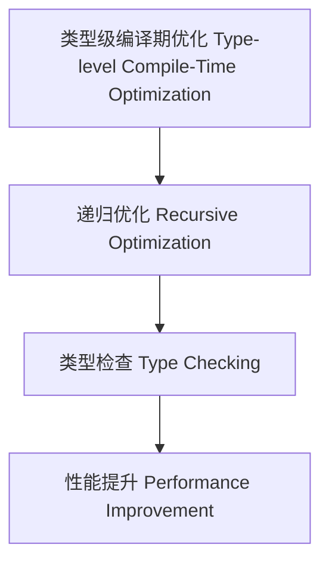

# 类型级编译期优化（Type-Level Compile-Time Optimization in Haskell）

## 定义 Definition

- **中文**：类型级编译期优化是指在类型系统层面对类型级结构和表达式进行递归优化、类型检查与性能提升的机制，支持类型安全的编译期优化。
- **English**: Type-level compile-time optimization refers to mechanisms at the type system level for recursive optimization, type checking, and performance improvement of type-level structures and expressions, supporting type-safe compile-time optimization in Haskell.

## Haskell 语法与实现 Syntax & Implementation

```haskell
{-# LANGUAGE GADTs, DataKinds, TypeFamilies #-}

-- 类型级表达式

data Expr a where
  LitInt  :: Int  -> Expr Int
  Add     :: Expr Int -> Expr Int -> Expr Int
  Zero    :: Expr Int

-- 类型级编译期优化

type family CTOptimize (e :: Expr Int) :: Expr Int where
  CTOptimize ('Add 'Zero x) = CTOptimize x
  CTOptimize ('Add x 'Zero) = CTOptimize x
  CTOptimize ('Add x y) = 'Add (CTOptimize x) (CTOptimize y)
  CTOptimize e = e
```

## 类型级递归优化与类型检查 Recursive Optimization & Type Checking

- 类型级表达式的递归编译期优化、类型检查、性能提升
- 支持类型安全的编译期优化

## 形式化证明 Formal Reasoning

- **编译期优化正确性证明**：CTOptimize e 与 e 语义等价且优化有效
- **Proof of compile-time optimization correctness**: CTOptimize e is semantically equivalent to e and effectively optimized

### 证明示例 Proof Example

- 对 `CTOptimize e`，归纳每个构造器，优化前后语义一致且性能提升

## 工程应用 Engineering Application

- 类型安全的类型级DSL、编译期优化、自动化验证
- Type-safe type-level DSLs, compile-time optimization, automated verification

## 结构图 Structure Diagram



## 本地跳转 Local References

- [类型级语义优化 Type-Level Semantic Optimization](../114-Type-Level-Semantic-Optimization/01-Type-Level-Semantic-Optimization-in-Haskell.md)
- [类型级编译期自动化 Type-Level Compile-Time Automation](../117-Type-Level-Compile-Time-Automation/01-Type-Level-Compile-Time-Automation-in-Haskell.md)
- [类型安全 Type Safety](../14-Type-Safety/01-Type-Safety-in-Haskell.md)
