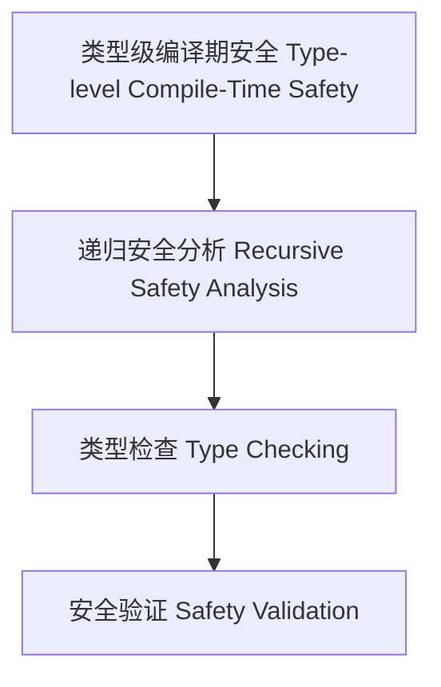

# 类型级编译期安全（Type-Level Compile-Time Safety in Haskell）

## 定义 Definition

- **中文**：类型级编译期安全是指在类型系统层面对类型级结构和表达式进行递归安全分析、类型检查与验证的机制，支持类型安全的编译期安全保障。
- **English**: Type-level compile-time safety refers to mechanisms at the type system level for recursive safety analysis, type checking, and validation of type-level structures and expressions, supporting type-safe compile-time safety in Haskell.

## Haskell 语法与实现 Syntax & Implementation

```haskell
{-# LANGUAGE GADTs, DataKinds, TypeFamilies #-}

-- 类型级表达式

data Expr a where
  LitInt  :: Int  -> Expr Int
  Add     :: Expr Int -> Expr Int -> Expr Int

-- 类型级编译期安全分析

type family CTSafe (e :: Expr a) :: Bool where
  CTSafe ('LitInt n) = 'True
  CTSafe ('Add x y) = CTSafe x && CTSafe y
```

## 类型级递归安全分析与类型检查 Recursive Safety Analysis & Type Checking

- 类型级表达式的递归安全分析、类型检查、验证
- 支持类型安全的编译期安全保障

## 形式化证明 Formal Reasoning

- **编译期安全正确性证明**：CTSafe e 能准确分析表达式编译期安全性
- **Proof of compile-time safety correctness**: CTSafe e can accurately analyze compile-time safety of expressions

### 证明示例 Proof Example

- 对 `CTSafe e`，归纳每个构造器，安全分析覆盖所有情况

## 工程应用 Engineering Application

- 类型安全的类型级DSL、编译期安全分析、自动化验证
- Type-safe type-level DSLs, compile-time safety analysis, automated verification

## 结构图 Structure Diagram



## 本地跳转 Local References

- [类型级编译期属性分析 Type-Level Compile-Time Property Analysis](../119-Type-Level-Compile-Time-Property-Analysis/01-Type-Level-Compile-Time-Property-Analysis-in-Haskell.md)
- [类型级语义一致性 Type-Level Semantic Consistency](../122-Type-Level-Semantic-Consistency/01-Type-Level-Semantic-Consistency-in-Haskell.md)
- [类型安全 Type Safety](../14-Type-Safety/01-Type-Safety-in-Haskell.md)
