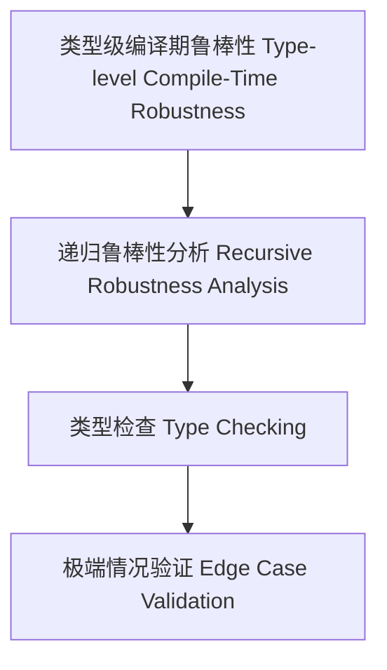

# 15-类型级编译期鲁棒性（Type-Level Compile-Time Robustness in Haskell）

## 定义 Definition

- **中文**：类型级编译期鲁棒性是指在类型系统层面对类型级结构和表达式进行递归鲁棒性分析、类型检查与极端情况验证的机制，支持类型安全的编译期鲁棒性保障。
- **English**: Type-level compile-time robustness refers to mechanisms at the type system level for recursive robustness analysis, type checking, and edge case validation of type-level structures and expressions, supporting type-safe compile-time robustness in Haskell.

## Haskell 语法与实现 Syntax & Implementation

```haskell
{-# LANGUAGE GADTs, DataKinds, TypeFamilies #-}

-- 类型级表达式

data Expr a where
  LitInt  :: Int  -> Expr Int
  Add     :: Expr Int -> Expr Int -> Expr Int

-- 类型级编译期鲁棒性分析

type family CTRobust (e :: Expr a) :: Bool where
  CTRobust ('LitInt n) = 'True
  CTRobust ('Add x y) = CTRobust x && CTRobust y
```

## 类型级递归鲁棒性分析与类型检查 Recursive Robustness Analysis & Type Checking

- 类型级表达式的递归鲁棒性分析、类型检查、极端情况验证
- 支持类型安全的编译期鲁棒性保障

## 形式化证明 Formal Reasoning

- **编译期鲁棒性正确性证明**：CTRobust e 能准确分析表达式编译期鲁棒性
- **Proof of compile-time robustness correctness**: CTRobust e can accurately analyze compile-time robustness of expressions

### 证明示例 Proof Example

- 对 `CTRobust e`，归纳每个构造器，鲁棒性分析覆盖所有情况

## 工程应用 Engineering Application

- 类型安全的类型级DSL、编译期鲁棒性分析、自动化验证
- Type-safe type-level DSLs, compile-time robustness analysis, automated verification

## 结构图 Structure Diagram



## 本地跳转 Local References

- [类型级编译期安全 Type-Level Compile-Time Safety](../123-Type-Level-Compile-Time-Safety/01-Type-Level-Compile-Time-Safety-in-Haskell.md)
- [类型级语义健壮性 Type-Level Semantic Robustness](../126-Type-Level-Semantic-Robustness/01-Type-Level-Semantic-Robustness-in-Haskell.md)
- [类型安全 Type Safety](../14-Type-Safety/01-Type-Safety-in-Haskell.md)

---

## 历史与发展 History & Development

- **中文**：类型级编译期鲁棒性随着类型系统和编译器理论的发展而演进。Haskell社区通过GADTs、Type Families等特性，推动了类型级鲁棒性分析的研究。
- **English**: Type-level compile-time robustness has evolved with advances in type systems and compiler theory. The Haskell community has promoted research on type-level robustness analysis through features like GADTs and Type Families.

## Haskell 相关特性 Haskell Features

### 经典特性 Classic Features

- GADTs、类型族、类型类、DataKinds等为类型级鲁棒性分析提供基础。
- GADTs, type families, type classes, and DataKinds provide the foundation for type-level robustness analysis.

### 最新特性 Latest Features

- **Type-level Programming**：类型级函数、类型级递归。
- **Singletons**：类型与值的单例化，支持类型安全的鲁棒性分析。
- **Dependent Types**：实验性支持，类型依赖于表达式结构。
- **Template Haskell**：元编程辅助类型级鲁棒性分析。
- **GHC 2021/2022**：标准化类型级编程相关扩展。

- **English**:
  - Type-level programming: Type-level functions and recursion.
  - Singletons: Singletonization of types and values, supporting type-safe robustness analysis.
  - Dependent Types: Experimental support, types depending on expression structure.
  - Template Haskell: Metaprogramming for type-level robustness analysis.
  - GHC 2021/2022: Standardizes type-level programming extensions.

## 应用 Applications

- **中文**：类型安全的DSL、编译期鲁棒性分析、自动化验证、极端情况检测等。
- **English**: Type-safe DSLs, compile-time robustness analysis, automated verification, edge case detection, etc.

## 例子 Examples

```haskell
{-# LANGUAGE DataKinds, GADTs, TypeFamilies #-}
data Expr a where
  LitInt  :: Int -> Expr Int
  Add     :: Expr Int -> Expr Int -> Expr Int
  SafeDiv :: Expr Int -> Expr Int -> Expr (Maybe Int)

type family CTRobust (e :: Expr a) :: Bool where
  CTRobust ('LitInt n) = 'True
  CTRobust ('Add x y) = CTRobust x && CTRobust y
  CTRobust ('SafeDiv _ ('LitInt 0)) = 'False
  CTRobust ('SafeDiv x y) = CTRobust x && CTRobust y
```

## 相关理论 Related Theories

- 类型级编程（Type-level Programming）
- 依赖类型（Dependent Types）
- 形式化验证（Formal Verification）
- 编译期优化（Compile-time Optimization）

## 参考文献 References

- [Wikipedia: Robustness (computer science)](https://en.wikipedia.org/wiki/Robustness_(computer_science))
- [GHC User's Guide](https://downloads.haskell.org/ghc/latest/docs/html/users_guide/)
- [Type-level Programming in Haskell](https://wiki.haskell.org/Type-level_programming)
