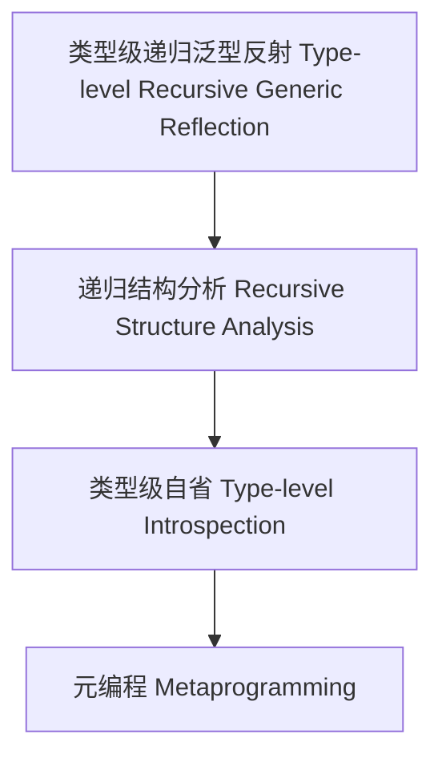

# 18-类型级递归泛型反射（Type-Level Recursive Generic Reflection in Haskell）

## 目录 Table of Contents

- [18-类型级递归泛型反射（Type-Level Recursive Generic Reflection in Haskell）](#18-类型级递归泛型反射type-level-recursive-generic-reflection-in-haskell)
  - [目录 Table of Contents](#目录-table-of-contents)
  - [定义 Definition](#定义-definition)
  - [Haskell 语法与实现 Syntax \& Implementation](#haskell-语法与实现-syntax--implementation)
  - [递归泛型反射机制 Recursive Generic Reflection Mechanism](#递归泛型反射机制-recursive-generic-reflection-mechanism)
  - [形式化证明 Formal Reasoning](#形式化证明-formal-reasoning)
    - [证明示例 Proof Example](#证明示例-proof-example)
  - [工程应用 Engineering Application](#工程应用-engineering-application)
  - [结构图 Structure Diagram](#结构图-structure-diagram)
  - [本地跳转 Local References](#本地跳转-local-references)

## 定义 Definition

- **中文**：类型级递归泛型反射是指在类型系统层面对递归泛型结构和行为进行类型级别的自省、分析与操作的机制，支持类型安全的泛型元编程。
- **English**: Type-level recursive generic reflection refers to mechanisms at the type system level for introspecting, analyzing, and manipulating recursive generic structures and behaviors, supporting type-safe generic metaprogramming in Haskell.

## Haskell 语法与实现 Syntax & Implementation

```haskell
{-# LANGUAGE TypeFamilies, DataKinds, GADTs, TypeOperators #-}

-- 递归泛型反射示例：类型级递归结构分析

data Tree a = Leaf a | Node (Tree a) (Tree a)

type family TreeDepth (t :: Tree a) :: Nat where
  TreeDepth ('Leaf x) = 1
  TreeDepth ('Node l r) = 1 + Max (TreeDepth l) (TreeDepth r)

type family Max (a :: Nat) (b :: Nat) :: Nat where
  Max a b = If (a <=? b) b a
```

## 递归泛型反射机制 Recursive Generic Reflection Mechanism

- 类型级递归结构分析、类型级自省与元编程
- 支持递归泛型结构的深度、形态等属性分析

## 形式化证明 Formal Reasoning

- **递归泛型反射正确性证明**：归纳证明类型级反射计算的正确性
- **Proof of correctness for recursive generic reflection**: Inductive proof of correctness for type-level reflection computation

### 证明示例 Proof Example

- 对 `TreeDepth t` 递归归纳，`t = Leaf` 时为 1，`t = Node l r` 时递归调用 `TreeDepth l` 和 `TreeDepth r`，归纳成立

## 工程应用 Engineering Application

- 泛型元编程、类型安全的递归结构分析、自动化代码生成
- Generic metaprogramming, type-safe recursive structure analysis, automated code generation

## 结构图 Structure Diagram



## 本地跳转 Local References

- [类型级递归反射 Type-Level Recursive Reflection](../68-Type-Level-Recursive-Reflection/01-Type-Level-Recursive-Reflection-in-Haskell.md)
- [类型级递归泛型算法 Type-Level Recursive Generic Algorithm](../72-Type-Level-Recursive-Generic-Algorithm/01-Type-Level-Recursive-Generic-Algorithm-in-Haskell.md)
- [类型级元编程 Type Metaprogramming](../16-Type-Metaprogramming/01-Type-Metaprogramming-in-Haskell.md)
- [类型级递归反射 Type-Level Recursive Reflection](../68-Type-Level-Recursive-Reflection/01-Type-Level-Recursive-Reflection-in-Haskell.md)
- [类型元编程 Type Metaprogramming](../18-Type-Metaprogramming/01-Type-Metaprogramming-in-Haskell.md)
- [类型安全 Type Safety](../14-Type-Safety/01-Type-Safety-in-Haskell.md)
