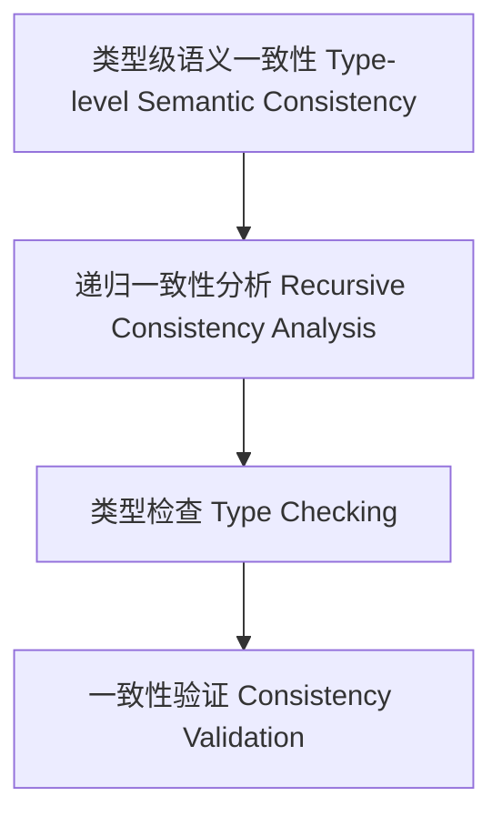

# 23-类型级语义一致性（Type-Level Semantic Consistency in Haskell）

## 定义 Definition

- **中文**：类型级语义一致性是指在类型系统层面对类型级结构和表达式进行递归一致性分析、类型检查与验证的机制，支持类型安全的编译期语义一致性保障。
- **English**: Type-level semantic consistency refers to mechanisms at the type system level for recursive consistency analysis, type checking, and validation of type-level structures and expressions, supporting type-safe compile-time semantic consistency in Haskell.

## Haskell 语法与实现 Syntax & Implementation

```haskell
{-# LANGUAGE GADTs, DataKinds, TypeFamilies #-}

-- 类型级表达式

data Expr a where
  LitInt  :: Int  -> Expr Int
  Add     :: Expr Int -> Expr Int -> Expr Int

-- 类型级语义一致性分析

type family SemConsistent (e :: Expr a) :: Bool where
  SemConsistent ('LitInt n) = 'True
  SemConsistent ('Add x y) = SemConsistent x && SemConsistent y
```

## 类型级递归一致性分析与类型检查 Recursive Consistency Analysis & Type Checking

- 类型级表达式的递归语义一致性分析、类型检查、验证
- 支持类型安全的编译期语义一致性保障

## 形式化证明 Formal Reasoning

- **语义一致性正确性证明**：SemConsistent e 能准确分析表达式语义一致性
- **Proof of semantic consistency correctness**: SemConsistent e can accurately analyze semantic consistency of expressions

### 证明示例 Proof Example

- 对 `SemConsistent e`，归纳每个构造器，一致性分析覆盖所有情况

## 工程应用 Engineering Application

- 类型安全的类型级DSL、编译期语义一致性分析、自动化验证
- Type-safe type-level DSLs, compile-time semantic consistency analysis, automated verification

## 结构图 Structure Diagram



## 本地跳转 Local References

- [类型级语义验证 Type-Level Semantic Validation](../120-Type-Level-Semantic-Validation/01-Type-Level-Semantic-Validation-in-Haskell.md)
- [类型级语义归纳 Type-Level Semantic Induction](../118-Type-Level-Semantic-Induction/01-Type-Level-Semantic-Induction-in-Haskell.md)
- [类型安全 Type Safety](../14-Type-Safety/01-Type-Safety-in-Haskell.md)
