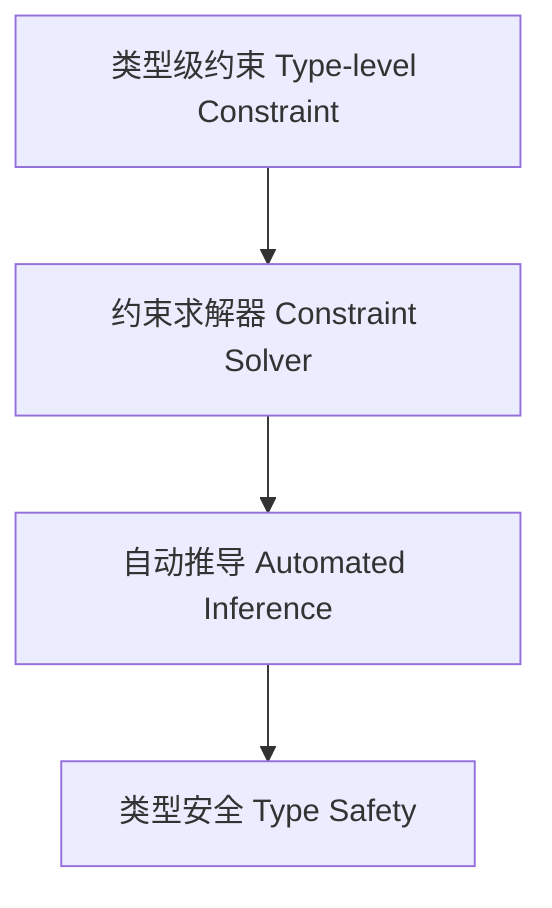

# 类型级约束求解器（Type-Level Constraint Solver in Haskell）

## 定义 Definition

- **中文**：类型级约束求解器是指在类型系统层面自动化处理和消解类型约束的机制或工具，支持复杂类型关系的自动推导与验证。
- **English**: Type-level constraint solver refers to mechanisms or tools at the type system level for automatically handling and solving type constraints, supporting automatic inference and verification of complex type relations in Haskell.

## Haskell 语法与实现 Syntax & Implementation

```haskell
{-# LANGUAGE TypeFamilies, ConstraintKinds, TypeOperators, UndecidableInstances #-}
import GHC.Exts (Constraint)

-- 类型级约束求解器示例

type family Solve (c :: Constraint) :: Bool where
  Solve (() :: Constraint) = 'True
  Solve c = 'False
```

## 约束求解算法 Constraint Solving Algorithms

- 类型族递归归约
- 类型类实例选择与合成
- 约束传播与消解

## 形式化证明 Formal Reasoning

- **约束求解器正确性证明**：证明求解器输出与类型系统一致
- **Proof of solver correctness**: Show that the solver's output is consistent with the type system

### 证明示例 Proof Example

- 对 `Solve c`，归纳证明 `c` 可解时返回 `True`，否则为 `False`

## 工程应用 Engineering Application

- 类型安全的泛型库、DSL、自动化验证工具
- Type-safe generic libraries, DSLs, automated verification tools

## 范畴论映射 Category Theory Mapping

- 约束求解器可视为范畴中的限制函子（Limit functor）或等价类划分

## 结构图 Structure Diagram



## 本地跳转 Local References

- [类型级约束求解 Type-Level Constraint Solving](../22-Type-Level-Constraint-Solving/01-Type-Level-Constraint-Solving-in-Haskell.md)
- [类型级自动化 Type-Level Automation](../27-Type-Level-Automation/01-Type-Level-Automation-in-Haskell.md)
- [类型级编程 Type-level Programming](../12-Type-Level-Programming/01-Type-Level-Programming-in-Haskell.md)
