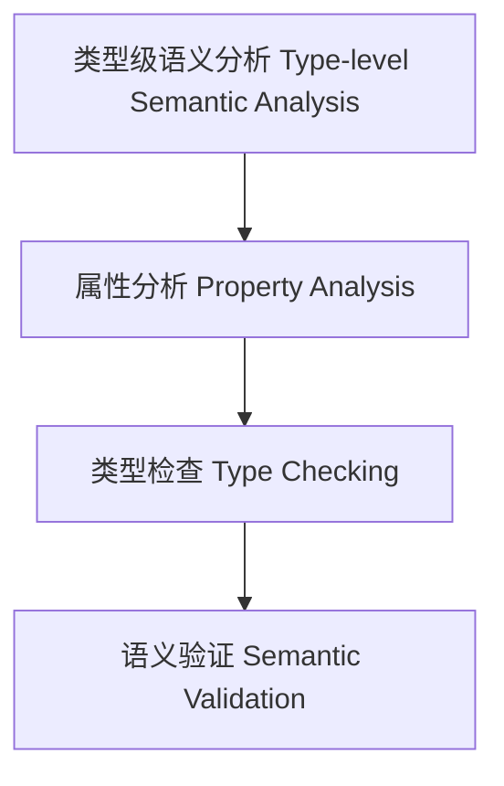
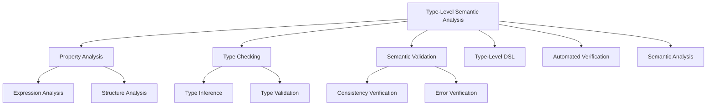

# 29-类型级语义分析（Type-Level Semantic Analysis in Haskell）

## 定义 Definition

- **中文**：类型级语义分析是指在类型系统层面对类型级结构、表达式等进行属性分析、类型检查与语义验证的机制，支持类型安全的编译期语义分析。
- **English**: Type-level semantic analysis refers to mechanisms at the type system level for property analysis, type checking, and semantic validation of type-level structures and expressions, supporting type-safe compile-time semantic analysis in Haskell.

## Haskell 语法与实现 Syntax & Implementation

```haskell
{-# LANGUAGE GADTs, DataKinds, TypeFamilies #-}

-- 类型级表达式

data Expr a where
  LitInt  :: Int  -> Expr Int
  Add     :: Expr Int -> Expr Int -> Expr Int

-- 类型级语义分析：类型检查

type family TypeCheck (e :: Expr a) :: Bool where
  TypeCheck ('LitInt n) = 'True
  TypeCheck ('Add x y) = TypeCheck x && TypeCheck y
```

## 类型级属性分析与类型检查 Property Analysis & Type Checking

- 类型级表达式的属性分析、类型检查、语义验证
- 支持类型安全的编译期语义分析与错误检测

## 形式化证明 Formal Reasoning

- **语义分析正确性证明**：TypeCheck e 能准确判断表达式类型合法性
- **Proof of semantic analysis correctness**: TypeCheck e can accurately determine the type validity of expressions

### 证明示例 Proof Example

- 对 `TypeCheck e`，归纳每个构造器，类型检查覆盖所有情况

## 工程应用 Engineering Application

- 类型安全的类型级DSL、编译期语义分析、自动化验证
- Type-safe type-level DSLs, compile-time semantic analysis, automated verification

## 结构图 Structure Diagram



## 对比分析 Comparison

- **中文**：类型级语义分析 vs 运行时语义分析 vs 静态语义分析 vs 动态语义分析
  - 类型级语义分析关注"编译时的类型级语义检查"；运行时语义分析聚焦"执行时的语义验证"；静态语义分析强调"编译时分析"；动态语义分析注重"运行时监控"。
- **English**: Type-level semantic analysis vs runtime semantic analysis vs static semantic analysis vs dynamic semantic analysis
  - Type-level semantic analysis focuses on "compile-time type-level semantic checking"; runtime semantic analysis on "runtime semantic verification"; static semantic analysis on "compile-time analysis"; dynamic semantic analysis on "runtime monitoring".

## 争议与批判 Controversies & Critique

- **中文**：
  - 类型级语义分析 vs 运行时灵活性的权衡；过度类型约束 vs 编程便利性；
  - 语义分析的复杂性；类型级语义分析的适用范围。
- **English**:
  - Trade-off between type-level semantic analysis vs runtime flexibility; over-typing constraints vs programming convenience;
  - Complexity of semantic analysis; scope of applicability of type-level semantic analysis.

## 前沿趋势 Frontier Trends

- **中文**：
  - AI辅助的类型级语义分析；量子计算中的类型级语义分析；
  - 分布式系统的类型级语义分析；多语言类型级语义分析框架。
- **English**:
  - AI-assisted type-level semantic analysis; type-level semantic analysis in quantum computing;
  - Type-level semantic analysis for distributed systems; multi-language type-level semantic analysis frameworks.

## 常见陷阱 Common Pitfalls

- **中文**：
  - 过度依赖类型级语义分析；忽视运行时边界情况；
  - 类型级语义分析的复杂性；语义分析的误报问题。
- **English**:
  - Over-reliance on type-level semantic analysis; ignoring runtime edge cases;
  - Complexity of type-level semantic analysis; false positive issues in semantic analysis.

## 扩展交叉引用 Extended Cross References

- [编译时安全 Compile-Time Safety](../Type-Level/06-编译时安全.md)
- [类型级编译期一致性 Type-Level Compile-Time Consistency](../Type-Level/14-类型级编译期一致性.md)
- [编译时优化 Compile-Time Optimization](../Type-Level/07-编译时优化.md)
- [类型级编程 Type-Level Programming](../Type-Level/01-类型级编程.md)
- [类型级证明 Type-Level Proof](../Type-Level/04-类型级证明.md)
- [类型级自动化 Type-Level Automation](../Type-Level/03-编译时自动化.md)

## 知识图谱 Knowledge Graph



## 本地跳转 Local References

- [类型级语义模型 Type-Level Semantics](../107-Type-Level-Semantics/01-Type-Level-Semantics-in-Haskell.md)
- [类型级泛型算法 Type-Level Generic Algorithm](../33-Type-Level-Generic-Algorithm/01-Type-Level-Generic-Algorithm-in-Haskell.md)
- [类型安全 Type Safety](../14-Type-Safety/01-Type-Safety-in-Haskell.md)
