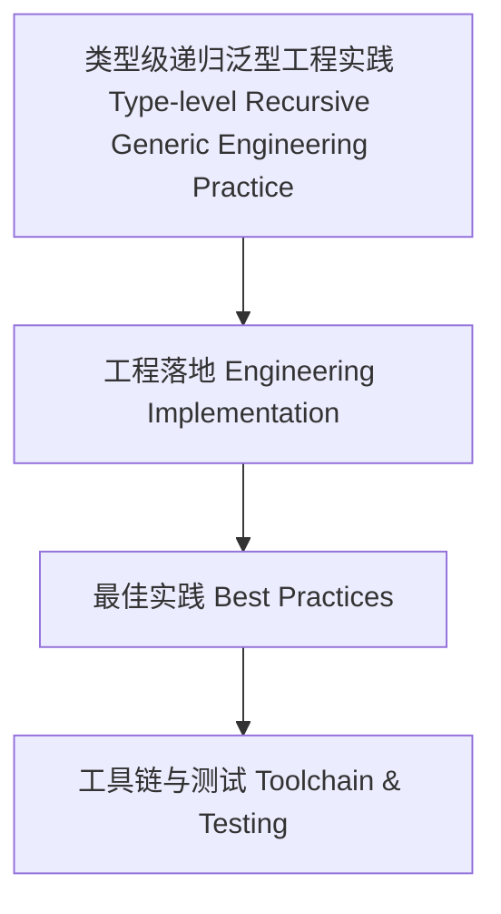

# 38-类型级递归泛型工程实践（Type-Level Recursive Generic Engineering Practice in Haskell）

## 定义 Definition

- **中文**：类型级递归泛型工程实践是指在实际软件开发中，类型级递归泛型技术的工程化落地方法、工具链与最佳实践。
- **English**: Type-level recursive generic engineering practice refers to engineering implementation methods, toolchains, and best practices for type-level recursive generic techniques in real-world software development.

## 工程落地方法 Engineering Implementation Methods

- 结合GHC.Generics、Template Haskell等工具自动生成递归泛型代码
- 利用类型族、GADT、类型类递归实现类型安全的自动推导与验证
- 工程中分层设计、递归深度控制、类型级缓存优化

## Haskell 实现与最佳实践 Haskell Implementation & Best Practices

```haskell
{-# LANGUAGE TypeFamilies, DataKinds, TypeOperators, GADTs, TemplateHaskell #-}
import Language.Haskell.TH

-- 工程实践：自动生成递归类型族

genReverse :: Q [Dec]
genReverse = [d|
  type family Reverse (xs :: [k]) :: [k] where
    Reverse '[] = '[]
    Reverse (x ': xs) = Append (Reverse xs) '[x]
  |]
```

## 最佳实践 Best Practices

- 分层递归、尾递归优化、类型级缓存、类型族终止性检查
- 工程化工具链集成与自动化测试

## 结构图 Structure Diagram



## 本地跳转 Local References

- [类型级递归泛型元编程 Type-Level Recursive Generic Metaprogramming](../99-Type-Level-Recursive-Generic-Metaprogramming/01-Type-Level-Recursive-Generic-Metaprogramming-in-Haskell.md)
- [类型级递归泛型性能 Type-Level Recursive Generic Performance](../101-Type-Level-Recursive-Generic-Performance/01-Type-Level-Recursive-Generic-Performance-in-Haskell.md)
- [类型安全 Type Safety](../14-Type-Safety/01-Type-Safety-in-Haskell.md)
