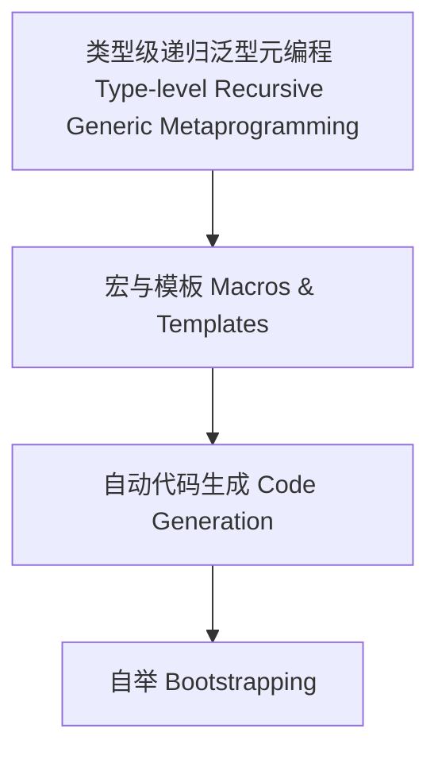

# 40-类型级递归泛型元编程（Type-Level Recursive Generic Metaprogramming in Haskell）

## 定义 Definition

- **中文**：类型级递归泛型元编程是指在类型系统层面对递归泛型结构和算法进行类型级别的宏、模板、自动代码生成与自举的机制。
- **English**: Type-level recursive generic metaprogramming refers to mechanisms at the type system level for macros, templates, automated code generation, and bootstrapping of recursive generic structures and algorithms in Haskell.

## Haskell 语法与实现 Syntax & Implementation

```haskell
{-# LANGUAGE TemplateHaskell, TypeFamilies, DataKinds, TypeOperators #-}
import Language.Haskell.TH

-- 递归泛型元编程示例：自动生成递归类型族

genReverse :: Q [Dec]
genReverse = [d|
  type family Reverse (xs :: [k]) :: [k] where
    Reverse '[] = '[]
    Reverse (x ': xs) = Append (Reverse xs) '[x]
  |]
```

## 元编程机制 Metaprogramming Mechanism

- 类型级宏、模板、自动代码生成、自举
- 支持递归泛型结构的自动化元编程

## 形式化证明 Formal Reasoning

- **元编程一致性证明**：自动生成的类型级递归泛型结构与手写一致
- **Proof of metaprogramming consistency**: Automatically generated type-level recursive generic structures are equivalent to handwritten ones

### 证明示例 Proof Example

- 对 `genReverse` 生成的类型族与手写 `Reverse` 结构归纳一致

## 工程应用 Engineering Application

- 类型安全的递归泛型元编程、自动化代码生成、DSL
- Type-safe recursive generic metaprogramming, automated code generation, DSLs

## 结构图 Structure Diagram



## 本地跳转 Local References

- [类型级递归泛型反射 Type-Level Recursive Generic Reflection](../90-Type-Level-Recursive-Generic-Reflection/01-Type-Level-Recursive-Generic-Reflection-in-Haskell.md)
- [类型级元编程 Type Metaprogramming](../16-Type-Metaprogramming/01-Type-Metaprogramming-in-Haskell.md)
- [类型安全 Type Safety](../14-Type-Safety/01-Type-Safety-in-Haskell.md)
